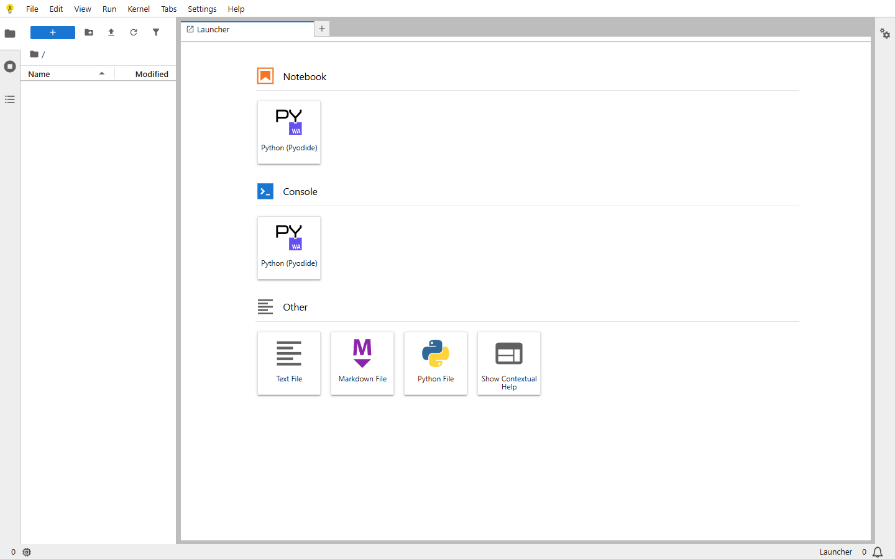

# SQL-on-FHIR analytics: a query notebook that scales to BI (#650)

**Issue:** [#650](https://github.com/HeliosSoftware/hfs/issues/650) — research task; deliverable is this document.
**Branch:** `docs/650-analytics-evaluation` (off `main`).
**Evaluated against `main`** at 2026-08-28 (post-#710 Arrow IPC, post-#649 SQL-on-FHIR UI, post-#712 design polish).

**The question #650 asks, in its own words:** *"a place to explore that data… write a ViewDefinition, run it,
and chart the result **without leaving the server**."* The goal is **in-product BI** — close the loop inside HFS
instead of exporting a file and leaving.

**The answer this document reaches:** build a **query notebook** for SQL-on-FHIR — an interactive surface to run
queries and see results — and let it **scale into governed BI** (charts → dashboards → a semantic layer). It is
one continuous surface, built native on the UI that #649 already shipped. Bundling a third-party notebook or BI
tool was evaluated and rejected: it is the wrong *shape* for BI and breaks HFS's hardest constraints. Arbitrary
Python / ML stays a separate, later tier (companion service or external platform), reached by handing over
result data, never credentials.

Claim tags: **[measured]** = reproduced locally for this document, **[verified]** = read from current `main`
with a file citation, **[upstream]** = vendor/docs claim not independently verified, **[proposal]** =
architectural suggestion.

---

## 1. The decision framed correctly: buy vs build for in-product BI

#650's title says "evaluate notebook tools for bundling or integration," but its motivation asks for something
more specific: an analyst should author a query, run it, and *chart the result in the product*. That is a BI
surface, and the notebook is its authoring front end — the two are one continuous thing in every BI-as-code tool
(Evidence, Hex, Graphene): cells where you write queries and pin their results as charts, which compose into
dashboards.

So the real question is **buy vs build**:

- **Buy (bundle a tool).** Ship JupyterLite / marimo / Superset / Cube / Graphene inside or beside HFS. §6–§8
  show this fails: the Python notebooks are the wrong shape for BI *and* break the no-CDN constraint (or cost
  463 MB vendored); the BI platforms are multi-service apps or Node runtimes with their own auth and datastore
  that cannot fold into a single Rust binary, and one (Graphene) is not even OSI-licensed.
- **Build (native surface).** A query notebook rendered by HFS itself, growing BI capabilities stage by stage,
  in the existing Askama/HTMX + SVG stack. This is the recommendation (§5). The rejected BI tools become its
  **blueprint** (§7), not its runtime.

Buying fails on the constraints; building satisfies them and reuses what #649 already landed. The rest of this
document is the evidence for that conclusion and the staged plan that follows from it.

## 2. Current state on `main` (all [verified])

**Engine & REST surface.**
- `POST /$sql-run` and `POST /$sql-export` are **system-level routes only** — there are no
  `/ViewDefinition/$sql-run` type-level routes (`crates/rest/src/routing/fhir_routes.rs:445,452`).
- Sync `$sql-run` output formats: JSON, NDJSON, CSV (with/without header), Parquet, FHIR, and — new in #710 —
  **Arrow IPC** (`application/vnd.apache.arrow.stream`, `_format=arrow`; `crates/sof/src/lib.rs:655,729-758`).
  Arrow IPC and Parquet are batch-only; the streaming/chunked drivers reject them
  (`crates/sof/src/lib.rs:2201-2213`).
- Async `$sql-export` formats: `ndjson` (default), `csv`, `json`, `parquet` — **no** `arrow`
  (`crates/rest/src/handlers/sof/export.rs:103,115-116`).
- pysof exposes the same engine in-process, including `"arrow"` output (`crates/pysof/src/lib.rs:330`).
- Server-side limits, enforced where the data lives: `HFS_SOF_SQLQUERY_MAX_ROWS` 100,000;
  max source rows per ViewDefinition 1,000,000; max dependent ViewDefinitions 16; SQL timeout 30 s
  (`crates/rest/src/config.rs:1113-1134,1247-1250`). Any BI surface should lean on these, not invent
  browser-side duplicates.
- Client-parse benchmark in-repo: Arrow IPC vs CSV for `$sql-run` consumption, ~114× faster to a usable
  DataFrame ([measured], `crates/sof/scripts/bench_arrow_client.py`). The interactive run→see loop is therefore
  cheap over Arrow.

**UI — the query surface already half-exists.** #649 landed a top-level SQL-on-FHIR section (View Definitions /
SQL Library / SQL Views / Export / Files — `crates/ui/templates/pages/sql-*.html`). A ViewDefinition previews
via `?run=1`, which performs a **server-side loopback self-call** to `POST {base}/$sql-run?_format=json&_limit=N`
and renders rows as a data table (`crates/ui/src/conformance.rs:317-377`, `crates/ui/src/sql_views.rs:72`).
`$sql-export` jobs submit and poll from the UI (`crates/ui/src/conformance.rs:473-495`). Saved queries live in
the SQL Library. What is missing is exactly the BI layer: **no charting, grouping, or aggregation anywhere in the
UI today.** The query notebook (§5) is the natural continuation of this surface, not a greenfield feature.

**The no-CDN guard is executable, not aspirational.** `crates/ui/e2e/tests/no-cdn.spec.ts` fails the build if
*any* page makes *any* off-origin request (only `data:`/`blob:` exempt), and separately fails on any inline
executable `<script>` (only `application/json`/`ld+json` data carriers exempt). This is the constraint that
disqualifies most "buy" options.

**No CSP.** There is no `Content-Security-Policy` header anywhere in `crates/rest` or `crates/ui` (repo-wide
grep, zero hits). The no-CDN Playwright test is currently the only network-egress control on the browser side.

**Deployment.** One prebuilt Rust binary copied into `debian:trixie-slim` with `libssl3t64` + `ca-certificates`;
no Python, no Node, no supervisor (`Dockerfile`). A local release build of `sof-cli` measures 146.6 MB
[measured]. `hfs` default features are `["R4", "sqlite", "ui"]` with the UI behind an optional `ui` feature
(`crates/hfs/Cargo.toml:18,30`) — clean precedent for an opt-in `analytics-ui` feature if a heavier surface is
ever gated. `pysof` is excluded from default workspace members (root `Cargo.toml`).

**Tenancy & self-call auth.** All persistence is tenant-first; direct DB access bypasses tenant/auth entirely
(and is backend-specific across SQLite/Postgres/Mongo/ES/S3). The UI's browser JS sends `X-Tenant-ID` from a
meta tag with `credentials: "same-origin"` and **no bearer token** (`crates/ui/assets/saved-queries.js:40,67`);
server-side self-calls use either the provisioned `HFS_OUTBOUND_BEARER_TOKEN` (`crates/auth/src/outbound.rs`) or
forward the caller's own `Authorization`. `HFS_BASE_URL` provides a validated public base URL
(`crates/rest/src/public_url.rs`). This "server runs the query, hands rows to the page" pattern is already the
right one for the query notebook.

## 3. Security finding: SMART authorization gap on `/$sql-run` and `/$sql-export` [verified]

This must be fixed **before** the query notebook makes these endpoints more prominent.

- The auth middleware classifies requests via `extract_operation`; any path whose first segment starts with `$`
  returns `None` ("system-level") — `crates/rest/src/middleware/auth.rs:368-371`.
- When classification is `None`, the middleware **skips the scope check entirely** and passes the request
  through (`crates/rest/src/middleware/auth.rs:185-225` — only the `Some` arm checks `SmartScopePolicy`).
- The SOF handlers perform no scope checks of their own (grep of `crates/rest/src/handlers/sof/`: none).
- The guard test that exists — `test_sof_and_subscription_ops_still_require_scope`
  (`crates/rest/src/middleware/auth.rs:822-841`) — asserts **type-level** shapes (`/ViewDefinition/$sql-run`,
  `/Library/$sql-run`) that are *not the registered routes*. The registered routes are root-level (§2), and
  root-level `$` paths hit the line-368 early return the test never exercises.

**Net effect:** with `HFS_AUTH_ENABLED=true`, any *authenticated* bearer token — regardless of SMART scopes —
can execute arbitrary ViewDefinitions and SQL via `POST /$sql-run` and start `$sql-export` jobs. Authentication
and tenant isolation hold; resource authorization does not. Follow-up issue #1 (§14) fixes it: define the
operation's scope semantics (a dedicated `system/sql-run` operation scope, or a read-scope mapping) and add
root-level-path regression tests.

## 4. Evaluation criteria

From #650, in filtering order: (1) license vs MIT distribution; (2) runtime footprint / deployment-model impact,
quantified; (3) the no-CDN constraint as enforced by `no-cdn.spec.ts`; (4) tenant isolation & blast radius;
(5) authN/authZ composition with `helios-auth`; (6) integration surface (bundle / adjacent / client library /
in-browser / **native**); (7) fit with the landed #649 UI; (8) maintenance cost.

Two further filters this document applies:

- **Data, not credentials.** Any analytics runtime receives *bounded result data* (JSON/CSV/Parquet/Arrow) that
  already passed HFS auth + tenant + row-limit enforcement. It never receives `HFS_OUTBOUND_BEARER_TOKEN`, a
  service identity, or direct datastore access (which also breaks on 4 of 5 backends — §2).
- **Right shape for BI.** BI is *governed, shareable, repeatable* — a metric defined once, a dashboard others
  can open. A tool that only produces one-off analyses (a Python notebook) is the wrong shape for the goal, even
  when it can technically draw a chart.

## 5. Recommendation: a query notebook that scales to BI [proposal]

Build it native, in the #649 UI, one capability at a time. Each stage is the previous stage plus one addition on
the same surface; nothing before Stage 4 needs a foreign runtime in the image.

**Stage 1 — Query notebook (v1).** An interactive surface of query cells: author a ViewDefinition or SQL, run it
against `$sql-run`, see the result as a table inline. Save and reuse via the existing SQL Library; results stream
back as Arrow (fast run→see loop, §2). This is the "notebook where you run queries" — the entry point — and it is
mostly an extension of the run-preview and SQL Library that already exist. Server-rendered Askama/HTMX; no new
runtime. *Maps to acceptance criteria 6, 7.*

**Stage 2 — Visualization on a result.** Add to each cell: sort/filter, **group-by with count/sum/avg**, KPI /
BigValue tiles, and bar/line/scatter charts — rendered native as SVG. For interactive pivoting/aggregation
*without* re-querying the server, optionally vendor **DuckDB-WASM** (~8 MB gz [measured]) to re-aggregate the
Arrow result in the browser, and **Perspective** or Arrow JS (51 KB gz) to read it. All MIT/Apache, all
self-hostable, all pass the no-CDN guard [measured]. This is the bridge from notebook to BI. The component set
and the "chart hint from the query" idea are copied from Evidence and Graphene (§7).

**Stage 3 — Scale to BI.** Compose saved query+chart cells into **dashboards**; add a **semantic layer** — define
a metric once, reuse it everywhere — with **row-level access** enforced through HFS's existing tenant/auth. This
is "BI on HFS." The model is Cube's (dimensions/measures + RLS) and Graphene's (`.gsql` deterministic metrics),
adopted as design, implemented in Rust over the SQL-on-FHIR engine (§7).

**Stage 4 — Beyond BI (not native).** Arbitrary Python, ML, research — genuinely unsafe inside a Rust binary next
to multi-tenant PHI, and not what #650 asks for. This tier is the **companion Python service** (the HFS Analytics
v1 direction) or an **external platform**, reached by handing over result data (Arrow over HTTP, or Parquet from
`$sql-export`). Never HFS credentials or direct DB access.

**Why staged, not one big build:** Stage 1 delivers the loop the issue is about with the least new code; each
later stage is independently valuable and independently shippable; and the surface never forks — the notebook a
user learns in Stage 1 is the same surface they build a dashboard on in Stage 3.

## 6. Why not *buy* a notebook — measured

The "buy a Python notebook and embed it" path is the one #650 names first, so it was tested hardest. Two leading
browser notebooks were built offline and served from localhost; a real browser drove them while the network was
watched (reproduction in §13).

| JupyterLite (vendored offline) — passes no-CDN | marimo WASM export — fails no-CDN |
|---|---|
|  |  |
| 0 off-origin requests of 91 (static assets included) | 13 off-origin requests: `wasm.marimo.app` + `cdn.jsdelivr.net`, hardcoded in worker JS |

- **JupyterLite (vendored-offline build).** Loaded the full JupyterLab UI and a Pyodide kernel; **0 off-origin
  requests** out of 91, static assets included [measured]. It *can* pass the no-CDN guard. Cost: **463 MB** raw /
  365 MB gz for the full Pyodide bundle — ~3× the largest binary in the workspace (§2). Wrong shape for BI (a
  Python IDE, not a governed dashboard), and it stores notebooks in browser IndexedDB — cross-user/cross-tenant
  on a shared clinical workstation (§9). Verdict: viable only as an **opt-in escape hatch** for power users, never
  the BI surface.
- **marimo WASM export.** Booted Pyodide and executed the notebook (computed a table and `total = 17` in-shot),
  but made **13 off-origin requests at runtime** — `wasm.marimo.app/pyodide-lock.json` and
  `cdn.jsdelivr.net/pyodide/v314…` for the runtime and every wheel [measured]. Those URLs are hardcoded in
  minified worker JS: patching them out is a fork, not a config flag. It **cannot** pass the no-CDN guard today.
  Corroborated upstream ([marimo#3667](https://github.com/marimo-team/marimo/issues/3667): CDN-asset export is
  the intended design; [marimo#5206](https://github.com/marimo-team/marimo/issues/5206): missing files offline).

The measured takeaway: even the *best* embeddable notebook is 463 MB, wrong-shaped, and opt-in at most — which
is why the recommendation builds the BI surface native and keeps notebooks as a later escape hatch.

## 7. The BI blueprint: Graphene, Cube, Evidence

These are the most valuable candidates for #650 — not as tools to bundle, but as the **design** the native
surface copies. Each is rejected as a runtime for a concrete reason, and mined for its model.

- **Graphene** (`graphene-data/graphene`, "BI built for agents") — [upstream] **Elastic-2.0** (not OSI), Node +
  Vite runtime, direct DB connectors (Snowflake/BigQuery/ClickHouse/Postgres/DuckDB), inline scripts in its
  pages. Rejected as a runtime three times over (license blocks code reuse into MIT HFS; Node process; inline
  scripts trip the guard; direct-DB bypasses tenancy). **Adopt:** its component set (KPI/BigValue, charts,
  tables) and `.gsql` "define a metric once, deterministically" model (Malloy/LookML lineage) — the Stage 2/3
  blueprint.
- **Cube** (`cube.dev`) — [upstream] Cube Core dual-licensed (**Apache-2.0** backend + MIT clients — license is
  fine), but deployment is Node services + Cube Store (a separate Rust OLAP engine) + caching: a multi-service
  platform, not a single-binary fit. Pointing it at HFS's store duplicates and bypasses the SQL-on-FHIR + tenant
  layer HFS already has. **Adopt:** the **semantic-layer** model — dimensions/measures defined once, **row-level
  security** — mapped onto HFS's tenant/auth for Stage 3. *(If a governed semantic layer ever becomes a hard
  requirement beyond what Stage 3 delivers, Cube-as-adjacent-service downstream of `$sql-export` Parquet is the
  first thing to reach for — a named path, not a default.)*
- **Evidence** (`evidence.dev`) — [upstream] **MIT**; static-site generator from SQL + markdown; its "Universal
  SQL" runs **DuckDB-WASM** in the browser. Rejected as a runtime (Node/Svelte build toolchain), but it is the
  closest existing thing to the target: **SQL-first authoring where query cells become charts**. **Adopt:** the
  authoring model and the DuckDB-WASM-in-the-browser pattern (Stage 2).

## 8. Candidate comparison (all #650 candidates)

Categories: **N** native-build reference (BI blueprint) · **A** embed-in-HFS browser/WASM · **E** engine
component · **C** adjacent self-hosted service · **D** external platform · **F** publishing.

| Candidate | Cat | License | Bundle-viable? | Role here |
|---|---|---|---|---|
| **Native query notebook → BI** | — | MIT (ours) | n/a (build) | **The recommendation (§5)** |
| Evidence | N | MIT | No — Node build toolchain | **Blueprint:** SQL-first authoring, DuckDB-WASM (§7) |
| Graphene | N | **Elastic-2.0** | No — license + Node + inline scripts | **Blueprint:** component set, `.gsql` metrics (§7) |
| Cube (Core) | N/C | Apache-2.0 core [upstream] | No — Node + Cube Store multi-service | **Blueprint:** semantic layer + RLS (§7) |
| DuckDB-WASM | E | MIT | Yes, self-hosted bundles [measured] | Stage-2 client-side pivot engine (~8 MB gz) |
| Arrow JS | E | Apache-2.0 | Yes [measured] | Reads `$sql-run?_format=arrow` (51 KB gz) |
| Perspective (FINOS) | E/A | Apache-2.0 | Yes [upstream] | Stage-2 table/chart widget option (~4–12 MB) |
| JupyterLite | A | BSD-3 | Opt-in only — 463 MB vendored [measured] | Runner-up escape hatch (Stage 4, power users) |
| marimo WASM | A | Apache-2.0 | **No — CDN-locked** [measured] | Rejected embed; revisit on offline export |
| JupyterLab / Jupyter Server / Notebook 7 | C | BSD-3 | No — CPython process, 1.5–4 GB image [upstream] | Adjacent only; superseded by companion service |
| JupyterHub | C | BSD-3 | No — proxy + spawner infra | Superseded by companion service |
| Apache Superset | C | Apache-2.0 | No — 5-service platform (gunicorn/Celery×2/Postgres/Redis) [upstream] | Adjacent BI for customers who already run it |
| Zerve | D | Commercial | No | External; native Python → pysof runs as-is; verify air-gap/BAA for PHI [upstream] |
| Deepnote / Hex | D | Commercial | No | External; single-tenant/VPC, HIPAA tiers [upstream] |
| Databricks notebooks | D | Commercial | No | External; natural `$sql-export` Parquet consumer |
| Quarto | F | MIT | n/a (render-time) | Rejected for exploration; future *reports* from pysof |
| Observable Framework | F | ISC | Static output, self-hosts npm [upstream] | Rejected for exploration; dashboard-publishing reference |
| Polars (browser) | E | — | No — js-polars "experimental, not for production" [upstream] | Pysof-side only, not browser-side |
| pysof + example notebooks | — | MIT (ours) | n/a | **Do-nothing baseline (§12)** |

## 9. Security / tenant model for any browser code

- **Execution isolation.** Native server-rendered BI runs no user-authored code in a shared context — the query
  is SQL-on-FHIR, executed by the engine under existing limits. This is the safest shape and another reason to
  build native rather than embed an interpreter.
- **If Stage 2 vendors DuckDB-WASM / Perspective**, they execute in the user's own tab over data the server
  already gated — bounded blast radius, but still needs a CSP: `connect-src 'self'`, `worker-src 'self' blob:`,
  `script-src` incl. `'wasm-unsafe-eval'` [upstream], ideally on an isolated route subtree. HFS has no CSP today
  (§2). Follow-up issue #4.
- **If Stage 4 ever ships an embedded JupyterLite**, add: IndexedDB is browser-profile storage —
  cross-user/cross-tenant on shared machines [upstream]; scope per-tenant or disable in favor of server-side
  notebook storage. `SharedArrayBuffer` (fastest kernel FS path) needs COOP/COEP or falls back to a service
  worker [upstream]. Never expose `HFS_OUTBOUND_BEARER_TOKEN` to notebook JS.
- **Identity.** The existing UI pattern (same-origin cookies + `X-Tenant-ID`, server-side self-calls carry the
  outbound/forwarded token — §2) already implements "data, not credentials" for the native surface.

## 10. Measurements

All [measured] 2026-08-28, Windows 11, Python 3.12 (uv), Node 24. Reproduction: §13.

| Artifact | Version | Raw | Compressed | Off-origin at runtime? |
|---|---|---|---|---|
| JupyterLite, default build | core 0.8.3 + pyodide-kernel 0.8.5 | 70.1 MB | 16.1 MB gz | **Yes** — `pyodideUrl` → `cdn.jsdelivr.net/pyodide/v314.0.5`; piplite → PyPI |
| JupyterLite, vendored (`--pyodide` full tarball) | same | **463.4 MB** (Pyodide 393.4 MB) | 365.0 MB gz | **No** at runtime (0/91 requests, browser-verified); one residual `pypi.org` piplite index for *installs* |
| marimo WASM export | marimo 0.24.0 | 27.3 MB | — | **Yes** — 13 requests: `wasm.marimo.app` + `cdn.jsdelivr.net`, hardcoded in worker JS (browser-verified) |
| DuckDB-WASM | 1.33.1-dev57.0 (MIT) | eh.wasm 35.9 MB · worker 0.77 MB | eh.wasm **8.06 MB gz** · worker 188 KB gz · loader 8 KB gz | No — self-hosted via explicit `selectBundle` |
| Arrow JS | apache-arrow 21.2.0 (Apache-2.0) | 192 KB | 51 KB gz | No |

The recommendation's in-image footprint: **~0** for the Stage 1 query notebook and Stage 2 native charts
(server-rendered), **+8.3 MB gz** if Stage 2 later vendors DuckDB-WASM, **+463 MB** only for the rejected-by-
default JupyterLite escape hatch.

## 11. Architecture [proposal]

```text
browser (same-origin UI page)
      │  htmx: run a query cell
      ▼
HFS ui feature (Askama/HTMX, no inline scripts)          ← Stage 1: query notebook
      │  server-side self-call (caller's / outbound token)
      ▼
POST {base}/$sql-run?_format=json|arrow&_limit=N          ← auth + tenant + row/timeout limits (§2, §3)
      │
      ├── Stage 1  server renders the result table
      ├── Stage 2  native SVG charts / group-by / KPIs; optional vendored DuckDB-WASM + Arrow JS
      │            re-aggregate the Arrow result client-side (same-origin, no re-query)
      ├── Stage 3  compose cells → dashboards; semantic layer + row-level access via tenant/auth
      └── Stage 4  large/advanced → $sql-export Parquet / Arrow-over-HTTP → companion service / external
```

Rules the sketch encodes: results flow down, credentials never do; every byte the browser gets already passed
the server's tenant/auth/limit gates; anything vendored is same-origin static assets subject to
`no-cdn.spec.ts`; the async/file path is the only door to the advanced tier.

## 12. Runner-up, rejected, do-nothing

**Runner-up:** an opt-in `analytics-ui`-gated, vendored JupyterLite for the Stage-4 power-user escape hatch
(CSP'd subtree per §9). Feasible and measured; it loses the headline on shape and size (§6), not feasibility.

**Do-nothing baseline (evaluated on merit, as #650 requires):** publish first-class `pysof` example notebooks
(Jupyter + marimo `.py`) showing `$sql-run` (Arrow) and `$sql-export` (Parquet) consumption. Docs-only cost;
serves every Python user today; already ~114× faster to a DataFrame over Arrow. Worth doing **regardless** — it
is the client-library leg of the same architecture — but alone it leaves the in-product BI gap (#650's whole
point) open, which is why it is the floor, not the recommendation.

**Rejected, and why (so this isn't re-researched in six months):**
- *marimo WASM embed* — CDN-locked export [measured, §6/§10]; revisit on upstream offline support.
- *Bundling JupyterLab/Jupyter Server/Notebook 7 (or JupyterHub)* — CPython process, 1.5–4 GB image class
  [upstream], per-user isolation burden; superseded by the companion service.
- *Superset / Cube / Graphene as runtimes* — multi-service platforms or Node runtimes with their own
  auth/metadata stores (Graphene also Elastic-2.0); belong to customers' estates or, for Cube/Evidence/Graphene,
  serve as the native surface's blueprint (§7).
- *Observable Framework / Quarto for exploration* — publishing tools (build-time data / render-time execution);
  references for a future "reports" feature.
- *Direct DB access for any tool* — bypasses tenant isolation and auth; breaks on 4 of 5 backends (§2).
- *js-polars in the browser* — experimental upstream [upstream].
- *pysof inside Pyodide (wasm32-emscripten wheel)* — out of #650's scope; the Arrow-over-HTTP path removes the
  need.

## 13. Acceptance-criteria checklist (#650)

- Every listed candidate covered or explicitly ruled out — §7/§8/§12.
- Licenses named per candidate, checked against MIT distribution — §8 (Graphene and the commercial platforms are
  the only conflicts, none bundled).
- Image-size / process-model impact quantified — §10 (measured; recommendation ~0 in-image for Stages 1–2,
  +8.3 MB gz if DuckDB-WASM vendored, +463 MB for the rejected-by-default hatch).
- No-CDN satisfaction stated per candidate — §8/§10.
- Tenant isolation and auth addressed for the recommendation — §3/§9.
- Merged under `docs/` + follow-up issues filed — this document; §14.

## 14. Proposed follow-up issues

1. **security:** enforce SMART authorization for system-level `/$sql-run` and `/$sql-export` (§3) — root-level
   regression tests; decide scope semantics. *Do first — gates the query notebook.*
2. **ui:** SQL-on-FHIR **query notebook v1** — interactive query cells over `$sql-run`, inline result tables,
   save/reuse via SQL Library (§5 Stage 1).
3. **ui:** **visualization on results** — sort/filter/group-by/KPI/charts, native SVG (§5 Stage 2).
4. **security:** CSP + sandboxing for any browser code surface (`connect-src`, `worker-src`, `wasm-unsafe-eval`,
   COOP/COEP) — gates Stage 2's optional DuckDB-WASM and any Stage 4 hatch (§9).
5. **ui (conditional):** vendored **DuckDB-WASM / Perspective** for client-side pivot over Arrow results, behind
   `analytics-ui`, gated on Stage 2 native charts hitting their limits (§5 Stage 2).
6. **ui:** **dashboards + semantic layer** — compose cells, define-a-metric-once, row-level access via tenant/
   auth (§5 Stage 3).
7. **sof/rest:** decide whether `$sql-export` gains `arrow` output, or Parquet remains the file format (§5
   Stage 4).
8. **docs:** `pysof` + notebook examples — Jupyter and marimo `.py`, Arrow and Parquet paths (§12 baseline).
9. **docs/integration:** Zerve workflow (pysof in a native Python env; PHI/air-gap checklist); Databricks/
   Superset one-pagers as demand appears (§5 Stage 4).
10. **research (conditional):** re-run the marimo offline probe when upstream ships a self-contained export;
    re-measure a *curated* JupyterLite build if the escape hatch is ever funded (§6/§10).

## 15. Reproduction notes

Spike artifacts under the session scratchpad (`spike-jupyterlite/`, `spike-marimo/`, `spike-duckdb/`), built
2026-08-27/28 with: `uv venv --python 3.12`; `uv pip install jupyterlite-core jupyterlite-pyodide-kernel` →
0.8.3/0.8.5; `jupyter lite build` (default) and `jupyter lite build --pyodide
https://github.com/pyodide/pyodide/releases/download/314.0.5/pyodide-314.0.5.tar.bz2` (vendored);
`uv pip install marimo` → 0.24.0; `marimo export html-wasm nb.py -o dist-run --mode run`;
`npm pack @duckdb/duckdb-wasm` → 1.33.1-dev57.0; `npm pack apache-arrow` → 21.2.0. Sizes via `du -sb` /
`gzip -9 | wc -c`. Runtime off-origin behavior confirmed by serving each build over `python -m http.server` and
driving Playwright (network log filtered to non-localhost hosts): JupyterLite vendored = 0 off-origin of 91;
marimo = 13 off-origin (`wasm.marimo.app`, `cdn.jsdelivr.net`).
