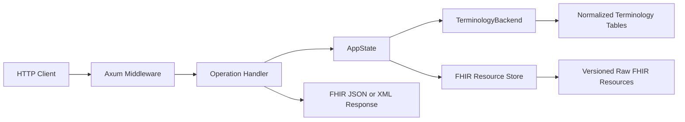
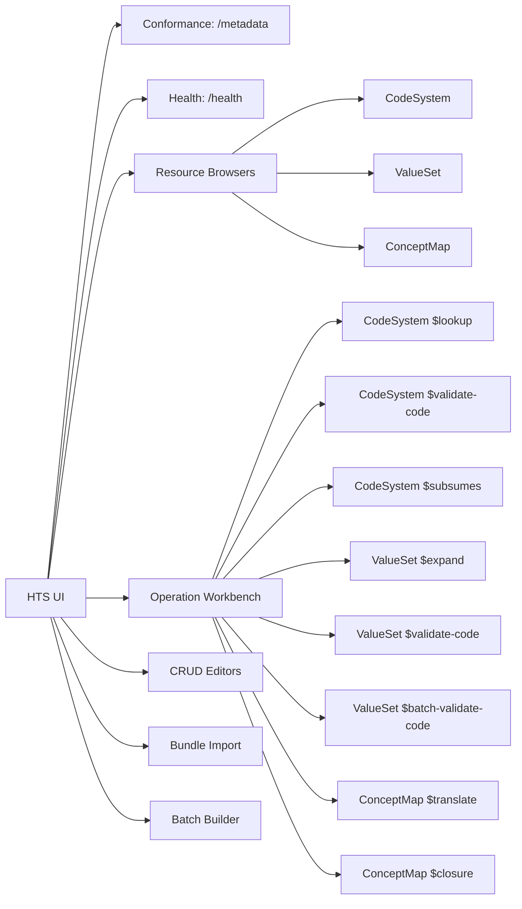

# Helios Terminology Server (HTS): Architecture, Operations, and REST API

This document is a code-first reference for the Helios Terminology Server in
[`crates/hts`](../../crates/hts). It records the findings from the local HFS
setup session and describes the complete HTTP and operator-facing surface
needed to design a future HTS UI.

The implementation is authoritative. Where the crate README, project skill, or
FHIR conformance metadata differs from the registered routes or handler code,
this document calls out the difference.

## Contents

1. [Executive summary](#executive-summary)
2. [Architecture](#architecture)
3. [Feature flags and storage](#feature-flags-and-storage)
4. [Configuration](#configuration)
5. [Startup and middleware](#startup-and-middleware)
6. [Complete HTTP route inventory](#complete-http-route-inventory)
7. [Utility and conformance APIs](#utility-and-conformance-apis)
8. [CodeSystem APIs](#codesystem-apis)
9. [ValueSet APIs](#valueset-apis)
10. [ConceptMap APIs](#conceptmap-apis)
11. [Batch and import APIs](#batch-and-import-apis)
12. [Search and CRUD conventions](#search-and-crud-conventions)
13. [Cross-cutting HTTP behavior](#cross-cutting-http-behavior)
14. [Error model](#error-model)
15. [Terminology import and bootstrap](#terminology-import-and-bootstrap)
16. [Bundled terminology data](#bundled-terminology-data)
17. [Integration with HFS, FHIRPath, SOF, and UI](#integration-with-hfs-fhirpath-sof-and-ui)
18. [Local build and run procedure](#local-build-and-run-procedure)
19. [UI design map](#ui-design-map)
20. [Implementation gaps and documentation drift](#implementation-gaps-and-documentation-drift)
21. [Source map](#source-map)

---

## Executive summary

HTS is a standalone FHIR terminology service implemented in Rust and Axum. It
has its own binary (`hts`), database, startup/import workflow, and HTTP API.
The default runtime is:

| Setting | Default |
|---|---|
| Bind address | `127.0.0.1:8090` |
| FHIR version | R4, selected at compile time |
| Storage | SQLite |
| Database | `./data/hts.db` |
| CORS | Enabled, origin `*` |
| Request limit | 10 MiB after decompression |
| Expansion limit | 3,500 concepts through the CLI runtime |
| Authentication | None in HTS itself |

The code exposes **42 method/path pairs**:

- 41 routes registered in [`server.rs`](../../crates/hts/src/server.rs)
- `GET /metrics` from the merged observability router

Core capabilities:

- CodeSystem `$lookup`, `$validate-code`, and `$subsumes`
- ValueSet `$expand`, `$validate-code`, and `$batch-validate-code`
- ConceptMap `$translate` and `$closure`
- Search and CRUD for CodeSystem, ValueSet, and ConceptMap
- Root batch/transaction Bundle processing for selected operations
- HTTP FHIR Bundle import
- Filesystem imports for HL7 packages, SNOMED CT, LOINC, RxNorm, ICD,
  UCUM, NCI Thesaurus, MeSH, DICOM, HL7 v2, NUCC, and NDC
- SQLite and PostgreSQL backends
- JSON responses and generic FHIR XML response serialization
- gzip, deflate, Brotli, and Zstandard transport compression
- BCP-47-aware designation/display selection
- SNOMED Expression Constraint Language (ECL) expansion

Two endpoints are present in code but omitted from the main README operation
tables:

- `POST /ValueSet/$batch-validate-code`
- `GET /metrics`

The CapabilityStatement advertises a server-level `$versions` operation, but
no `$versions` route is registered.

---

## Architecture

### Workspace component

[`crates/hts/Cargo.toml`](../../crates/hts/Cargo.toml) defines both:

- library: `helios_hts`
- binary: `hts`

The library exposes the router, state, backends, importers, operations, types,
and traits so integration tests can build an in-process server.

### Source layout

| Area | Important files | Responsibility |
|---|---|---|
| Binary/bootstrap | `main.rs`, `config.rs` | CLI parsing, observability, database initialization, bootstrap import, listener |
| Router | `server.rs` | Routes and middleware |
| Shared state | `state.rs` | Backend, resource stores, pools, caches, expansion limit |
| Backend contracts | `traits/*.rs` | CodeSystem, ValueSet, ConceptMap, metadata, cache traits |
| SQLite | `backends/sqlite/*` | Default persistence, normalized terminology tables, FTS, closure tables |
| PostgreSQL | `backends/postgres/*` | PostgreSQL parity implementation |
| Operations | `operations/*.rs` | HTTP handlers and operation orchestration |
| Imports | `import/*.rs` | Native terminology readers and FHIR Bundle construction |
| ECL | `ecl/parser.rs`, `ecl/evaluator.rs` | SNOMED Expression Constraint Language |
| Shared types | `types.rs` | Lookup, validation, expansion, translation, search, closure types |
| Errors | `error.rs` | `HtsError` and OperationOutcome conversion |
| Language | `language.rs` | BCP-47 display/designation matching |
| UCUM/MIME validation | `ucum_validate.rs`, `bcp13.rs` | UCUM and BCP-13 mime-type checks |

### Request flow



HTS stores both normalized terminology rows for operation performance and raw
FHIR resources for CRUD/read behavior. Handlers are generic over
`TerminologyBackend + BundleImportBackend`.

---

## Feature flags and storage

| Feature | Default | Effect |
|---|---:|---|
| `sqlite` | Yes | SQLite backend, r2d2 pool, bundled SQLite |
| `R4` | Yes | FHIR R4 models and persistence |
| `postgres` | No | PostgreSQL backend and deadpool |
| `R4B` | No | FHIR R4B models |
| `R5` | No | FHIR R5 models |
| `R6` | No | FHIR R6 models |
| `otel` | No | OTLP trace export through `helios-observability` |

### Runtime backend selection

`HTS_STORAGE_BACKEND` is matched case-sensitively:

| Build | Setting | Result |
|---|---|---|
| Default (`sqlite`, `R4`) | `sqlite` | SQLite starts |
| Default | `postgres` | Startup error: PostgreSQL feature not enabled |
| Build with `postgres` | `postgres` | PostgreSQL starts |
| Build without `sqlite` | `sqlite` | Startup error |

There is no runtime backend enum in the HTTP layer. `main.rs` constructs a
concrete backend and then instantiates the generic router.

### Pool defaults

- SQLite r2d2 pool: 64 connections
- PostgreSQL deadpool: 32 connections
- Pool sizes are not currently operator-configurable through HTS flags
- Both backends apply schemas/migrations automatically at startup

---

## Configuration

### HTS runtime settings

| Setting | Environment variable | `hts run` flag | Default | Description |
|---|---|---|---|---|
| Port | `HTS_SERVER_PORT` | `--port` | `8090` | HTTP port |
| Host | `HTS_SERVER_HOST` | `--host` | `127.0.0.1` | Bind host |
| Log level | `HTS_LOG_LEVEL` | `--log-level` | `info` | `error`, `warn`, `info`, `debug`, `trace` |
| Database | `HTS_DATABASE_URL` | `--database-url` | `./data/hts.db` | SQLite path or PostgreSQL URL |
| Backend | `HTS_STORAGE_BACKEND` | `--storage-backend` | `sqlite` | `sqlite` or `postgres` |
| CORS enabled | `HTS_ENABLE_CORS` | `--enable-cors` | `true` | Enables configured CORS policy |
| CORS origins | `HTS_CORS_ORIGINS` | `--cors-origins` | `*` | Comma-separated origins |
| Max request body | `HTS_MAX_BODY_SIZE` | `--max-body-size` | `10485760` | Bytes after decompression |
| Max expansion | `HTS_MAX_EXPANSION_SIZE` | `--max-expansion-size` | `3500` | Maximum expansion concepts |
| Bootstrap path | `HTS_BOOTSTRAP_DIR` | `--bootstrap-dir` | empty | Startup terminology directory |
| Bootstrap batch | `HTS_BOOTSTRAP_BATCH_SIZE` | `--bootstrap-batch-size` | `5000` | Concepts per bootstrap batch |
| Import languages | `HTS_IMPORT_LANGUAGES` | `--import-languages` | empty/all | SNOMED/LOINC BCP-47 filter; English retained |

`HtsConfig::default()` internally uses an expansion maximum of 10,000, while
the CLI default is 3,500. Normal binary startup uses the CLI value.

### Observability settings

| Variable | Default | Effect |
|---|---|---|
| `HELIOS_OBS_MODE` | default mode | `default`, `full`, `no-span`, or `off` |
| `RUST_LOG` | falls back to `HTS_LOG_LEVEL` | Tracing filter |
| `OTEL_EXPORTER_OTLP_ENDPOINT` | unset | OTLP endpoint when built with `otel` |
| `OTEL_SERVICE_NAME` | `hts` | OTLP service name |

---

## Startup and middleware

### Startup sequence

SQLite:

1. Parse `run` settings; a bare `hts` is equivalent to `hts run`.
2. Initialize uptime, telemetry, and Prometheus metrics.
3. Open SQLite, configure PRAGMAs, create schema, and apply migrations.
4. If configured, synchronize `HTS_BOOTSTRAP_DIR`.
5. Rebuild concept closures and the FTS index.
6. Initialize the raw FHIR resource store on the same database.
7. Build `AppState` with backend, stores, pool, caches, and expansion limit.
8. Build the Axum router.
9. Bind the configured listener and serve.

PostgreSQL follows the same broad sequence, replacing SQLite FTS finalization
with PostgreSQL closure rebuilding.

### Middleware stack

Outermost to innermost:

1. HTTP tracing (`TraceLayer`)
2. 30-second timeout, returning HTTP 408
3. CORS
4. Helios observability request tracking
5. Response compression
6. Request decompression
7. Configured body-size limit on decompressed bytes

Supported content encodings: `gzip`, `deflate`, `br`, and `zstd`. Unsupported
encodings return 415. Oversized decompressed bodies return 413.

### Route ordering

Instance operation routes are intentionally registered before generic
`/{id}` CRUD routes. For example, `/ValueSet/{id}/$expand` must be registered
before `/ValueSet/{id}` so the operation suffix is not captured as an id.

---

## Complete HTTP route inventory

### Utility, conformance, batch, and import

| Method | Path | Handler |
|---|---|---|
| POST | `/` | Root batch/transaction |
| GET | `/health` | Process health |
| GET | `/metadata` | CapabilityStatement or TerminologyCapabilities |
| POST | `/import` | FHIR Bundle import |
| GET | `/metrics` | Prometheus exposition |

### CodeSystem

| Method | Path | Capability |
|---|---|---|
| GET | `/CodeSystem/$lookup` | Query-string lookup |
| POST | `/CodeSystem/$lookup` | Parameters-body lookup |
| GET | `/CodeSystem/$validate-code` | Query-string validation |
| POST | `/CodeSystem/$validate-code` | Parameters-body validation |
| GET | `/CodeSystem/$subsumes` | Query-string hierarchy test |
| POST | `/CodeSystem/$subsumes` | Parameters-body hierarchy test |
| GET | `/CodeSystem` | Search |
| POST | `/CodeSystem` | Create |
| GET | `/CodeSystem/{id}/$lookup` | Instance lookup |
| POST | `/CodeSystem/{id}/$lookup` | Instance lookup |
| GET | `/CodeSystem/{id}` | Read |
| PUT | `/CodeSystem/{id}` | Update |
| DELETE | `/CodeSystem/{id}` | Delete |

### ValueSet

| Method | Path | Capability |
|---|---|---|
| GET | `/ValueSet/$expand` | Query-string expansion |
| POST | `/ValueSet/$expand` | Parameters-body expansion |
| GET | `/ValueSet/$validate-code` | Query-string validation |
| POST | `/ValueSet/$validate-code` | Parameters-body validation |
| POST | `/ValueSet/$batch-validate-code` | Multi-code validation |
| GET | `/ValueSet` | Search |
| POST | `/ValueSet` | Create |
| GET | `/ValueSet/{id}/$expand` | Instance expansion |
| POST | `/ValueSet/{id}/$expand` | Instance expansion |
| GET | `/ValueSet/{id}/$validate-code` | Instance validation |
| POST | `/ValueSet/{id}/$validate-code` | Instance validation |
| GET | `/ValueSet/{id}` | Read |
| PUT | `/ValueSet/{id}` | Update |
| DELETE | `/ValueSet/{id}` | Delete |

### ConceptMap

| Method | Path | Capability |
|---|---|---|
| GET | `/ConceptMap/$translate` | Query-string translation |
| POST | `/ConceptMap/$translate` | Parameters-body translation |
| POST | `/ConceptMap/$closure` | Closure calculation |
| GET | `/ConceptMap` | Search |
| POST | `/ConceptMap` | Create |
| GET | `/ConceptMap/{id}/$translate` | Instance translation |
| POST | `/ConceptMap/{id}/$translate` | Instance translation |
| GET | `/ConceptMap/{id}` | Read |
| PUT | `/ConceptMap/{id}` | Update |
| DELETE | `/ConceptMap/{id}` | Delete |

Total: **42 method/path pairs**.

---

## Utility and conformance APIs

### `GET /health`

Always returns HTTP 200. It does not test database connectivity.

```json
{
  "status": "ok",
  "service": "hts",
  "version": "0.2.1",
  "backend": "sqlite",
  "uptime_seconds": 120.25,
  "started_at": "2026-08-18T04:00:00Z",
  "timestamp": "2026-08-18T04:02:00Z"
}
```

UI use: process status and runtime information, not a dependency-readiness
probe.

### `GET /metrics`

Returns Prometheus text exposition. If metrics initialization was skipped, it
returns 503 with the plain-text body `metrics recorder not initialized\n`.

UI use: normally not rendered in the terminology UI; consumed by monitoring.

### `GET /metadata`

| Query | Response |
|---|---|
| none | CapabilityStatement |
| `mode=full` | CapabilityStatement |
| `mode=terminology` | TerminologyCapabilities |

Any mode other than `terminology` falls back to CapabilityStatement.
`_format` or `Accept` can select XML.

The CapabilityStatement advertises:

- CodeSystem: read/create/update/delete/search-type; lookup/validate-code/subsumes
- ValueSet: read/create/update/delete/search-type; expand/validate-code
- ConceptMap: read/create/update/delete/search-type; translate/closure
- search parameters: `url`, `version`, `name`, `title`, `status`
- formats: `application/fhir+json`, `application/fhir+xml`

Conformance mismatches:

- `$batch-validate-code`, `/import`, root batch, and `/metrics` are not
  advertised.
- `$versions` is advertised at server level but has no route.

FHIR version is compile-time:

| Feature | `fhirVersion` |
|---|---|
| R4 | `4.0.1` |
| R4B | `4.3.0` |
| R5 | `5.0.0` |
| R6 | `6.0.0` |

There is no `HTS_DEFAULT_FHIR_VERSION` runtime switch.

---

## CodeSystem APIs

### `$lookup`

Routes:

- `GET /CodeSystem/$lookup`
- `POST /CodeSystem/$lookup`
- `GET /CodeSystem/{id}/$lookup`
- `POST /CodeSystem/{id}/$lookup`

Type-level parameters:

| Name | Type | Required | Notes |
|---|---|---:|---|
| `system` | uri/string | Yes | Canonical CodeSystem URL |
| `code` | code/string | Yes | Concept code |
| `version` | string | No | Exact CodeSystem version |
| `displayLanguage` | code/string | No | Explicit value overrides `Accept-Language` |
| `property` | code/string, repeatable | No | Requested properties; `*` requests all |
| `date` | date/dateTime/string | No | Point-in-time lookup |
| `expression` | string | No | Recognized but returns 501 |
| `useSupplement` | canonical/uri, repeatable | No | POST works; GET string conversion is ineffective |

Instance routes derive `system` from `{id}` and override a supplied system.

Representative POST:

```json
{
  "resourceType": "Parameters",
  "parameter": [
    {"name": "system", "valueUri": "http://example.org/cs"},
    {"name": "code", "valueCode": "ABC"},
    {"name": "property", "valueCode": "*"}
  ]
}
```

The response is a Parameters resource containing some combination of:
`name`, `version`, `display`, `definition`, `system`, `code`, `abstract`,
repeatable `property`, repeatable `designation`, and `used-supplement`.
Hierarchy is exposed through `property=parent` and `property=child`, not
top-level `subsumedBy` fields.

Status:

- 200 success
- 400 missing/invalid parameters
- 404 unknown concept, instance id, or supplement
- 501 when `expression` is supplied
- 500 storage/internal failure

UI form: system or instance selector, code, version, display language,
repeatable property selector, date, and optional supplements.

### CodeSystem `$validate-code`

Routes:

- `GET /CodeSystem/$validate-code`
- `POST /CodeSystem/$validate-code`

There is no CodeSystem instance-level `$validate-code`.

POST input forms:

1. `url` or `system` plus `code`
2. `coding` (`valueCoding`)
3. `codeableConcept` (`valueCodeableConcept`)

Optional parameters:

| Name | Purpose |
|---|---|
| `display` | Expected display |
| `version` / `systemVersion` | Version selection |
| `displayLanguage` | Display validation language |
| `lenient-display-validation` | Downgrade display mismatch to warning |
| `abstract` | Whether abstract concepts are acceptable |
| `date` | Point-in-time validation |
| `activeOnly` | Reject inactive concepts where applicable |
| `useSupplement` | Apply terminology supplement |
| `force-system-version` | Force `system|version` |
| `system-version` | Default `system|version` |
| `check-system-version` | Verify selected version |

GET supports the scalar `url`/`system` plus `code` form. Structured Coding and
CodeableConcept inputs are POST-only.

The response is Parameters with `result` and optional `code`, `system`,
`version`, `display`, `inactive`, `status`, `message`, `issues`,
`normalized-code`, and unknown-system markers. Invalid codes normally return
HTTP 200 with `result=false`; they are not transport-level 404 errors.

UI form: input-mode selector (code, Coding, CodeableConcept), CodeSystem,
version controls, display/language, active/abstract toggles, supplements, and
an OperationOutcome-aware result panel.

### `$subsumes`

Routes:

- `GET /CodeSystem/$subsumes`
- `POST /CodeSystem/$subsumes`

Bare-code form:

| Parameter | Required |
|---|---:|
| `system` | Yes |
| `codeA` | Yes |
| `codeB` | Yes |
| `version` | No |

POST additionally accepts `codingA` and `codingB`; both must share a system.

Response:

```json
{
  "resourceType": "Parameters",
  "parameter": [
    {"name": "outcome", "valueCode": "subsumes"}
  ]
}
```

Possible outcomes: `equivalent`, `subsumes`, `subsumed-by`,
`not-subsumed`.

UI form: system/version selector, two code or Coding inputs, and a directional
relationship result.

---

## ValueSet APIs

### `$expand`

Routes:

- `GET /ValueSet/$expand`
- `POST /ValueSet/$expand`
- `GET /ValueSet/{id}/$expand`
- `POST /ValueSet/{id}/$expand`

The system route accepts a canonical `url` or inline `valueSet`. Instance
routes inject the canonical URL resolved from `{id}`.

#### Expansion parameter matrix

| Name | Type | Default | Behavior |
|---|---|---|---|
| `url` | uri/canonical/string | — | ValueSet canonical; supports `url|version` |
| `valueSet` | embedded resource | — | Inline ValueSet, POST only |
| `valueSetVersion` | string | backend choice | Explicit ValueSet version |
| `filter` | string | none | Code/display text filter |
| `count` | integer | unlimited | Flat-result page size |
| `offset` | integer | `0` | Flat-result offset |
| `hierarchical` | boolean | inferred | Explicit tree mode |
| `excludeNested` | boolean | inferred | `true` requests flat output |
| `date` | dateTime | none | Point-in-time expansion |
| `activeOnly` | boolean | `false` | Remove inactive concepts |
| `includeDesignations` | boolean | `false` | Include designations |
| `designation` | string/code, repeatable | none | Language or designation-use filter |
| `displayLanguage` | code/string | header/default | Preferred display language |
| `property` | string/code, repeatable | none | Include concept properties |
| `useSupplement` | canonical, repeatable | none | Apply supplements |
| `tx-resource` | resource, repeatable | none | Ad-hoc terminology resources |
| `force-system-version` | canonical, repeatable | none | Force CodeSystem versions |
| `system-version` | canonical, repeatable | none | Default CodeSystem versions |
| `check-system-version` | canonical, repeatable | none | Verify CodeSystem versions |
| `default-valueset-version` | canonical, repeatable | none | Pin nested/top-level ValueSet versions |

The `X-TOO-COSTLY-THRESHOLD` request header can inject a request-specific
maximum expansion size.

Advertised in `TerminologyCapabilities.expansion.parameter` but not read by
the current expand handler:

- `includeDefinition`

Not advertised and not implemented:

- `excludeNotForUI`
- `excludePostCoordinated`
- `contextDirection`

Representative request:

```json
{
  "resourceType": "Parameters",
  "parameter": [
    {"name": "url", "valueUri": "http://example.org/vs/limbs"},
    {"name": "filter", "valueString": "arm"},
    {"name": "count", "valueInteger": 25},
    {"name": "includeDesignations", "valueBoolean": true}
  ]
}
```

Response: a ValueSet with populated `expansion.identifier`, `timestamp`,
`total`, optional `offset`, `contains`, parameters, properties, and warnings.

Important behavior:

- Text filtering, includes/excludes, property filters, and version pins
- ECL through compose filters (`property=constraint`) on SQLite
- implicit ValueSets through a CodeSystem `valueSet` URL
- `?fhir_vs` and `?fhir_vs=isa/{code}` implicit forms
- materialized and in-memory caches
- flat pagination; tree mode generally ignores paging
- active-only filtering with child promotion
- supplements and multilingual designations

Status:

- 200 success
- 400 invalid request or version verification
- 404 unknown ValueSet/supplement
- 422 too costly or cyclic reference

UI form: canonical/instance/inline source selector, filter, page controls,
tree/flat control, language/designation/property controls, active-only,
version pin editor, supplement/resource editor, and warning display.

### ValueSet `$validate-code`

Routes:

- `GET /ValueSet/$validate-code`
- `POST /ValueSet/$validate-code`
- `GET /ValueSet/{id}/$validate-code`
- `POST /ValueSet/{id}/$validate-code`

Required source: `url`, inline `valueSet`, or instance id.

Code input: bare `code` and optional `system`, `coding`, or
`codeableConcept`.

Optional parameters include:

- `display`, `version`, `systemVersion`
- `valueSetVersion`, `displayLanguage`, `date`
- `activeOnly`, `abstract`, `lenient-display-validation`
- `useSupplement`, `tx-resource`
- `default-valueset-version`, `system-version`
- `force-system-version`, `check-system-version`

The response is Parameters with `result` plus normalized concept information
and optional embedded OperationOutcome issues. Membership failure is normally
HTTP 200 with `result=false`.

UI form: ValueSet selector, code input mode, system/version/display fields,
language and validation toggles, plus structured issues output.

### `POST /ValueSet/$batch-validate-code`

This code route is not listed in the main README operation table.

The outer Parameters body requires a principal ValueSet supplied as
`tx-resource`. It contains repeated `validation` parameters, each embedding a
Parameters resource with a code, Coding, or CodeableConcept.

Batch-level defaults such as `displayLanguage`, `valueSetVersion`,
`lenient-display-validation`, `abstract`, version pins, date, and supplements
are copied into each validation unless overridden.

Response:

- outer Parameters
- one `validation` parameter per request
- each `validation.resource` is either validate-code Parameters or an
  OperationOutcome

Well-formed batches return HTTP 200; per-item validation errors are embedded.

UI form: principal inline ValueSet editor, inherited defaults panel,
repeatable validation rows/import, and per-row result/issues table.

---

## ConceptMap APIs

### `$translate`

Routes:

- `GET /ConceptMap/$translate`
- `POST /ConceptMap/$translate`
- `GET /ConceptMap/{id}/$translate`
- `POST /ConceptMap/{id}/$translate`

Accepted POST parameters:

| Name | Notes |
|---|---|
| `url` | Optional ConceptMap canonical |
| `code` / `sourceCode` | Scalar source code |
| `system` / `sourceSystem` | Scalar source system |
| `coding` / `sourceCoding` | Structured source Coding |
| `codeableConcept` / `sourceCodeableConcept` | Structured source concept |
| `targetCode` | Reverse-translation code |
| `targetCoding` / `targetCodeableConcept` | Structured reverse input |
| `targetSystem` | Opposite-side system filter |
| `source` / `target` | Parsed ValueSet URLs; not currently applied in SQL lookup |
| `reverse` | Explicit reverse mode |
| `date` | Point-in-time ConceptMap filter |

Not accepted by current code: dependency, ConceptMap version, lowercase
`targetsystem`.

Response Parameters contains repeatable `match` groups and a final `result`.
Each match includes a `concept`, an R4/R4B `equivalence` or R5/R6
`relationship`, and either `originMap` (forward) or `source` (reverse).

No match returns HTTP 200 with `result=false` and a message.

UI form: map selector, forward/reverse mode, source Coding/CodeableConcept,
target constraints, date, and a match grid showing relationship and origin.

### `POST /ConceptMap/$closure`

Parameters:

| Name | Required | Notes |
|---|---:|---|
| `name` | Yes | Closure name |
| `concept` | No, repeatable | Coding with system and code |
| `version` | No | Accepted and carried internally, but never surfaced in the HTTP response |

The implementation is stateless. An initial name-only request returns an empty
ConceptMap. Later requests compute ancestor/descendant pairs among the codes in
that request; prior responses are not persisted or merged.

Response: Parameters containing `return.resource`, a ConceptMap with
`equivalence=subsumes` relationships.

UI form: closure name, repeatable Coding inputs, and a hierarchy/edge view.
Do not present this as a durable server-side closure session.

---

## Batch and import APIs

### `POST /` batch/transaction

Accepted outer Bundle types: `batch` and `transaction`. Both execute entries
independently and return `batch-response`; `transaction` is **not atomic**.

Supported exact `entry.request.url` values:

- `CodeSystem/$validate-code`
- `ValueSet/$validate-code`
- `ConceptMap/$translate`

`entry.request.method` is ignored. Unsupported URLs produce an entry-level
400 OperationOutcome. One failed entry does not abort later entries. A valid
outer Bundle returns HTTP 200 even when entries fail.

UI form: Bundle editor/import, entry operation selector restricted to the
three supported URLs, and per-entry response/status display. Label transaction
as non-atomic to avoid misleading users.

### `POST /import`

This is not a FHIR Parameters operation.

- Body extractor: raw bytes
- Body: JSON FHIR Bundle
- XML input: not supported
- Bundle type: not validated
- Imported entries: CodeSystem, ValueSet, ConceptMap
- Other resource types: skipped
- Response: non-FHIR JSON summary

Response fields:

```json
{
  "code_systems": 1,
  "value_sets": 1,
  "concept_maps": 0,
  "concepts": 12,
  "errors": []
}
```

Status:

- 200 import without non-fatal errors
- 207 import completed with errors
- 400 invalid JSON or non-Bundle root
- 500 backend failure

UI form: JSON Bundle upload/editor, preview counts, execute button, and summary
with a non-fatal error list. Do not offer XML for this endpoint.

---

## Search and CRUD conventions

### Search

Routes:

- `GET /CodeSystem`
- `GET /ValueSet`
- `GET /ConceptMap`

Supported query fields:

| Parameter | Behavior |
|---|---|
| `url` | Exact |
| `version` | Exact |
| `name` | Exact |
| `title` | Exact |
| `status` | Exact |
| `_count` | Page size, default 20 |
| `_offset` | Zero-based offset, default 0 |
| `_summary=true` | Summary mode for CodeSystem/ValueSet; ignored for ConceptMap |

Response is a `searchset` Bundle. `total` is the number of entries on the
current page, not the full matching count. Pagination links are not populated.

Not implemented: `_id`, `_sort`, accurate `_total`, modifiers, chained
parameters, `_include`, and `_elements`.

Search handlers return JSON and do not use the operation content-negotiation
helper.

### Create

- `POST /CodeSystem`
- `POST /ValueSet`
- `POST /ConceptMap`

Body: complete JSON resource. Success returns 201, a `Location` header,
weak ETag, and the stored resource. Normalized tables are updated and
terminology caches are invalidated.

### Read

- `GET /CodeSystem/{id}`
- `GET /ValueSet/{id}`
- `GET /ConceptMap/{id}`

Success returns 200 and an ETag. Missing or soft-deleted resources return 404.

### Update

- `PUT /CodeSystem/{id}`
- `PUT /ValueSet/{id}`
- `PUT /ConceptMap/{id}`

Optional `If-Match` supports optimistic concurrency. A mismatch returns 412.
Successful updates return 200, a new ETag, re-index normalized data, and clear
caches.

### Delete

- `DELETE /CodeSystem/{id}`
- `DELETE /ValueSet/{id}`
- `DELETE /ConceptMap/{id}`

Returns 204. The raw resource is soft-deleted and normalized terminology rows
are removed.

---

## Cross-cutting HTTP behavior

### GET versus POST operation parameters

GET operation routes convert every query pair to `valueString`. They cannot
represent structured Coding, CodeableConcept, embedded resource, boolean, or
integer values with native FHIR types.

POST operation routes read a JSON Parameters body and support `valueXxx`,
`part`, and embedded `resource` forms. Query parameters on POST are used for
`_format`; operation inputs in the query are not merged with the body.

Repeated GET keys work for repeatable string parameters.

### Content negotiation

`_format` takes precedence over `Accept`.

| Request | Result |
|---|---|
| `_format=xml` | XML |
| `_format=application/fhir+xml` | XML |
| `_format=json` | JSON even if Accept requests XML |
| Accept containing `xml` | XML |
| Missing/unrecognized | JSON |

Accept parsing is substring-based and does not honor quality weights. An
Accept header containing any XML media type selects XML even if JSON has a
higher `q` value.

Most JSON responses use Axum `application/json`; `$expand` explicitly uses
`application/fhir+json`. XML uses
`application/fhir+xml; charset=utf-8`.

XML is response-only and is generated by a generic JSON-to-FHIR-XML converter.
POST bodies are JSON. `/health`, search, and `/import` are JSON-only.

Errors are JSON OperationOutcome even when XML was requested.

### Language handling

Explicit `displayLanguage` wins over `Accept-Language`. When absent,
supporting handlers inject the first non-wildcard language from the header.

BCP-47 match ranking:

1. exact tag
2. separator-insensitive exact form
3. same primary language

Examples: `de-DE` can match `de`; `fr` can match `fr-CA`. There is no global
English fallback. Without a requested language, the default concept display
is used.

Handlers using language negotiation: lookup, expand, and validation.
Subsumes, translate, closure, and batch validation do not uniformly read the
header.

### CORS

- disabled: a bare non-permissive CORS layer
- enabled with `*`: permissive
- explicit origins: GET, POST, PUT, DELETE, OPTIONS and common FHIR headers

### Authentication

HTS has no built-in authentication or authorization middleware. Deployments
requiring protection must put HTS behind an authenticated reverse proxy,
service mesh, or private network boundary. A future administrative UI must not
assume that CRUD/import endpoints are protected.

---

## Error model

Standard application errors return a JSON FHIR OperationOutcome.

| `HtsError` | HTTP | Severity | Issue code | Notes |
|---|---:|---|---|---|
| `NotFound` | 404 | error | `not-found` | Missing resource/concept |
| `NotSupported` | 501 | error | `not-supported` | Recognized unsupported feature |
| `InvalidRequest` | 400 | error | `invalid` | Invalid/missing input |
| `VsInvalid` | 400 | error | `invalid` | ValueSet processing issue |
| `Internal` | 500 | error | `exception` | Internal failure |
| `StorageError` | 500 | error | `exception` | Backend failure |
| `PreconditionFailed` | 412 | error | `conflict` | ETag mismatch |
| `TooCostly` | 422 | error | `too-costly` | Expansion limit |

Special paths produce IG-compatible OperationOutcome variants for invalid
display language, ValueSet version checks, unknown CodeSystem versions, and
cyclic ValueSet references.

Infrastructure failures generated before handlers, such as malformed JSON,
408 timeout, 413 body limit, and 415 encoding/media rejection, may not use the
standard `HtsError` OperationOutcome shape.

---

## Terminology import and bootstrap

### CLI commands

```text
hts run [OPTIONS]
hts import <PATH> [OPTIONS]
```

A bare `hts` starts the server.

`hts import` options:

| Flag | Default | Purpose |
|---|---|---|
| `--format` | auto-detect | Force importer |
| `--database-url` | `./data/hts.db` | Target DB |
| `--storage-backend` | `sqlite` | Backend |
| `--log-level` | `info` | Logging |
| `--batch-size` | `500` | Import batch size |
| `--languages` | all | SNOMED/LOINC languages |
| `--dry-run` | false | Parse/count only |
| `--verbose` | false | Progress and debug logging |

Exit codes:

- 0: success
- 1: fatal failure
- 2: completed with non-fatal errors

### Import formats

| Format | Typical input | Auto-detected | Canonical output |
|---|---|---:|---|
| `hl7-npm` | `.tgz`, `.tar.gz` | Yes | URLs in package resources |
| `snomed-rf2` | RF2 zip | Yes | `http://snomed.info/sct` |
| `loinc` | LOINC zip | Yes | `http://loinc.org` |
| `icd10-cm` | tabular XML/zip | Yes | `http://hl7.org/fhir/sid/icd-10-cm` |
| `icd9-cm` | description zip | Yes | `http://hl7.org/fhir/sid/icd-9-cm` |
| `rxnorm` | RRF file/zip/directory | Yes | NLM RxNorm canonical |
| `ucum` | essence XML | Yes | `http://unitsofmeasure.org` |
| `nci-thesaurus` | flat text/zip | Yes | NCI Thesaurus canonical |
| `mesh` | descriptor XML/zip | Yes | NLM MeSH canonical |
| `dicom` | DICOM table in zip | Zip detection | DICOM DCM canonical |
| `hl7-v2-tables` | HL7 v2 XML | No; force format | THO v2 CodeSystems |
| `nucc` | taxonomy CSV/zip | Yes | NUCC taxonomy canonical |
| `ndc` | `product.txt`/zip | Yes | NDC canonical |
| `fhir-bundle` | JSON Bundle | Yes | Resource URLs |

Not implemented: HCPCS Level II, ICD-11, CPT, MedDRA.

SNOMED CT, LOINC, and RxNorm are not bundled because they require licenses,
registration, or accepted terms.

### Bootstrap synchronization

Set `HTS_BOOTSTRAP_DIR` to synchronize a terminology directory before the
server listens.

The `bootstrap_imports` ledger stores:

- file name
- content hash
- byte size
- modification timestamp
- import language selection
- import timestamp

Regular files use streaming SHA-256. RxNorm directories use a sorted
name-and-size signature to avoid hashing multi-gigabyte contents on every
boot. Size/mtime/language matching provides a cheaper first skip.

Changed files or language selections are re-imported. Unchanged files are
skipped. A missing configured directory logs a warning and does not prevent
startup. Fatal directory/finalization errors do prevent startup; individual
file errors are accumulated while processing continues.

---

## Bundled terminology data

Repository path:
[`crates/hts/terminology-data`](../../crates/hts/terminology-data)

| File | Approx. size | Contents |
|---|---:|---|
| `desc2026.zip` | 16.0 MB | MeSH 2026 |
| `hl7.fhir.r4.core-4.0.1.tgz` | 12.2 MB | FHIR R4 core |
| `hl7.fhir.us.core-8.0.1.tgz` | 2.6 MB | US Core |
| `hl7.fhir.uv.ips-2.0.0.tgz` | 0.7 MB | International Patient Summary |
| `hl7.terminology-7.1.0.tgz` | 4.5 MB | HL7 terminology |
| `hl7.terminology.r4-7.1.0.tgz` | 4.5 MB | R4 terminology |
| `hl7.terminology.r5-7.1.0.tgz` | 4.5 MB | R5 terminology |
| `ICD-9-CM-v32-master-descriptions.zip` | 1.0 MB | ICD-9-CM |
| `icd10cm-table-and-index-2026.zip` | 17.9 MB | ICD-10-CM 2026 |
| `ndctext-current.zip` | 10.0 MB | FDA NDC |
| `nucc_taxonomy_251.csv` | 0.5 MB | NUCC provider taxonomy |
| `Thesaurus_26.03e.FLAT.zip` | 16.1 MB | NCI Thesaurus |
| `ucum-essence-v2.2.xml` | 0.1 MB | UCUM |
| `us.cdc.phinvads-0.12.0.tgz` | 18.0 MB | CDC PHIN VADS |
| `us.nlm.vsac-0.17.0.tgz` | 42.2 MB | NLM VSAC |
| `vsac-supplement.bundle.json` | small | Demonstration/supplemental ValueSets |

The checked-in data totals roughly 148 MB. VSAC resources may reference
terminologies whose content has separate licensing requirements.

---

## Integration with HFS, FHIRPath, SOF, and UI

### HFS REST search

Configure:

```powershell
$env:HFS_TERMINOLOGY_SERVER = "http://127.0.0.1:8090"
```

[`crates/rest/src/terminology.rs`](../../crates/rest/src/terminology.rs)
constructs a no-proxy HTTP client with:

- 2-second connect timeout
- 10-second request timeout
- explicit `.no_proxy()` to avoid corporate/internal proxy hangs

Search behavior:

| Modifier | HTS behavior |
|---|---|
| token `:in` | POST ValueSet `$expand`, rewrite to OR token list |
| token `:below` | Inline ValueSet `$expand` with `is-a` |
| token `:above` | Inline ValueSet `$expand` with `generalizes` |
| URI/reference `:above`/`:below` | Native backend path, no HTS call |
| `:not-in` | Always 501; not implemented |

If HTS is configured but an expansion call fails, terminology preprocessing
currently fails open: it logs a warning and drops that filter. An empty
successful expansion uses a sentinel that matches nothing.

Without HTS, token `:in` and token hierarchy modifiers return 501.

### HFS resource validation

| Variable | Default | Values |
|---|---|---|
| `HFS_VALIDATION_TERMINOLOGY` | `embedded` | `off`, `embedded`, `remote` |
| `HFS_VALIDATION_TERMINOLOGY_TIMEOUT_MS` | `3000` | Positive milliseconds |
| `HFS_VALIDATION_TERMINOLOGY_FAIL` | `open` | `open`, `closed` |

Remote mode calls `POST /ValueSet/$validate-code`, caches results for five
minutes, and requires `HFS_TERMINOLOGY_SERVER`.

- fail-open: outage becomes a warning
- fail-closed: outage becomes an error
- code not in a required ValueSet is an error in both modes

The default embedded mode validates against bundled core terminology without
calling HTS.

### FHIRPath

Configure `FHIRPATH_TERMINOLOGY_SERVER` directly. HFS startup propagates
`HFS_TERMINOLOGY_SERVER` into the FHIRPath setting when the latter is unset.

| FHIRPath function | HTS operation |
|---|---|
| `%terminologies.expand` | GET `/ValueSet/$expand` |
| `%terminologies.lookup` | POST `/CodeSystem/$lookup` |
| `%terminologies.validateVS` | POST `/ValueSet/$validate-code` |
| `%terminologies.validateCS` | POST `/CodeSystem/$validate-code` |
| `%terminologies.subsumes` | POST `/CodeSystem/$subsumes` |
| `%terminologies.translate` | POST `/ConceptMap/$translate` |
| `Coding.memberOf` | POST `/ValueSet/$validate-code` |

`subsumedBy` is not implemented as a separate terminology function.
Without a configured server, terminology-aware expressions fail evaluation.
`FHIRPATH_TERMINOLOGY_TIMEOUT` defaults to 30 seconds; zero disables timeout.

### SQL-on-FHIR

`SOF_TERMINOLOGY_SERVER` is propagated to
`FHIRPATH_TERMINOLOGY_SERVER` when the latter is unset. SOF does not maintain
a separate terminology client; ViewDefinition expressions call the FHIRPath
engine.

### Existing HFS UI integration

`GET /ui/editor/expand?url=...&filter=...` is an HFS UI proxy, not an HTS
route. It calls:

```text
GET {HFS_TERMINOLOGY_SERVER}/ValueSet/$expand?url=...&count=25&filter=...
```

It uses a 2.5-second timeout and returns a compact `codes` JSON array. Missing
configuration or HTS failures degrade silently to 204 so the editor remains a
plain text control.

---

## Local build and run procedure

The Rust and MinGW installation procedure for this machine is documented in
[`start-app.md`](start-app.md). The important paths are:

```text
Project: C:\Users\tercere\src\helios\hfs
Cargo:   C:\Users\tercere\.cargo\bin
MinGW:   C:\Users\tercere\mingw64-toolchain\mingw64\bin
```

### Build

```powershell
Remove-Item Env:HTTP_PROXY,Env:HTTPS_PROXY,Env:http_proxy,Env:https_proxy -ErrorAction SilentlyContinue
$env:Path = "$env:USERPROFILE\.cargo\bin;$env:USERPROFILE\mingw64-toolchain\mingw64\bin;$env:Path"
Set-Location C:\Users\tercere\src\helios\hfs
cargo build -p helios-hts
```

### Import bundled data explicitly

```powershell
.\target\debug\hts.exe import .\crates\hts\terminology-data `
  --database-url .\data\hts.db `
  --batch-size 500
```

### Run with startup bootstrap synchronization

```powershell
$env:HTS_DATABASE_URL = ".\data\hts.db"
$env:HTS_BOOTSTRAP_DIR = ".\crates\hts\terminology-data"
$env:HTS_LOG_LEVEL = "info"
.\target\debug\hts.exe run
```

Verify:

```powershell
Invoke-WebRequest http://127.0.0.1:8090/health -UseBasicParsing
Invoke-WebRequest http://127.0.0.1:8090/metadata -UseBasicParsing
Invoke-WebRequest "http://127.0.0.1:8090/metadata?mode=terminology" -UseBasicParsing
```

### Connect HFS

Stop and restart HFS with:

```powershell
$env:HFS_TERMINOLOGY_SERVER = "http://127.0.0.1:8090"
$env:FHIRPATH_TERMINOLOGY_SERVER = "http://127.0.0.1:8090"
.\target\debug\hfs.exe
```

---

## UI design map



Recommended pages:

1. Dashboard: health, backend, uptime, terminology capabilities
2. CodeSystem browser/editor: search, read, concepts, lookup, validate, subsumes
3. ValueSet browser/editor: search, compose, expand, validate, batch validate
4. ConceptMap browser/editor: search, groups/elements, translate, closure
5. Import: Bundle upload plus operator CLI/bootstrap guidance
6. Batch workbench: supported per-entry operations only
7. Diagnostics: OperationOutcome renderer and optional Prometheus link

Security requirement: because HTS itself has no auth, destructive/editor pages
must be gated by deployment-level authentication before production use.

---

## Implementation gaps and documentation drift

### Code versus README/skill

- Code-only routes: `POST /ValueSet/$batch-validate-code`, `GET /metrics`
- The workspace skill omits GET operation variants, instance operation routes,
  search routes, root batch, batch validation, and metrics
- README import lists understate the `fhir-bundle` importer
- `HTS_MAX_EXPANSION_SIZE`, bootstrap batch/language settings, observability
  variables, and middleware timeout behavior are incompletely summarized in
  the skill/README

### Metadata versus code

- `$versions` is advertised but not routed
- `$batch-validate-code`, `/import`, root batch, and `/metrics` are routed but
  not advertised
- TerminologyCapabilities advertises `includeDefinition` in
  `expansion.parameter`, but the `$expand` handler does not read it

### API limitations important to a UI

- Request XML is unsupported
- Search is exact and minimally parameterized
- Search `total` is page count, not total matches
- Search has no pagination links
- Root `transaction` is not atomic
- Closure is stateless
- GET operation inputs are strings only
- POST operation query parameters are not merged with Parameters bodies
- Errors do not honor XML negotiation
- `/health` does not check database readiness
- `/import` returns a non-FHIR JSON summary
- `:not-in` remains unimplemented in HFS even with HTS configured

---

## Source map

Primary HTS sources:

- [`crates/hts/README.md`](../../crates/hts/README.md)
- [`crates/hts/Cargo.toml`](../../crates/hts/Cargo.toml)
- [`crates/hts/src/main.rs`](../../crates/hts/src/main.rs)
- [`crates/hts/src/config.rs`](../../crates/hts/src/config.rs)
- [`crates/hts/src/server.rs`](../../crates/hts/src/server.rs)
- [`crates/hts/src/state.rs`](../../crates/hts/src/state.rs)
- [`crates/hts/src/error.rs`](../../crates/hts/src/error.rs)
- [`crates/hts/src/types.rs`](../../crates/hts/src/types.rs)
- [`crates/hts/src/operations`](../../crates/hts/src/operations)
- [`crates/hts/src/backends`](../../crates/hts/src/backends)
- [`crates/hts/src/import`](../../crates/hts/src/import)
- [`crates/hts/src/ecl`](../../crates/hts/src/ecl)
- [`crates/hts/tests`](../../crates/hts/tests)
- [`crates/hts/terminology-data`](../../crates/hts/terminology-data)

Integration sources:

- [`crates/rest/src/terminology.rs`](../../crates/rest/src/terminology.rs)
- [`crates/rest/src/handlers/search.rs`](../../crates/rest/src/handlers/search.rs)
- [`crates/rest/src/validation.rs`](../../crates/rest/src/validation.rs)
- [`crates/fhirpath/src/terminology_functions.rs`](../../crates/fhirpath/src/terminology_functions.rs)
- [`crates/fhirpath/src/terminology_client.rs`](../../crates/fhirpath/src/terminology_client.rs)
- [`crates/sof/src/cli.rs`](../../crates/sof/src/cli.rs)
- [`crates/sof/src/server.rs`](../../crates/sof/src/server.rs)
- [`crates/ui/src/editor.rs`](../../crates/ui/src/editor.rs)
- [`crates/hfs/src/main.rs`](../../crates/hfs/src/main.rs)
- [`crates/observability/src/metrics.rs`](../../crates/observability/src/metrics.rs)

Operational references:

- [`edson/docs/start-app.md`](start-app.md)
- [HTS project skill](../../.claude/skills/work-with-hts/SKILL.md)
- [HFS runtime skill](../../.claude/skills/run-hfs-server/SKILL.md)
