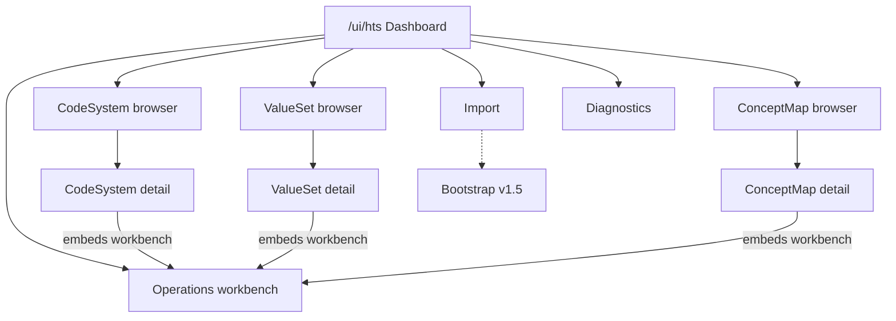
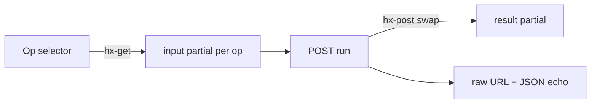
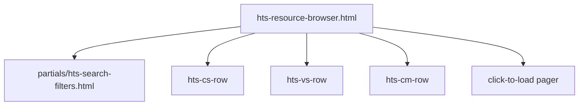
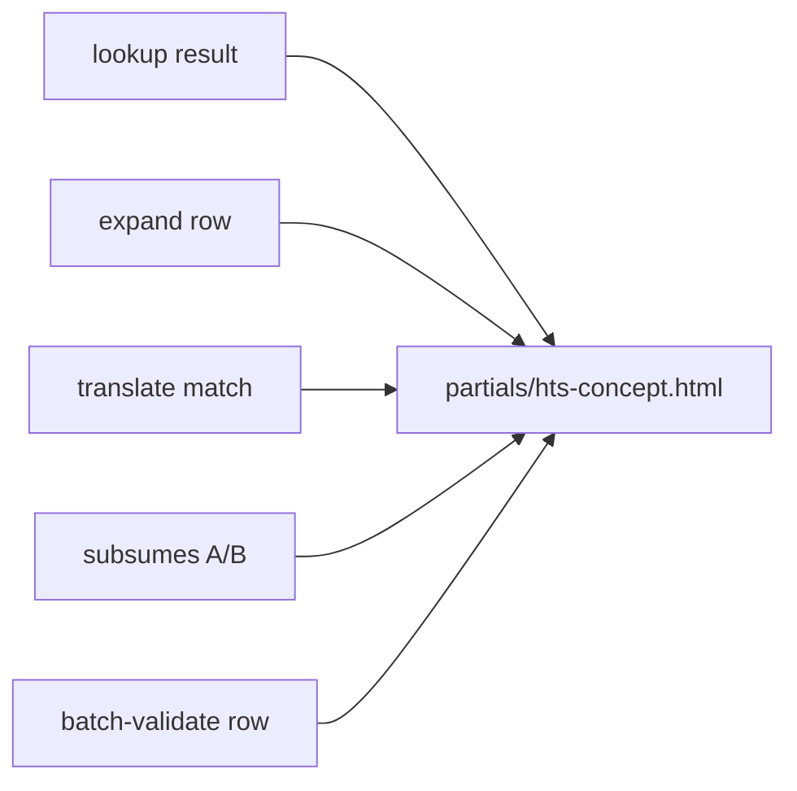
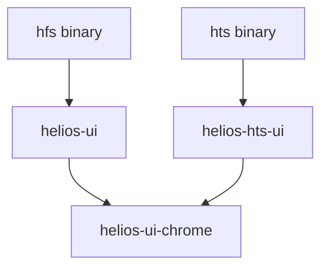

# HTS UI design document

Design artifact for the Helios Terminology Server administrative console
([issue #551](https://github.com/HeliosSoftware/hfs/issues/551)). Implementation
follows `crates/ui` house rules; this document locks scope, information
architecture, reuse strategy, and phasing before code lands.

**Status:** v1 shipped on `feat/551-hts-ui` (§7.1–§7.7 + §7.9; §7.8 Bootstrap ledger deferred as its own future mini-issue). Tests green: `cargo test -p helios-hts-ui` 80/0, `pnpm --filter helios-hts-ui-e2e test` 75/0/3 skipped. **§9 shared-chrome extraction (`helios-ui-chrome`) is deferred out of #551 scope entirely (2026-08-21 decision)** — v1 achieved visual parity via the in-place shared-assets arrangement documented in §14; the crate extraction remains a valid future refactor but ships as its own dedicated issue, not part of #551. See §9.0 for the defer rationale.  
**Companion API truth:** [hts-details.md](hts-details.md).  
**Fetched / authored:** 2026-08-18.

---

## 1. Requirement (verbatim)

> Reproduced verbatim from
> [HeliosSoftware/hfs#551](https://github.com/HeliosSoftware/hfs/issues/551)
> (fetched 2026-08-18). The sections below answer or elaborate on every open
> question.

````markdown
## Summary

Research what a FHIR terminology-server UI needs to offer, then build one for HTS. Two phases: a requirements write-up informed by the spec and the reference implementations below, then implementation in the same style and with the same technologies as the existing HFS web UI.

Tracked on the roadmap under **Now — Actively In Progress** → Terminology → "Administrative UI for HTS".

## Note on "same style / same technologies"

HTS ships **no UI today** — `crates/hts/` contains no templates, stylesheets, or browser assets. So this is written on the assumption that the target is the existing HFS web UI (`crates/ui`, `helios-ui`): match its look, and use its technology choices. Correct me on this issue if a different reference was meant.

The house rules are in `crates/ui/README.md` ("Rules of the road") and are non-negotiable for this work:

- **Server-rendered Askama templates + htmx** for partial updates. Handlers return full pages on hard navigation, HTML fragments on `HX-Request`. State lives on the server.
- **No SPA framework, no bundler, no npm dependency** for browser code. The only vendored third-party script is pinned htmx; everything else is hand-written vanilla JS in an IIFE.
- **No off-origin requests** — no CDN, no remote fonts or images. Assets are embedded and served by the binary (enforced by `e2e/tests/no-cdn.spec.ts`).
- **No user-visible prose in templates** — all strings come from Fluent catalogs (`locales/ /main.ftl` at the workspace root; `en`, `es`, `de` today).
- **No new browser-facing JSON API** — the UI consumes the existing FHIR REST surface and HTML fragments.
- Light/dark theming via CSS custom properties, stamped before first paint.
- Test rings: Rust HTTP tests (`crates/ui/tests/`) plus Playwright e2e with axe-core accessibility checks (`crates/ui/e2e/`).

## What HTS already exposes

The REST surface a console would sit on is complete — `crates/hts/src/server.rs:84-180`:

| Area | Endpoints |
|---|---|
| Utility | `GET /health`, `GET /metadata` |
| CodeSystem | search / create, read / update / delete, `$lookup` (type + instance), `$validate-code`, `$subsumes` |
| ValueSet | search / create, read / update / delete, `$expand` (type + instance), `$validate-code`, `$batch-validate-code` |
| ConceptMap | search / create, read / update / delete, `$translate` (type + instance), `$closure` |
| Ingestion | `POST /import` (bundle import); bootstrap sync via `HFS_HTS_BOOTSTRAP_*` config (`crates/hts/src/config.rs:96-112`) |
| Observability | `GET /metrics` — `helios_observability::metrics::router()` is already merged (`server.rs:192`), with uptime and request tracking initialized in `main.rs:25-27` |

That means the console can self-fetch over HTTP against endpoints that already exist, the same stance `helios-ui` takes — no new UI-facing API.

## Research inputs

**Specification** — 
Catalogues 700+ HL7-defined code systems under `http://hl7.org/fhir/`, each with a canonical URI, title, description, and standards status. Implications for a UI: canonical URIs must be discoverable and queryable, concept lookup must surface display names and properties, and versioning across FHIR releases has to be visible. The page also points at terminology.hl7.org as the authority for external code systems.

**tx.fhir.org** — the reference HL7 terminology server. Its landing page is essentially an **operational dashboard**: uptime, request counts and average requests/minute, memory breakdown, expansion/client cache performance, disk utilization, time-series charts (heap, cache, turnaround, request rate), and a background-task table showing periodic jobs (registry crawl, VSAC sync, cache pruning). It also exposes separate endpoints per FHIR version (R3/R4/R5) and a terminology-server registry for discovering which servers support which systems. The interface is informational rather than transactional.

**Ontoserver** (CSIRO) — advertises the content-oriented half: full-text SNOMED CT search with filtering by release, reference set, and hierarchical subsumption; code lookup and detail retrieval; batch search and lookup; code validation within a specified subset; historical association traversal; ConceptMap management with runtime and batch translate; storage of local terminology sets and multiple code-system versions; and syndication — consuming feeds from central/other servers and publishing its own.

Between them these sketch the two halves worth covering: **operational visibility** (tx.fhir.org) and **terminology browsing / operation exercise** (Ontoserver).

## Draft scope — to be confirmed by the research phase

1. **Dashboard** — uptime, request and latency figures from `/metrics`, content inventory counts, import and bootstrap-sync status.
2. **Browse & search** — CodeSystem / ValueSet / ConceptMap lists with filtering, detail views, version awareness.
3. **Concept explorer** — search within a CodeSystem; concept detail showing designations, properties, and hierarchy/subsumption.
4. **Operation consoles** — try-it forms for `$lookup`, `$validate-code`, `$subsumes`, `$expand`, `$translate`, `$closure`, each showing the request URL and the raw response so the console doubles as live documentation.
5. **Content management** — import history and status, bootstrap sync monitoring, what is loaded per version.
6. **Language / dialect surfacing** — HTS already has BCP-47 matching and SNOMED dialect reference sets (`crates/hts/src/language.rs`); expansions and displays should let the user pick and see which dialect is in play.

## Open questions for the research phase

- **Where does the UI live?** `helios-ui` is coupled to HFS state — storage, tenants, per-user settings, compartments — and `hts` is a separate binary. Options: a new `crates/hts-ui` crate, a feature-gated module inside `helios-hts`, or extracting the shared chrome (layout, CSS tokens, theme, i18n scaffolding) into a reusable crate both consoles depend on. The third option interacts directly with **#543** (unify the stylesheet approach so pages can't diverge) — worth deciding alongside it rather than after.
- **Read-only or read/write?** HTS exposes create/update/delete on all three resource types. Does the console edit content, or only browse and exercise operations?
- **Authentication.** Should the console be gated, and if so by what — many terminology deployments are intentionally open for read.
- **Scale.** A naive `$expand` against SNOMED CT can return an enormous set. Paging, filtering, and count-first behavior need designing in, not bolting on.
- **Multi-version.** tx.fhir.org exposes separate per-FHIR-version endpoints; decide whether the console needs an equivalent selector.

## Deliverables

- [ ] A requirements write-up, published as a GitHub Discussion for comment before implementation — matching how Validation ([#215](https://github.com/HeliosSoftware/hfs/discussions/215)) and clustered deployment ([#223](https://github.com/HeliosSoftware/hfs/discussions/223)) were handled.
- [ ] A decision recorded on where the code lives and how the look is shared with `helios-ui`.
- [ ] Implementation following the house rules above.
- [ ] Rust HTTP tests plus Playwright e2e with axe-core, mirroring `crates/ui/tests/` and `crates/ui/e2e/`.
- [ ] All user-visible strings in `locales/{en,es,de}/main.ftl`.
- [ ] No off-origin requests; assets embedded in the `hts` binary.
- [ ] Roadmap entry updated when the shape is settled.

## Pointers

- `crates/hts/src/server.rs:84-193` — the route table the console builds on
- `crates/hts/src/config.rs` — bootstrap sync and runtime configuration
- `crates/hts/src/language.rs` — BCP-47 matching and dialect reference sets
- `crates/ui/README.md` — rules of the road for UI work in this repo
- `crates/ui/` — the Askama + htmx reference implementation, and its two test rings
- `.claude/skills/work-with-hts/SKILL.md`, `.claude/skills/work-with-ui/SKILL.md`
- Related: #543 (stylesheet unification — decide the shared-chrome question with it)
````

> **Editor's note (2026-08-19, updated 2026-08-21) — D5/D6 enforcement mechanism.** The
> `e2e/tests/no-cdn.spec.ts` reference above is `crates/ui`'s enforcement
> path (that file exists at `crates/ui/e2e/tests/no-cdn.spec.ts`). Half of
> the HTS mirror shipped on 2026-08-20 (commit `8f617f0e6`):
> `crates/hts-ui/e2e/tests/no-cdn.spec.ts` enforces the three "no off-origin
> request / no uncaught page error / no inline executable `<script>`"
> assertions across ten Phase 1 routes, plus `crates/hts-ui/tests/route_enum.rs`
> walks every registered `/ui/hts/*` route through the `locale × HX-Request`
> matrix on the Rust side. The residual (a standalone enumerator-driven
> `a11y.spec.ts` for `/ui/hts/*` and unifying the hand-maintained Playwright
> ROUTES list with `route_enum.rs`) was originally sequenced into the
> `helios-ui-chrome` extraction so the walker would not be double-authored.
> With that extraction now **deferred out of #551 scope (2026-08-21)**, the
> residual is an independent micro-PR that can ship whenever — tracked as
> `phase1_3_debt` in the delivery plan. See §11.2 and §12.

---

## 2. Locked scope decisions

These close the five open questions from §1. Positions that interact with
[#543](https://github.com/HeliosSoftware/hfs/issues/543) are called out
explicitly.

### 2.1 UI home — new `helios-hts-ui` crate (shared chrome extraction deferred)

**Decision (as-shipped, 2026-08-21):** Ship a new `helios-hts-ui` crate at
`crates/hts-ui/` mounted by the `hts` binary under `/ui` — same way `hfs`
mounts `helios-ui`. The shared `helios-ui-chrome` crate extraction that
was originally the anchor of this decision is **deferred out of #551
scope** (see §9.0). Visual parity between HTS and HFS is achieved
without the extraction, via the in-place shared-assets arrangement
documented in §14: `crates/hts-ui` mounts `RustEmbed` at `../ui/assets`,
so `app.css`, `theme.js`, `htmx.min.js`, `logo.png`, and the Figtree
`woff2` files serve identical bytes under `/ui/*` (HFS) and `/ui/hts/*`
(HTS); templates and icons are copied by-value into the HTS crate for
Askama-local includes.

**Why not feature-gated inside `helios-hts`?** Templates, Fluent catalogs, and
Playwright rings belong next to the UI code, not inside the terminology engine.
**Why not only `helios-ui`?** HFS tenants, compartments, and per-user settings
are the wrong domain model for a terminology console; coupling would force
dummy tenants or dual-purpose handlers.

**#543 alignment (revised 2026-08-21):** Issue #543 still demands cascade
layers, one canonical component vocabulary (`.btn`, `.data-table`,
`.page-head__title`), documentation, and CI guards against class drift —
that work remains in-scope for `crates/ui` on its own timeline and both
consoles benefit through the shared `app.css` mount. What is **no longer
tied to #543** is the `helios-ui-chrome` extraction that this doc
originally coupled to it. See §9.0 for the rationale and §9.1–§9.4 for
the extraction plan as future work.

### 2.2 Scope — read-only v1

**Decision:** v1 is browse + exercise. Browsers for CodeSystem / ValueSet /
ConceptMap, per-instance and type-level operation try-it forms, `/import`
status view (and a non-fatal error list after upload if the operator posts a
Bundle), diagnostics (`/metadata`, `/health`, `/metrics` deep-links).

**Deferred to v2:** CRUD editors for CS/VS/CM, bulk authoring, resource
selectors for compose, in-app auth, multi-FHIR-version selector, multi-tenant
surface if HTS ever grows one.

CRUD REST already exists on HTS; the UI simply does not expose write forms in
v1. That keeps the first delivery focused on discoverability and live
documentation — the Ontoserver half of #551's research inputs — without
shipping half-finished editors.

### 2.3 Authentication — deployment gating in v1

**Decision:** v1 assumes deployment-level gating (reverse proxy, private
network, mTLS) consistent with HTS's current zero-auth posture. No in-app login
screen.

**Deferred to v2:** SMART / OAuth / basic gate for the console, cross-linked
with [.claude/skills/work-with-auth/SKILL.md](../../.claude/skills/work-with-auth/SKILL.md).
Operators who need auth today put it in front of the binary.

### 2.4 Multi-version — not a v1 concern

**Decision:** HTS's FHIR version is compile-time. The console inherits whatever
version the binary was built with. No R3/R4/R5 endpoint selector in v1.

**v2 note:** tx.fhir.org's per-version selector is a useful pattern if HTS ever
ships multi-version binaries or a versioned reverse-proxy front. Documented
here so the research question is answered, not forgotten.

### 2.5 Scale — designed in

**Decision:** Click-to-load pagination is the default for search and `$expand`
(HTS search omits reliable `_total` in several paths). `$expand` always
exposes `count` / `offset` / `filter`, tree-vs-flat, and an
`X-TOO-COSTLY-THRESHOLD` escape hatch on 422 `too-costly`. No infinite scroll
in v1. Batch validation fans out per-row `$validate-code` calls upstream
(semaphore-bounded by `HTS_UI_BATCH_FANOUT_CONCURRENCY = 8`) and delivers
per-row results via client-side htmx polling — skeleton rows self-fetch
with `hx-trigger="load"` and swap `outerHTML`, plus a self-terminating
progress endpoint — rather than blocking on the full response. See §7.6.1
F1 = D for the transport rationale.

### 2.6 Explicit v1 non-goals

- No SPA, CDN, npm browser dependency, or new browser-facing JSON API.
- No CRUD editors, no direct SQL against HTS tables for bootstrap ledger (needs
  a first-class admin HTTP route first — see §7 bootstrap).
- No in-app auth, no multi-FHIR-version selector.
- No implementation of the shared-chrome extraction in this deliverable —
  originally sequenced as #543 joint work; now deferred out of #551 scope
  entirely (§9.0). Visual parity is achieved via the in-place shared-assets
  arrangement in §14.

---

## 3. External UX benchmarks

Consolidated from the research phase (HAPI / VSAC / tx.fhir.org fold-in from
the intermediate research notes; Snowstorm / Ontoserver re-derived from public
product docs). Strictly design patterns — not a feature checklist for HTS.

### 3.1 Snowstorm / SNOMED CT Browser (IHTSDO)

Primary sources:
[SNOMED CT Browser](https://browser.ihtsdotools.org/),
[browse SNOMED CT International](https://docs.snomed.org/snomed-ct-user-guides/snomed-ct-browser-guide/how-to/browse-snomed-ct-international-edition-concepts),
[sct-browser-frontend](https://github.com/IHTSDO/sct-browser-frontend),
[snomed-interaction-components](https://github.com/IHTSDO/snomed-interaction-components),
[Snowstorm search.md](https://github.com/IHTSDO/snowstorm/blob/master/docs/search.md),
[using-the-fhir-api.md](https://github.com/IHTSDO/snowstorm/blob/master/docs/using-the-fhir-api.md),
[loading-snomed.md](https://github.com/IHTSDO/snowstorm/blob/master/docs/loading-snomed.md),
[SNOMED implementation — browsers](https://www.implementation.snomed.org/browsers),
[terminology services](https://www.implementation.snomed.org/terminology-services).

- **Layout — perspectives + dual pane.** Header picks Release / Version /
  Perspective / Language; the left column is a tab strip (Taxonomy | Search |
  Favorites | Refset); the right column is the concept-detail workspace with
  its own tabs (Summary / Details / Diagram / Expression / Refsets / Members /
  History / References) plus an Expression Constraint Queries surface. Maps
  cleanly to Askama: one shell + `hx-get` fragments per tab keyed by
  `conceptId`.
- **Layout — composable widgets.** The official UI is assembled from discrete
  panels (taxonomy, search, concept details, refsets), not a monolith — same
  mental model as htmx swap targets.
- **Search — typeahead-friendly contract.** Multi-prefix, any-order term
  match; shortest match wins ties; `activeFilter` / `termActive` is on by
  default so inactive noise stays out of admin search.
- **Search — scope before free text.** ECL and `semanticTag`
  (disorder/finding/procedure) filters go in front of the query box; mirror
  those as facet chips that re-POST the results fragment.
- **Search — description vs concept.** Description search returns
  aggregations (module, semantic tag, language, refset) fit for facet UIs;
  concept search returns FSN/PT and hides the matched synonym — surface the
  matched term explicitly when using description search.
- **Hierarchy — focus tree, not full DAG.** Inverted tree from root; single
  click loads details, double click re-focuses; expand/collapse icons and a
  leaf marker; children arrive lazily via `hx-get` rather than "expand all".
- **Hierarchy — stated vs inferred toggle.** The concept detail flips between
  model views; if HTS surfaces `property=parent/child`, label which graph is
  in view.
- **Operation UX — ECL as a first-class canvas.** ECL sits beside browse, not
  under "advanced"; refset membership browsing and diagram views live at the
  same level.
- **Operation UX — deep links.** URL params (`perspective`, `edition`,
  `conceptId1`, `languages`) restore layout + focus; keep HTS URLs shareable.
- **Admin — API/Swagger, not HTML.** Snowstorm itself ships no HTML admin
  console — RF2 import, archive upload, branch/codesystem rollback,
  daily-build, and `/fhir-admin/load-package` are API/operator flows. HTS
  should keep import/bootstrap on a dedicated `/ui/hts/import` surface rather
  than pretending Swagger is the UI.
- **Borrow** — Sticky edition/version context; hierarchy as breadcrumb + lazy
  children; dialect-aware preferred display; deep-linkable session state.
- **Avoid** — Assuming every CodeSystem has SNOMED-shaped ECL — LOINC / ICD /
  local systems need the generic FHIR form path.

### 3.2 Ontoserver ecosystem — Shrimp, Snapper, Launchpad (CSIRO)

Primary sources:
[Shrimp product](https://ontoserver.csiro.au/site/our-solutions/shrimp/),
[Shrimp live](https://ontoserver.csiro.au/shrimp/),
[Snapper product](https://ontoserver.csiro.au/site/our-solutions/snapper/),
[Snapper live](https://ontoserver.csiro.au/snapper2/),
[Snapper:Author guide](https://ontoserver.csiro.au/site/technical-documentation/snapper-documentation/snapperauthor-guide),
[Snapper:Map guide](https://ontoserver.csiro.au/site/technical-documentation/snapper-documentation/snappermap-guide),
[FHIR launchpad](https://ontoserver.csiro.au/site/technical-documentation/ontoserver-technical-documentation/fhir-launchpad/),
[NHS England terminology-server how-to](https://digital.nhs.uk/services/terminology-server/how-to-use-the-terminology-server).

- **Layout — resource-type top nav.** Shrimp centers Terminology /
  CodeSystems | ValueSets | ECL, with a language selector and a server-endpoint
  switcher. HTS fold-in: top nav by FHIR resource + ops, plus an explicit HTS
  base / FHIR version chip for multi-env admins.
- **Layout — search → hierarchy → properties → modelling.** After a hit, four
  coordinated panes update together (results list, ISA hierarchy,
  designations/properties, attribute/modelling diagram). Server-side, one
  selection event fans out to two or three `hx-get` fragments sharing the same
  code / system / version.
- **Search — fuzzy-friendly, top-N refine.** Partial words (≥2 chars), any
  order, synonyms and acronyms, plus SCTID; return a bounded top-N and nudge
  the user to add filters (semantic tag, refset, ValueSet membership).
- **Search — ValueSet as search scope.** Filtering by ValueSet/refset limits
  results and highlights members in the hierarchy (Shrimp uses a color badge).
  For HTS: reuse a membership badge in tree rows during `$expand` browse
  rather than a second page.
- **Hierarchy — bidirectional ancestors + children.** The focus concept sits
  centered with ancestors above and children below; definition-status color
  distinguishes fully defined vs primitive; any node retargets on click.
- **Operation UX — properties + inactive remediation.** Properties expose
  code, preferred/display, synonyms, module, effectiveTime; inactive rows are
  clickable and drive to the replacement concept — maps to HTS `$lookup` +
  historical association properties.
- **Operation UX — ECL builder with live expand.** Interactive ECL panel with
  counts, member list, and CSV/XLSX download. HTS: an ECL/`filter` form →
  `$expand` fragment; keep the builder optional so non-SNOMED CodeSystems
  stay usable.
- **Operation UX — server is the source of truth.** Shrimp/Snapper are thin
  FHIR clients (`$lookup` / `$expand` / CRUD); the documented "how it works"
  path is inspecting network traffic. HTS UI proxies the same ops server-side
  (the `/ui/editor/expand` pattern already does this) instead of reimplementing
  terminology logic in the browser.
- **Admin — Snapper split.** Author = create/edit CS/VS/CM, permissions,
  syndication, download JSON, upload to FHIR server. Map = tri-pane (resource
  list | mapping table | target search) with CSV/TSV import wizard, an
  automap step, bulk relationship/status edits, and inactive-target migrate
  via historical associations. Fold-in: keep Browse/Validate separate from
  Author/Import/Map in HTS IA and gate author routes on role.
- **Admin — publish pipeline explicit.** Validate → download FHIR JSON →
  upload/syndicate is a first-class last step, not hidden behind save. Mirror
  as an admin checklist fragment after CRUD/`/import` jobs, with status from
  `/health` + import job polling via `hx-trigger`.
- **Borrow** — Two-pane shell; concept detail panels; version/release filter;
  syndication-style source inventory as a table.
- **Avoid** — Splitting browse (Shrimp) and author (Snapper) into unrelated
  apps for v1 — HTS ships one console; authoring waits for v2.

### 3.3 HAPI FHIR JPA / Smile CDR

Primary sources:
[HAPI public test server home](http://hapi.fhir.org/),
[HAPI CodeSystem resource page](http://hapi.fhir.org/resource?serverId=home_r4&resource=CodeSystem),
[HAPI Swagger UI](https://hapi.fhir.org/baseR4/swagger-ui/?page=CodeSystem),
[HAPI web testpage overlay](https://hapifhir.io/hapi-fhir/docs/server_plain/web_testpage_overlay.html),
[HAPI JPA terminology](https://hapifhir.io/hapi-fhir/docs/server_jpa/terminology.html),
[JPA starter README](https://github.com/hapifhir/hapi-fhir-jpaserver-starter),
[Smile FHIRWeb Console](https://smilecdr.com/docs/fhir_repository/fhirweb_console.html),
[Smile Web Admin](https://smilecdr.com/docs/modules/admin_web.html),
[Smile ValueSet Expansion](https://smilecdr.com/docs/terminology/valueset_expansion.html),
[Smile Terminology & Full-Text Indexing](https://smilecdr.com/docs/terminology/terminology_and_fulltext_indexing.html).

- **Layout — server metadata + action tiles.** Home shows a Server / Software
  / FHIR Base card with large "Server Actions" tiles for Conformance /
  History / Transaction; per-resource pages use a three-tab IA
  (Search / Queries / CRUD) with a left rail of resource types. Swagger
  (`?page=<resource>`) is a parallel deep-linkable surface.
- **Layout — overlay/templating.** The built-in UI is a Thymeleaf WAR overlay
  that operators can rebrand file by file without forking — the same
  file-by-file replacement discipline Askama partials give us. Smile ships
  two separate consoles: FHIRWeb (developer-facing FHIR browser, explicitly
  not clinical) and Web Admin (server admin, opt-in new UI via
  `-Dwac.switch.ui=true`).
- **Browse — generic resource pages.** CodeSystem / ValueSet / ConceptMap are
  ordinary FHIR resource pages: Search Parameters (accordion), Includes /
  Reverse Includes (checkboxes), Sort By + Direction, Other Options. Results
  are a paged Bundle rendered as a resource list. No terminology-specific
  chrome; no hierarchy view.
- **Search — filter properties on `$expand`.** Smile's terminology-powered
  search runs through `$expand` compose filters plus full-text properties
  (`display`, `display:exact`, `code`, `parent`, `child`, `ancestor`,
  `descendent`, `regex`, `property`, LOINC `copyright`). Pre-expansion is a
  background job whose status rides on `ValueSet.meta` — not a hidden admin
  queue.
- **Operation UX — everything is a Query.** `$expand` / `$validate-code` /
  `$lookup` / `$translate` / `$subsumes` all use the same generic Queries-tab
  Parameters form; results come back as raw `Parameters` JSON/XML with no
  operation-specific chrome. High power, low discoverability.
- **Admin — no web terminology UI.** Terminology upload is
  `hapi-fhir-cli upload-terminology` or REST PUT/POST. Smile Web Admin runs
  on a different port for modules/users; it is not a TX console.
- **Borrow** — Conformance as a top-level action; three-tab mental model
  (search / operations / CRUD) — HTS v1 keeps search + operations and defers
  CRUD; pre-expansion status attached to the resource; overlay/templating
  mindset for Askama partials.
- **Avoid** — Burying TX ops in a generic "Queries" tab with raw Parameters
  only; mixing server-admin tiles with test-tool tiles on one home; no
  hierarchy helper for large CodeSystems.

### 3.4 VSAC (NLM Value Set Authority Center)

Primary sources:
[VSAC home](https://vsac.nlm.nih.gov/),
[Search Value Sets](https://vsac.nlm.nih.gov/valueset/expansions?pr=all),
[Definitions vs expansions](https://www.nlm.nih.gov/vsac/support/authorguidelines/definitions-and-expansions.html),
[Expansion author guidelines](https://www.nlm.nih.gov/vsac/support/authorguidelines/expansions.html),
[SVS list expansion versions](https://www.nlm.nih.gov/vsac/support/usingvsac/svsapiendpoints/listexpansionversions.html),
[eCQI value-set guidance](https://ecqi.healthit.gov/value-set-information/value-set-guidance).

- **Layout — value-set-centric IA.** Sticky top bar with global actions
  (Sign In, Author Registration, Contact Us, VSAC Apps Status, Health Check,
  Keyword Management, Group Management); top tabs are Search Value Sets,
  Downloadable Resources (per program), Authoring, Program Release, and
  Program Release Admin. Result pages put metadata left and the definition /
  members pane right.
- **Layout — tabbed detail.** ValueSet detail is a tabbed pane
  (IntensionalDefinition / Member Of / GroupingMembers / Measure / Description
  / Metadata) with a **FHIR Details** bridge — FHIR Name / Title / URI —
  next to legacy OID fields. Expansion Details (profile, status, date,
  purpose / clinical focus / criteria) sits above Include / Exclude blocks
  grouped by CodeSystem and a flat members table. Retired and draft warnings
  render as inline coloured banners at the top of the members list.
- **Layout — no CS/CM browser.** Code systems appear only inside expansions
  or program bundles; ConceptMap is not a live browsable object — mappings
  ship as downloadable spreadsheets attached to program releases.
- **Search — program- and expansion-scoped.** The Search Value Sets tab has a
  Program dropdown, an Expansion Version dropdown (with an inline **Compare
  Releases** toggle), a Refine-by chip row (EP / EP-EC / EC / EH / OQR, plus
  CMS eCQM ID), a free-text Query box, and an Include Retired toggle.
- **Search — table + primary OID.** Results are a paged table with the OID as
  the hyperlinked primary identifier. Per-result-set export offers Excel /
  XML / Text; Compare Versions is a top-level action, not a hidden diff.
- **Expansion UX — versioned artifact.** Expansion is a first-class stored
  artifact, not an operation form. The user picks an Expansion Version
  (Latest / Steward / Program Release, each with a persistence-semantics
  tooltip) and the members re-render. Members are always shown as a flat
  table; hierarchy is not exposed.
- **Operation UX — API-only spot checks.** No public single-code
  `$validate-code`, `$translate`, `$lookup`, or `$subsumes` forms; the SVS
  API is the machine surface. Concepts only ever appear as rows in a members
  table.
- **Admin — Authoring behind auth.** The Authoring tab exposes a tree of My
  Value Set Definitions / My Value Set Review Status / My Program Releases,
  plus a definition-method chooser (Enumerated / Rule-Based / Grouping) with
  explanatory tooltips. Trial Expansion vs Expand/Publish is the gate for
  persistence. HQMF file import is a separate wizard. Health Check and VSAC
  Apps Status live in the top nav — there is no CapabilityStatement viewer.
- **Borrow** — Expansion-version selector; Compare Versions as a top action;
  definition-type badge (extensional / intensional / grouping); FHIR Details
  bridge for OID ↔ canonical URL; inline banners for retired/draft rows;
  export from every large table.
- **Avoid** — Overloaded search chrome (program + expansion + chips + query)
  that easily produces empty results; members-only flat view with no
  hierarchy for SNOMED-scale systems; no public single-concept lookup for
  spot checks.

### 3.5 tx.fhir.org (FHIRsmith reference server)

Primary sources:
[tx.fhir.org R4 home](https://tx.fhir.org/r4/),
[R4 CodeSystem search](https://tx.fhir.org/r4/CodeSystem),
[R4 TerminologyCapabilities](https://tx.fhir.org/r4/metadata?mode=terminology),
[R4 `$lookup` error](https://tx.fhir.org/r4/CodeSystem/$lookup),
[R4 `$expand` error](https://tx.fhir.org/r4/ValueSet/$expand),
[FHIR R5 TerminologyCapabilities](http://hl7.org/fhir/terminologycapabilities.html),
[FHIR R5 Terminology Service](http://hl7.org/fhir/terminology-service.html).

- **Layout — persistent header, timer footer.** Header links: Server Home /
  TX Home / Capability Statement / Terminology Capabilities / Operations /
  Problems. Footer stamps FHIR version, FHIRsmith version, and a visible
  server-side render timer `(N ms)` on every page — a permanent, always-on
  performance signal.
- **Home — ops dashboard first.** Metric rows for FHIR Version / Uptime /
  Request Count; Heap Used / Heap Total / Process Memory; CodeSystem # /
  ValueSet # / ConceptMap # — labeled numbers, no graphs. Below that a
  global Search panel with URL / Version / Text / Status / Language /
  Source / System / CS Content fields and four target buttons (CodeSystems /
  ValueSets / ConceptMaps / Summary Table).
- **Home — source provenance.** Underneath search: FHIR Packages (versioned
  list), External Sources (e.g. "VSAC (history)"), and a Special CodeSystems
  table with Name / URI / Version / **Use Count** so operators can see which
  supplements or editions are loaded and how heavily each is hit.
- **Browse — dedicated per-type search forms.** `/CodeSystem` renders a
  server-rendered form with URL, Version, Name, Title, Status, Publisher,
  Description, Identifier, Jurisdiction, Date, **Content Mode**
  (any / not-present / example / fragment / complete / supplement),
  Supplements, and System; plus a Sort By dropdown (`id`, `url`, `version`,
  `date`, `name`, `vurl`) and an "Elements to include" checkbox row so the
  user picks projected columns before hitting Search.
- **Detail — property-value tables.** IG-style property name / value rows;
  no SPA, no expand/collapse widgets. The TerminologyCapabilities page is a
  Properties table (Defining URL / Version / Name / Title / Status / Kind)
  plus a Code Systems subsection.
- **Operation UX — no forms, styled errors.** No operation forms at all;
  bare `GET $lookup` or `GET $expand` returns a server-rendered
  OperationOutcome ("Must provide either a ValueSet resource or a url
  parameter"). Success and error render as the same `## TX: <Title>`
  chrome, error box swapped in when parameters are missing.
- **Admin — read-only inventory.** No web import/bootstrap UI. Source
  Content, Special CodeSystems Use Count, and the header Operations / Problems
  links are the admin surface. Metrics + footer timer double as the operator
  status panel.
- **Borrow** — Dashboard-first home; CapabilityStatement + TerminologyCapabilities
  in the top nav; package/source provenance list; Content Mode dropdown on CS
  search; "Elements to include" column projection; consistent OperationOutcome
  partial; footer render-timer signal; philosophical match to Askama + htmx
  (no SPA, no CDN).
- **Avoid** — Zero try-it forms (steep URL-grammar curve for anyone not
  fluent in FHIR operation URLs); no hierarchy view.

---

## 4. Convergent patterns + design gaps

### 4.1 Convergent patterns worth copying

Patterns that appear in ≥2 of the benchmarks above and fit HTS + `crates/ui`:

1. **Two-pane shell** — list/tree left, detail right (Ontoserver Shrimp, VSAC
   detail, Snowstorm browser).
2. **Session-context header** — sticky edition / version / language (Snowstorm,
   Ontoserver, VSAC expansion version).
3. **Typeahead-first search** — concept and resource search that filters as you
   type (Ontoserver, Snowstorm; HTS maps to htmx `hx-trigger="input changed
   delay:300ms"`).
4. **Hierarchy-as-breadcrumb** — path from root plus lazy children (Snowstorm,
   Ontoserver).
5. **Session-wide language toggle** — BCP-47 / dialect affecting displays and
   expansions (Snowstorm language refsets; HTS `displayLanguage` /
   `Accept-Language`).
6. **Expansion-version-as-first-class-artifact** — VSAC; for HTS, surface
   ValueSet `version` + expansion `timestamp` / `parameter[]` clearly.
7. **Ops-dashboard-first home** — tx.fhir.org; HTS `/health` + `/metrics` +
   inventory counts.
8. **Syndication / source inventory table** — Ontoserver syndication; tx.fhir.org
   Source Content; HTS import + bootstrap ledger.
9. **CapabilityStatement as top-nav** — HAPI, tx.fhir.org.
10. **`_format=json` echo / raw response panel** — HAPI Queries; operation
    consoles that double as live docs (#551 draft scope item 4).

### 4.2 Gaps that HTS should fill

Where every benchmark falls short — HTS differentiators for v1:

1. **Unified `$validate-code` / `$subsumes` / `$translate` workbench** — one
   shell, not five buried generic Query tabs.
2. **First-class `$closure` sandbox** with an explicit **stateless** warning
   (HTS does not persist closure sessions).
3. **`$batch-validate-code` per-row progressive UI** via client-side htmx
   polling (skeleton rows self-fetch with `hx-trigger="load"`;
   semaphore-bounded fan-out at `HTS_UI_BATCH_FANOUT_CONCURRENCY = 8`;
   §7.6.1 F1 = D) — no benchmark offers this; HTS already has the route.
4. **Dedicated bootstrap-ledger view** — hash / file / last-import status
   without dumping operators into SQL (requires a small admin HTTP surface —
   see §7.8 / Phase 1.5).

---

## 5. Information architecture

### 5.1 Page tree

```text
/ui/hts
├── /ui/hts                             # Dashboard
├── /ui/hts/code-systems                # CodeSystem browser
│   └── /ui/hts/code-systems/{id}       # CodeSystem detail (+ lookup entry)
├── /ui/hts/value-sets                  # ValueSet browser
│   └── /ui/hts/value-sets/{id}         # ValueSet detail + embedded $expand
├── /ui/hts/concept-maps                # ConceptMap browser
│   └── /ui/hts/concept-maps/{id}       # ConceptMap detail + embedded $translate
├── /ui/hts/operations                  # Unified operation workbench
│   ├── ?op=lookup
│   ├── ?op=validate-code
│   ├── ?op=subsumes
│   ├── ?op=expand
│   ├── ?op=translate
│   ├── ?op=closure
│   └── ?op=batch-validate
├── /ui/hts/import                      # Import status + non-fatal error list
├── /ui/hts/bootstrap                   # Bootstrap ledger (v1.5)
└── /ui/hts/diagnostics                 # /metadata + /health + /metrics
```



**Interaction model** — Detail pages **embed** the operation workbench
partials from §6.1 as in-page tabs (Lookup / Validate / Subsumes on CS;
Expand / Validate on VS; Translate on CM). The standalone
`/ui/hts/operations` route only exists as an entry point for
"start from an arbitrary system/code" flows reached from the dashboard.
The `embeds workbench` labelled edges above denote template reuse, not
link-out navigation; the dashed edge marks the Phase 1.5 dependency
between Import and the Bootstrap ledger.

### 5.2 Page → HTS route → UI proxy map

| UI page | HTS routes consumed | HFS/HTS-UI proxy handlers to build |
|---|---|---|
| Dashboard | `GET /health`, `GET /metadata`, `GET /metadata?mode=terminology` (loaded `codeSystem[]`), `GET /metrics` (uptime, request count, avg latency), bootstrap dir footprint. **No search-based counts** — HTS `total` is a page count only | `GET /ui/hts`, `GET /ui/hts/partials/cards` |
| CS browser | `GET /CodeSystem?...` | `GET /ui/hts/code-systems`, `GET /ui/hts/code-systems/rows` |
| CS detail | `GET /CodeSystem/{id}` | `GET /ui/hts/code-systems/{id}` |
| VS browser | `GET /ValueSet?...` | `GET /ui/hts/value-sets`, `.../rows` |
| VS detail + expand | `GET /ValueSet/{id}`, `POST /ValueSet/{id}/$expand` | `GET/POST /ui/hts/value-sets/{id}` (+ expand fragment) |
| CM browser | `GET /ConceptMap?...` | `GET /ui/hts/concept-maps`, `.../rows` |
| CM detail + translate | `GET /ConceptMap/{id}`, `POST .../$translate` | `GET/POST /ui/hts/concept-maps/{id}` |
| Operations | All seven ops (type + instance where applicable) | `GET /ui/hts/operations`, `GET .../input`, `POST .../run` |
| Import | `POST /import` | `GET/POST /ui/hts/import` |
| Bootstrap | *new admin route required* | `GET /ui/hts/bootstrap` (Phase 1.5) |
| Diagnostics | `/metadata`, `/health`, `/metrics` | `GET /ui/hts/diagnostics` |

Full parameter matrices: [endpoints-quickref.md](../../.claude/skills/hts-api-skill/endpoints-quickref.md)
and [hts-details.md](hts-details.md). Per-op fragment notes already drafted in
[ui-design-map.md](../../.claude/skills/hts-api-skill/ui-design-map.md).

---

## 6. Component reuse strategy

Smart reuse requested by the research brief: three unifications that collapse
what would otherwise be duplicated templates across CS/VS/CM and seven
operations.

### 6.1 Unified operation workbench

One page template `pages/hts-operation.html` + shared submit/result fragments.
The operation is chosen from a top selector (`?op=`). The middle "input" panel
is a partial swapped by `hx-get /ui/hts/operations/input?op={op}&resource={id?}`.
The bottom "result" panel is a partial swapped on submit. Renders **all seven
operations** with the same shell; also shows request URL + raw JSON panel so
the console doubles as live documentation (#551 draft scope item 4).



Surfaces replaced: separate lookup / validate / subsumes / expand / translate /
closure / batch pages that would otherwise each reinvent chrome, error
partials, and language fields.

### 6.2 Unified resource browser

One template `pages/hts-resource-browser.html` parameterized by resource type
(`CodeSystem` | `ValueSet` | `ConceptMap`). The five identical search filters
(`url`, `version`, `name`, `title`, `status`) render from a shared partial.
Result rows are resource-specific partials (`partials/hts-cs-row.html`,
`partials/hts-vs-row.html`, `partials/hts-cm-row.html`). Pagination is
click-to-load (`_count` / `_offset`).



Surfaces replaced: three near-identical list pages with copy-pasted filter
forms.

### 6.3 Unified concept renderer

One partial `partials/hts-concept.html` renders a concept in every context
(lookup result, expand row, translate match, subsumes A/B, batch-validate row).
Consumes a small typed struct produced server-side:

```text
ConceptView { code, system, version, display, designations, properties }
```



Reused by 6 of the 8 operation surfaces (closure returns edges, not a single
focus concept — edge list is a sibling partial).

### 6.4 v2 resource-selector note

CRUD editors (deferred) should reuse a concept/resource selector pattern —
typeahead over search endpoints — rather than free-text IDs only. Called out
so v2 does not invent a fourth picker.

---

## 7. Per-page UX design

Each subsection: purpose, inputs/outputs, HTMX boundaries, empty/loading/error
states, wireframe, a11y notes, i18n key prefix. Deep fragment field lists live
in [ui-design-map.md](../../.claude/skills/hts-api-skill/ui-design-map.md);
this section owns layout and states.

**Fluent key convention.** All keys under this section follow
`hts-<page>-<role>-<control>` where `<page>` is `dashboard` / `cs` / `vs` /
`cm` / `operations` / `import` / `bootstrap` / `diagnostics`, `<role>` is
`browser` / `detail` / `expand` / `translate` / `lookup` / …, and
`<control>` is the specific label. Shared partials from §6 use the fixed
prefixes `hts-outcome-*`, `hts-concept-*`, and `hts-workbench-*`.

**Every page inherits three guards** (do not restate per section):

- **Degraded** — HTS-UI ships **inside the `hts` binary**, so the readiness
  check is an in-process handle on `Arc<AppState>` (bootstrap and dependency
  probes, not an HTTP loopback). When the handle is not yet ready, or when
  the operator explicitly runs the UI against a remote HTS via
  `HTS_UI_UPSTREAM_URL` and the probe 5xx-es, the entire page renders a
  `partials/hts-degraded.html` banner and disables interactive controls
  (mirrors `compartments-degraded` in `crates/ui`). `HFS_TERMINOLOGY_SERVER`
  is HFS-side and has no meaning inside the `hts` binary — do not read it
  here. No page is exempt.
- **nojs** — every control is a real `<a>` or `<form>` first; htmx only
  augments. `hx-swap-oob`, `hx-trigger="every Ns"`, and click-to-load pagers
  degrade to full-page navigation with a `?next=` cursor.
- **Error** — every operation surfaces `partials/hts-outcome.html`
  (`OperationOutcome`) inline in the affected region; never a modal, never
  a full-page swap.

### 7.0 Boot & runtime env

The `hts` binary boots with the settings below; each is a clap arg wired to
an `HTS_*` environment variable in `crates/hts/src/config.rs`. The UI only
cares about the subset listed here.

- **`HTS_UI_ENABLED`** — clap bool: `"true"` or `"false"` only; `"1"` / `"0"`
  are **not** accepted. Default `false`; the UI router mounts at `/ui` only
  when set to `true` (`crates/hts/src/config.rs:123-124`).
- **`HTS_SERVER_PORT`** default `8090` (not `8080`) and **`HTS_SERVER_HOST`**
  default `127.0.0.1` — combined they form the bind address the mount site
  synthesizes as the upstream base when no override is set.
- **`HTS_UI_UPSTREAM_URL`** — remote HTS base URL override; see the guards
  above for degraded-state semantics. Unset means "loopback to this binary".
- **`HTS_MAX_EXPANSION_SIZE`** — default `3500`. `too-costly` ceiling on
  `$expand`, applied **only when the request omits `count`**. UI expand flows
  always send an explicit `count`, so a user-visible "too costly" demo path
  requires either lifting the ceiling or emitting a bare `$expand` from the
  workbench (M8, Sub-CS).

Two knobs live in code, not env — a rebuild is the only way to change them:

- **`HTS_UI_MAX_EXPANSION_SIZE_HINT`** = `100_000`
  (`crates/hts-ui/src/upstream.rs:1391`). Threshold above which the UI omits
  the `count` param on `$expand` (§7.4).
- **`HTS_UI_BATCH_FANOUT_CONCURRENCY`** = `8`
  (`crates/hts-ui/src/upstream.rs:2806`). Concurrent fan-out for batch
  `$validate-code`.

**Corporate proxy handling.** `UpstreamClient::new_with_timeouts` calls
`reqwest::ClientBuilder::no_proxy()` when the base URL is loopback
(`crates/hts-ui/src/upstream.rs:78-79`, gated by `is_loopback_base_url` at
L1257). This is production behavior, not a test-only shim: operators with
`HTTP_PROXY` / `HTTPS_PROXY` in the environment still get a working
in-process self-call against `127.0.0.1` / `localhost`.

| Env var | Default | Effect on UI |
|---|---|---|
| `HTS_UI_ENABLED` | `false` | Mount `/ui` when `true` |
| `HTS_SERVER_HOST` / `HTS_SERVER_PORT` | `127.0.0.1` / `8090` | Loopback base URL when no override |
| `HTS_UI_UPSTREAM_URL` | *(unset)* | Point UI at a remote HTS |
| `HTS_MAX_EXPANSION_SIZE` | `3500` | `too-costly` ceiling on bare `$expand` |

### 7.1 Home — `/ui/hts`

- **Purpose / users** — Operator home: is HTS up, what is loaded, where to go.
- **Sources** — `/health`, `/metadata?mode=terminology` (loaded
  `codeSystem[]` count from `TerminologyCapabilities`), `/metrics` (request
  count, uptime, average latency), and the bootstrap directory footprint on
  disk. **Full CS/VS/CM inventory counts are not sourced from HTS today** —
  HTS search returns `total` as the current page count, not an authoritative
  inventory total, and `_summary=true` is ignored for `ConceptMap`. A real
  three-way inventory waits for a Phase 1.5 admin count route; v1 shows only
  what HTS can actually report.
- **HTMX** — `partials/hts-dashboard-cards.html` polled every 15s via
  `hx-trigger="every 15s"`.
- **Class contract** — the partial reuses HFS primitives from
  `crates/ui/assets/app.css` (no HTS-only stylesheet). Row grid is
  `.stat-grid` (4 col) / `.stat-grid.stat-grid--2` (2 col). Each tile is
  `<article class="card stat">` with `<span class="stat__label">`,
  `<span class="stat__value">`, `<span class="stat__sub">`. The single
  accent moment is `.stat__value--ok` on the Status tile (renders
  `var(--accent-text)`); the degraded state uses `&mdash;` neutrally so
  the `hts-degraded` banner remains the loud signal. Quick links are
  real `<a class="pill">` anchors inside a full-width
  `.card.hts-quick-strip` — nojs-safe. Row headings are
  `.visually-hidden` `<h2>`s addressable by `aria-labelledby` on each
  `<section>`.
- **States** — Loading skeleton cards; degrade banner via the shared
  in-process readiness guard from the §7 header (never label `/health` as
  "ready" — it does not check the DB or bootstrap).
- **Wireframe**

```text
+---------------------------------------------------------------+
| HTS   [dialect: en-US ▾] [theme ▾] [help ?]                   |
+---------------------------------------------------------------+
| .stat-grid (4 col) — sr-only <h2> "Server status"             |
|  [Status] [Backend] [Uptime]     [FHIR version]               |
|   ▲ .stat__value--ok             (only accent moment)         |
+---------------------------------------------------------------+
| .stat-grid.stat-grid--2 — sr-only <h2> "Loaded inventory"     |
|  [Loaded systems + hint]         [Bundled data + hint]        |
+---------------------------------------------------------------+
| .stat-grid.stat-grid--2 — sr-only <h2> "Traffic metrics"      |
|  [Requests — · hint]             [Avg latency — · hint]       |
+---------------------------------------------------------------+
| .card.hts-quick-strip — eyebrow "Quick links" (sr-only <h2>)  |
|  <a.pill CS> <a.pill VS> <a.pill CM> <a.pill Ops> <a.pill Im> |
+---------------------------------------------------------------+
@media (max-width: 900px) — .stat-grid collapses to 2 col, pills wrap.
```

- **HTS binary chrome contract** — the chrome topbar hides its
  tenant selector and its multi-version selector (both are compiled out via
  the `tenant` / `multi-version` chrome features, §9.2). The single FHIR
  version compiled into the binary appears **only** as a metadata chip in
  the status cards, never as an interactive control.
- **Dialect chip** — the topbar dialect chip is the session-wide
  `displayLanguage` / `Accept-Language` control (BCP-47). Per-op fields on
  §7.6 override the session value; the chip reflects the effective value.
- **A11y** — `aria-live="polite"` on cards region; focus remains on nav after
  poll swaps. Dialect chip is a `<details><summary>` menu so keyboard users
  can open it without JS.
- **i18n** — `hts-dashboard-*`.
- **Trailing-slash canonicalization** — `GET /ui/hts/` returns
  `308 Permanent Redirect` to `/ui/hts` (Axum matches paths exactly;
  the redirect route lives next to the dashboard route in
  `crates/hts-ui/src/dashboard.rs`). Regression-guarded by
  `dashboard_trailing_slash_redirects_to_canonical` in
  `crates/hts-ui/tests/router_http.rs`.

### 7.2 CodeSystem browser — `/ui/hts/code-systems`

- **Purpose** — Find systems by `name` / `title` / canonical `url` /
  `version` / `status`. Match semantics are inherited from the HTS
  backend (exact, case-sensitive equality); UI does not add a match-mode
  toggle nor case folding — see §7.2.1 for scope-boundary rationale.
- **HTMX** — Sticky-rail form `hx-get` → `partials/hts-cs-rows.html`
  (`hx-trigger="input changed delay:300ms, change, submit"`). Pager
  button `hx-swap="beforeend"` appends `<tr>`s into `#hts-cs-rows
  tbody` via `hx-select`, and **`hx-select-oob="#hts-cs-rows-foot"`**
  replaces the footer so the Load-more button's `_offset` advances
  (without OOB the button keeps a stale URL and re-appends the same
  page — duplicates). `CsBrowserFilters::load_more_url` preserves
  every filter value across offsets. When `next_offset()` is `None`
  the OOB foot arrives without a button → Load more disappears.
- **Filter contract.** Query parameters map 1:1 to FHIR
  SearchParameter names (`?url=…&name=…&title=…&version=…&status=…`);
  no companion mode params. `upstream.rs` forwards them unchanged to
  HTS.
- **Columns.** Name · Title · URL · Version · Status. `Name` is first
  because operators mental-key on the resource's machine name; the
  previous layout hid `name` behind a `title → name → id` fallback
  in the link cell, breaking column identity.
- **States**
  - Loading: `.data-table__row--skeleton` rows inside `<tbody>` (aria-busy).
  - Empty: "No CodeSystems match" partial in `<tbody>` (no chrome change).
  - Error: `partials/hts-outcome.html` above the table.
  - Degraded (HTS unreachable): banner + disabled inputs (mirrors
    `compartments-degraded`).
- **Wireframe**

```text
+-------------------------------------------------------------+
| CodeSystems                                                 |
+---------------- .filter-layout--two ------------------------+
| .filter-rail  (sticky 280 px)   |  results card             |
|                                 |                           |
| FILTERS                         |  Name  Title  URL  Ver  St|
|                                 |  ----  -----  ---  ---  --|
| URL                             |  loinc LOINC  http 2.77 Ac|
| [____________]                  |  snomed SNOMED http 2024 Ac|
|                                 |  ...                      |
| Name                            |  Showing 25 · [Load more] |
| [____________]                  |                           |
|                                 |                           |
| Title                           |                           |
| [____________]                  |                           |
|                                 |                           |
| Version                         |                           |
| [____________]                  |                           |
|                                 |                           |
| Status                          |                           |
| [Any status  v]                 |                           |
|                                 |                           |
| ─────────────────────           |                           |
| [ Search ]     [ Reset ]        |                           |
+-------------------------------------------------------------+
```

- **a11y** — filter inputs labelled via `<label for>`; results
  `<table>` with `<caption class="visually-hidden">`;
  `aria-live="polite"` on tbody; after append focus stays on Load more.
- **i18n** — `hts-cs-browser-*` plus the shared `hts-search-rail-*`
  and `hts-facet-status-any` keys (see §7.2.1).

#### 7.2.1 Phase 5 unified search-form contract

Applies verbatim to CS (§7.2), VS (§7.4), and CM (§7.5); documented
once here to avoid drift across the three mirrors.

- **Match semantics inherited from backend.** Search is exact,
  case-sensitive equality — the FHIR string-search modifier vocabulary
  (`:contains`, `:exact`, unmodified starts-with) is **not** wired into
  the HTS backend, so the UI does not expose a match-mode toggle. A
  per-field `<select>` was prototyped in Phase 5 but rolled back to
  keep the backend unchanged; adding it later is scoped as a
  coordinated `helios-hts` + `helios-hts-ui` change and belongs in a
  separate plan. See §7.2.1.0 (FHIR evidence) and §7.2.1.1 (why the
  UI cannot paper over this) below. Also listed under Phase 2 known
  backend limitations.

##### 7.2.1.0 FHIR string-search expectation vs HTS today (reviewer evidence)

**What HL7 FHIR R4 requires for `name` / `title`.** On CodeSystem,
ValueSet, and ConceptMap, both `name` and `title` are registered
SearchParameters of type **string** (not token/uri):

| Resource | Param | Type | Spec |
|---|---|---|---|
| CodeSystem | `name`, `title` | string | [CodeSystem Search Parameters](https://hl7.org/fhir/R4/codesystem.html#search) (`name` / `title` rows) |
| ValueSet | `name`, `title` | string | [ValueSet Search Parameters](https://hl7.org/fhir/R4/valueset.html#search) |
| ConceptMap | `name`, `title` | string | [ConceptMap Search Parameters](https://hl7.org/fhir/R4/conceptmap.html#search) |

FHIR Search defines how **string** parameters match
([FHIR R4 Search — string](https://hl7.org/fhir/R4/search.html#string)):

> For a simple string search, a string parameter serves as the input
> for a search against sequences of characters. This search is
> insensitive to casing and included combining characters, like
> accents or other diacritical marks. […] By default, a field matches
> a string query if the value of the field equals or **starts with**
> the supplied parameter value, after both have been normalized by
> case and combining characters. […] The `:contains` modifier returns
> results that include the supplied parameter value anywhere within
> the field being searched. The `:exact` modifier returns results
> that match the entire supplied parameter, including casing and
> accents.

The same page's modifier summary restates the default as
"**partial matches at the start of the string**" (case- and
accent-insensitive), with `:contains` / `:exact` as the alternatives
([FHIR R4 Search — modifiers](https://hl7.org/fhir/R4/search.html#modifiers)).

So for reviewers: **yes — the FHIR standard asks for prefix
(starts-with) matching on unmodified `name` / `title`**, plus optional
`:contains` / `:exact`. `url` (uri) and `status` (token) remain exact;
this gap is specifically about the string params.

**What HTS does today.** All three resource browsers hit the same
typed query and SQL shape:

1. `ResourceSearchQuery` documents `name` and `title` as **exact
   match** — `crates/hts/src/types.rs` (struct fields + doc comments
   on `name` / `title`).
2. SQLite CS / VS / CM `search` use equality, not prefix:
   `AND (?3 IS NULL OR name = ?3) AND (?4 IS NULL OR title = ?4)` —
   e.g. `crates/hts/src/backends/sqlite/code_system.rs`,
   `…/value_set.rs`, `…/concept_map.rs` (Postgres siblings mirror
   `= $n`).
3. No `:contains` / `:exact` / starts-with dispatch exists; colon-in-key
   modifiers are dropped by `Query<ResourceSearchQuery>` (§7.2.1.1).

**Net:** HTS resource search on `name` / `title` is **spec-drifted**
relative to FHIR R4 string search. The UI correctly inherits and
surfaces that backend behavior (invariant #5 — do not paper over).
Fix belongs to a `crates/hts` mini-issue (SQL + query model +
CapabilityStatement), then a coordinated UI match-mode affordance.

##### 7.2.1.1 Why UI-only toggles are impossible

A `<select>` in the rail that emits `?field:contains=…` or
`?field_mode=contains` **cannot** produce contains / starts-with /
case-insensitive behavior on its own. The `helios-hts` search path
imposes three hard constraints, each documented against the specific
code path that would need to change:

1. **SQL operator is `=`, not `LIKE`.** The row-mappers in
   `crates/hts/src/backends/sqlite/{code_system,value_set,concept_map}.rs`
   and their Postgres siblings build WHERE clauses of the shape
   `column = ?` (bindable parameter, exact byte-equal). Neither
   backend emits `LIKE 'value%'`, `LIKE '%value%'`, or `ILIKE`, so
   a substring or prefix match is unreachable regardless of what
   the URL says. Rewriting this requires patching the SQL
   generators — outside the UI crate.
2. **Case folding does not exist in the query pipeline.** SQLite
   comparisons are byte-exact unless a column has `COLLATE NOCASE`
   or the query uses `LIKE`; the `hts` schema uses neither.
   Postgres comparisons are case-sensitive unless the query uses
   `ILIKE` or `LOWER(column) = LOWER(?)`; neither is emitted.
   A UI-only "case-insensitive" toggle would send URLs the backend
   silently ignores — worse than a broken feature, because the
   toggle *looks* functional and hides the mismatch.
3. **Colon-in-key params are dropped before dispatch.** The FHIR
   modifier syntax `?url:contains=foo` produces a query-string key
   literally named `"url:contains"`. axum's `Query` extractor
   deserializes into `ResourceSearchQuery`
   (`crates/hts/src/types.rs`), which uses `#[serde(default)]` on
   each named field: unknown keys are dropped without error. The
   `upstream.rs` `search_*` fns therefore cannot smuggle a
   modifier through — the backend never sees it. Even a
   companion-param workaround (`?url=foo&url_modifier=contains`)
   hits the same wall because the backend has no dispatch table
   from modifier name to SQL operator.

Working around any single constraint at the UI layer breaks the
next. Client-side filtering can't compensate because axum returns
rows the backend already narrowed with `=` — the missing matches
never leave the database. Sending wildcards in the value
(`?url=%25foo%25`) produces a literal `= '%foo%'` comparison, not
a `LIKE`. The only path forward is a coordinated backend +
persistence + UI change; scoped in Phase 5 Gate 1 as ~8-14 PRs and
deferred to a separate plan.

##### 7.2.1.2 Why the FHIR version switcher cannot be UI-only

A Phase 5 follow-up audit examined whether a topbar switcher —
letting an operator flip the running HTS between `R4` / `R4B` /
`R5` / `R6` — could ship purely as a `crates/hts-ui` change. It
cannot. This section records the audit evidence so the next planner
inherits the constraints instead of re-discovering them.

**Audit finding: the UI is already version-typeless.** The switcher
is not blocked by any typed dependency in `crates/hts-ui`. On the
contrary:

- `rg helios_fhir crates/hts-ui/src` returns **zero** matches.
  `upstream.rs` deliberately deserializes upstream responses into
  `serde_json::Value` (module comment L27 states this explicitly),
  and every field the templates read (`.url`, `.name`, `.title`,
  `.status`, `.version`, CS `count`/`content`, VS
  `compose.include[*].system`, CM `sourceUri`/`targetUri`) is
  stable across R4-R6.
- `HtsUiState.fhir_version` (`crates/hts-ui/src/lib.rs:97`) is a
  `&'static str` label rendered in the sidebar chip only. No handler
  branches on it and no template makes typed decisions from it.
- `crates/hts-ui/Cargo.toml` declares `R4`/`R4B`/`R5`/`R6`
  features that forward to `helios-fhir`, but the crate never
  imports `helios_fhir` — those features are inert forwarders kept
  for workspace uniformity.

So the UI *would* render R5/R6 CodeSystems, ValueSets, and
ConceptMaps correctly today if the backend served them. The blocker
is on the backend side.

**Backend surface a functional switcher must change.** The audit
identified the following files in `crates/hts` that a coordinated
plan has to touch, with the specific reason for each:

1. **`crates/hts/Cargo.toml` L27-34.** The `R4`/`R4B`/`R5`/`R6`
   features forward to `helios-fhir/R*` and `helios-persistence/R*`
   but are used mutually exclusively across the build matrix. The
   `hts` binary compiles for exactly one FHIR version. Making the
   features additive requires reviewing every `#[cfg(feature =
   "R*")]` gate downstream — currently 3 uses in the crate — and
   turning them into runtime match arms.
2. **`crates/hts/src/server.rs` L297-316.** `FHIR_VERSION_LABEL` is
   a compile-time constant selected by a cfg-ladder. The comment
   above it states: *"the `hts` binary is built for exactly one
   FHIR version (features are mutually exclusive in this crate's
   build matrix)."* The label wires directly into
   `HtsUiState.fhir_version` at `server.rs:132`. A runtime switcher
   requires this to become per-request state, fed either from an
   extractor or a session cookie.
3. **`crates/hts/src/operations/metadata.rs` L330-354.** The
   `/metadata` endpoint returns `CapabilityStatement.fhirVersion`
   as a build-time-selected literal (`"4.0.1"` / `"4.3.0"` /
   `"5.0.0"` / `"6.0.0"`). A CapabilityStatement that advertises
   multiple `fhirVersion` values is not FHIR-legal at the resource
   level; the coordinated design has to decide between (a) one
   CapabilityStatement per version served under
   `/{version}/metadata`, or (b) content-negotiated `fhirVersion=X`
   in the `Accept` header returning the matching statement.
4. **`crates/hts/src/operations/crud.rs`.** One of two files with
   typed `helios_fhir::` imports. `create_*`, `read_*`, and
   `update_*` handlers deserialize the request body into
   `helios_fhir::r{4,5,6}::CodeSystem` — a type resolved at build
   time by the enabled feature. Multi-version dispatch requires
   either a version-aware wrapper enum (`SofResource`-style, see
   the `helios-sof` pattern documented in the workspace README) or
   per-version handler chains selected by the extractor from
   step 2.
5. **New extractor: `RequestFhirVersion`.** Not present today. Has
   to pick the version from — in priority order — the URL path
   segment (`/R5/CodeSystem/...`), the `Accept` header
   (`application/fhir+json; fhirVersion=5.0`), a session cookie,
   and finally the server default. Every version-sensitive handler
   has to take this extractor and pass it into typed dispatch.
6. **`crates/hts-ui/src/upstream.rs` `search_*` / `read_*` /
   operation calls.** Have to start forwarding the selected version
   as an `Accept` header (or path prefix) on every upstream request
   — otherwise the UI-side switcher sends a preference the backend
   doesn't see. Not a huge diff (a `with_fhir_version(&str)`
   builder on `UpstreamClient` reused by ~20 call sites), but it
   only makes sense once steps 1-5 land.

**Three variants considered, all rejected for Phase 5:**

| Variant | UI-only? | Why rejected |
|---------|----------|--------------|
| **A. Cosmetic-only** — dropdown that flips the chip label + persists a `hts_fhir_pref` cookie, no wire effect | Yes | Same trap as the search toggles: looks functional, isn't. The chip advertises `R5` while the server keeps returning `fhirVersion=4.0.1` on `/metadata` and only serves R4 resources. Actively misleading. |
| **B. Multi-upstream picker** — assume operator runs `hts-r4`/`hts-r5`/`hts-r6` on different ports; UI selector switches `UpstreamClient` base URL at runtime | Yes (in `hts-ui`) | `HTS_UI_UPSTREAM_URL` is env-time only today (`server.rs:100`) — making it runtime-selectable is small, but the whole feature is unusable without an ops story (docker-compose, health-checks per upstream, cross-origin cookie propagation, per-version CSRF tokens). Punts the complexity to deploy time rather than solves it. |
| **C. Functional end-to-end** — items 1-6 above | **No** | The only variant that gives an operator a real R4↔R5 flip. Estimated 5-8 coordinated PRs across `crates/hts` + `crates/hts-ui`. Does not fit Phase 5's UI-only charter. |

**Deferral rationale.** Phase 5's charter is UI-only work on top of
the frozen `crates/hts` surface (Gate 1 decision after the search
toggles audit). Variants A and B are UI-only but dishonest or
half-built; variant C is honest but out of scope. The switcher is
therefore deferred to a future coordinated plan whose Cargo scope
must include `crates/hts`, `crates/hts-ui`, and — for the persistence
side of version-aware row mappers — a review of `helios-persistence`
tenant tables. That plan should adopt this section's six-item
backend surface as its starting scope, not re-derive it.

- **URL contract.** UI URL uses `?<field>=value` 1:1 with FHIR
  SearchParameter names. `upstream.rs` `search_*` fns forward the
  parameters verbatim (no modifier translation).
- **Column contract.** Each rail field is paired with a visible
  column (or, for CM's source/target, a shared stacked cell — see
  §7.5). No filter without a column, no column without provenance.
- **Rail form primitive.** Reuses HFS `.filter-layout--two` +
  `.filter-rail` + `.builder-row__value`; HTS-specific additions
  capped at ≤ 15 CSS declaration lines in
  `crates/ui/assets/app.css` (`.filter-rail__field*`,
  `.data-table .col-name`, `.cm-mapping*`).
- **Fluent keys shared across CS/VS/CM.** `hts-search-rail-label`,
  `hts-search-rail-heading`, `hts-facet-status-any`. Per-browser
  additions: `hts-<res>-browser-column-name`; plus CM:
  `-column-source`, `-column-target`, `-column-mapping`,
  `-mapping-source-prefix`, `-mapping-target-prefix`. All keys ship
  in `en` / `es` / `de`.
- **FHIR version switcher — deferred, cannot be UI-only.** The
  multi-version compile + topbar switcher explored in Phase 5 Gate 1
  was scoped to L (~5-8 coordinated PRs across `helios-hts` /
  `helios-persistence` / `helios-hts-ui`). A Phase 5 follow-up
  audit confirmed that no functional variant can live in
  `crates/hts-ui` alone: the `hts` binary is single-version
  compiled today and the `/metadata` endpoint reports
  `fhirVersion` from a build-time constant. See §7.2.1.2 for the
  audit evidence, the three variants considered, and the exact
  backend surface a future plan must touch. Deferred until that
  coordinated plan opens.

### 7.3 CodeSystem detail — `/ui/hts/code-systems/{id}`

- **Purpose** — Resource summary (URL, publisher, jurisdiction, content
  mode, concept count, status) always visible at the top, with an
  **embedded** `$lookup` / `$validate-code` / `$subsumes` workbench
  underneath. §8.3 retires the former "Metadata" landing tab (not a
  FHIR operation; the label collided with the server-level `/metadata`
  endpoint and with `resource.meta`) — the facts block now lives
  outside the region-wrap and stays put regardless of which operation
  is active.
- **Landing contract (§8.3)** — the naked `/ui/hts/code-systems/{id}`
  URL responds `308 Permanent Redirect` to `/{id}/lookup`, the
  default operation tab. Browser URL and `aria-current` on the tab
  strip therefore always agree; the workbench never renders at a URL
  that doesn't name the active operation.
- **Interaction model** — Detail pages **embed** the workbench input +
  result partials from §6.1 (matching VS `Expand` tab §7.4 and CM
  `Translate` tab §7.5). Consistent across CS/VS/CM: one page, tabs for
  the supported operations only. No link-out to `/ui/hts/operations` —
  that page is only reached from the dashboard or nav for "start from
  an arbitrary system/code".
- **HTMX** — full page on hard nav; each tab body `hx-get`s the
  workbench input partial with `?op=<op>&resource={id}`. Submit swaps
  the result region; `_format=json` echo panel is a sibling fragment.
  Tab clicks swap `#hts-cs-detail-region` (§8.1); the facts block above
  the region is not re-rendered on tab change.
- **States** — 404 soft-deleted → 200 rendering with an explanatory
  OperationOutcome partial; redirected canonical URL surfaces a
  "supersedes/superseded-by" note when the resource carries those
  extensions.
- **Wireframe**

```text
+--------------------------------------------------+
| CodeSystem  {name}  · v{version}   [status pill] |
+--------------------------------------------------+
| Identity          | Content                      |
|  url              |  count · contentMode         |
|  publisher        |  filter / property list      |
|  jurisdiction     |                              |
+--------------------------------------------------+
| Tabs: [Lookup *] [Validate] [Subsumes]           |
+--------------------------------------------------+
| Op input (partial)          | Result (concept)   |
|  code_______                |  display · defs    |
|  displayLanguage [v]        |  properties        |
|  property [+]               |                    |
|  [ Run ]                    |                    |
+--------------------------------------------------+
| Raw response  [ JSON | XML ]   [ Copy URL ]      |
+--------------------------------------------------+
```

- **a11y** — heading order H1 (resource type + name) → H2 (sections);
  tabs are `<a role="tab">` with `aria-selected` + `aria-controls`
  targeting the shared result panel; result panel is `aria-live="polite"`.
- **i18n** — `hts-cs-detail-*`, `hts-cs-lookup-*`, `hts-cs-validate-*`,
  `hts-cs-subsumes-*` (reuse `hts-workbench-*` for shared strings).

#### 7.3.1 Slice B implementation notes (2026-08-18)

Divergences from the wireframes above, all pinned by
`crates/hts-ui/tests/code_systems.rs`:

- **`_count > MAX_COUNT` handling.** The browser clamps `MAX_COUNT` at
  100 and, when the client asks for more, returns 200 with an
  invalid-input `OperationOutcome` above an empty table rather than
  400. Rationale: the browser is a discovery surface and a broken pager
  is worse than a silently-defaulted one; the outcome partial is still
  the operator-visible signal so the divergence stays legible.
- **Terminal-page pager.** HTS's `Bundle.total` is a page count, not an
  authoritative match count (see `hts-details.md §Search`), so the
  "Load more" affordance uses a length-of-rows terminal-page heuristic
  (`rows.len() >= requested`) rather than the `total` field.
- **CS `$validate-code`.** HTS has no CS instance-level `$validate-code`
  route, so the Validate tab resolves the CS canonical URL from the
  same read that backs the detail page and POSTs to the type-level
  `/CodeSystem/$validate-code`. The `CodeableConcept` mode from
  `ui-design-map §3` is deferred to Slice E's standalone workbench —
  the CS detail form keeps `code` + `Coding` only.
- **CS `$subsumes`.** Both codes are pinned to the current CS's
  canonical URL server-side (`hts-details.md §$subsumes` requires
  codeA/codeB to share a system); the form asks only for `codeA`,
  `codeB`, and an optional `version`.
- **`$subsumes` closure-cache caveat (HTS backend, out of #551
  scope).** HTS's SQLite backend serves `$subsumes` from a
  materialised `concept_closure` table that
  `crates/hts/src/import/fhir_bundle.rs::write_code_system`
  wipes on every write. The post-commit rebuild in
  `import_parsed_sync` only fires for CodeSystems whose URL was
  **empty before** the import (the SNOMED-batch fast path), and
  `import_code_system` (single-resource CRUD) never rebuilds. Net
  effect: re-importing a hierarchical CS via `POST /import` or
  `PUT /CodeSystem/{id}` leaves closure empty for that CS, and
  `$subsumes(A, B)` silently regresses to `not-subsumed` even
  though `$lookup(B)` still reports `parent=A` (the latter reads
  `concept_hierarchy` directly). The safety net is
  `migrate_concept_closure` at server startup, which rebuilds
  closure for every CS with hierarchy edges but no closure rows.
  The UI does **not** paper over this — surfacing the backend's
  actual answer is the point (invariant #5). Diagnosis + fix
  belong to a separate `crates/hts` mini-issue; the manual
  workaround (documented in `edson/docs/hts-demo.md` §2.1 caveat
  + §3.3 red flag) is "restart `hts` after any re-seed of
  hierarchical CSes".
- **404 → OperationOutcome, never page 404.** HTS returns 404 for both
  truly-missing and soft-deleted resources; the UI cannot tell them
  apart at the HTTP layer, so the detail handler renders an explanatory
  `OperationOutcome` inside the page shell and keeps the HTTP status at
  200 (design doc §7.3 states matrix).
- **Property multi-map form parsing.** The `$lookup` form uses
  repeatable `property` checkboxes; `axum::Form` collapses those, so
  the crate adds a direct `form_urlencoded` dependency and the
  workbench POST handlers parse the body into a multi-map by hand.
- **Slice B route-enum matrix scope.** The `tests/route_enum.rs` matrix
  walks the browser + rows fragment + one detail path across locale ×
  HX-Request combinations. Every workbench tab and POST is exercised
  by `tests/code_systems.rs` instead — walking each through the
  full matrix would multiply request counts without new coverage.
- **Merged matrix + body-marker test.** The route-enumerator ring keeps
  the matrix walk and the `en, no-hx` shell-marker walk in a single
  `#[tokio::test]` function. Two separate tokio-tests in the same
  binary each build and then drop their own `reqwest::Client` around
  the closed-loopback `UpstreamClient`; on Windows that drop-then-
  reinit sequence leaks a socket handle into the next test's runtime,
  aborting with `STATUS_INVALID_HANDLE` (`0xFFFFFFFF`) before the
  matrix's first request completes. Merging the walks — the matrix
  runs the shell-marker assertion inline on its `en, no-hx` cell —
  keeps the ring green regardless of `--test-threads` and finishes
  under three seconds on Windows.
- **Test-only upstream timeouts.** `UpstreamClient::new_with_timeouts`
  exposes shorter (100 ms connect / 250 ms request) values so the
  test rings finish in seconds against a closed loopback port;
  production still uses the default 2 s / 5 s pair from
  [`UpstreamClient::new`]. Rationale: Windows' reqwest stack does not
  return `WSAECONNREFUSED` fast enough on `127.0.0.1:1` to keep the
  30-request matrix under a minute at the production defaults.
- **Two-hop-search reads (Alt E, Phase 3b, `b639ed858`).**
  `UpstreamClient::read_{code_system, value_set, concept_map}` first
  runs a summary search (`_count=1000`) filtered by the URL-safe base
  id, then re-GETs by canonical URL to sidestep HTS's composite
  `{fhir_id}|{version}` storage id — the UI never exposes composite
  ids in routes or templates. Root cause: `POST /import` populates
  the normalized terminology tables but not `helios-persistence`, so
  `GET /{Type}/{id}` 404s for imported resources; the two-hop lookup
  keeps `/ui/hts/*/{id}` working without touching the HTS backend.
  First-hop NotFound still surfaces as `UpstreamError::NotFound`,
  honoring invariant #5's outcome-in-shell contract. See
  `crates/hts-ui/src/upstream.rs::read_code_system` (L948-980) for
  the anchoring doc comment; `read_value_set` and `read_concept_map`
  reuse the same helper (`resolve_canonical_url` +
  `fetch_by_url`).

### 7.4 ValueSet browser + detail (with expand)

- **Browser** — Same unified sticky-rail browser as §7.2; VS row
  partial with the same 5-column set (Name · Title · URL · Version ·
  Status). Filters and the URL contract are described once in
  §7.2.1.
- **Detail** — Facts block (Identity + Governance: url, publisher,
  jurisdiction, immutable, purpose, copyright) always visible on top,
  with a tab strip below listing operations only. §8.3 retires the
  former "Metadata" landing tab; the naked `/{id}` URL 308-redirects
  to `/{id}/expand`. Tab strip today ships **Expand**; VS
  `$validate-code` defers to Slice E's standalone Operations workbench
  (§7.6). Expand embeds the workbench input partial scoped to the
  instance id. The canonical / inline-ValueSet source selector
  documented in the
  [hts-api-skill ui-design-map](../../.claude/skills/hts-api-skill/ui-design-map.md)
  §5 also defers to Slice E — Slice C is instance-only.
- **Wireframe (Expand tab)**

```text
+--------------------------------------------------+
| ValueSet  {name}  · v{version}   [status pill]   |
| Tabs: [Expand *]                                 |
+--------------------------------------------------+
| Controls               | Results                 |
|  filter______          |  total {expansion.total}|
|  count [50] offset [0] |    · offset {k}         |
|  displayLanguage [v]   |  [ tree | flat ]        |
|  activeOnly     [x]    |  code · display · sys   |
|  includeDesignations[x]|  ...                    |
|  useSupplement [+]     |  ...                    |
|  ▸ Advanced ────────── |  [ Load more ] (flat)   |
|    date, property[],   |                         |
|    tx-resource[],      |                         |
|    system-version[],   |                         |
|    check-system-       |                         |
|    version[], force-   |                         |
|    system-version[],   |                         |
|    default-valueset-   |                         |
|    version, threshold  |                         |
|  [ Expand ]            |                         |
+--------------------------------------------------+
| ! too-costly (threshold=N)   [ Raise ] [ Why? ]  |
+--------------------------------------------------+
```

- **Inline field set (14 of 15 HTS `$expand` params).** Slice C exposes:
  `filter`, `count`, `offset`, `displayLanguage`, `activeOnly`,
  `includeDesignations`, `useSupplement[]`, `date`, `property[]`,
  `tx-resource[]`, `system-version[]`, `check-system-version[]`,
  `force-system-version[]`, `default-valueset-version`. The 15th parameter,
  `designation[]` (repeatable filter), defers to Slice E where a chip
  multi-select ships. `includeDefinition` is advertised by HTS's
  CapabilityStatement but ignored server-side — do NOT add a UI toggle for
  it.
- **Tree ↔ flat toggle pins to HTS parameters.** `tree` sends
  `hierarchical=true`; `flat` sends `excludeNested=true`. There is no
  "auto / server-inferred" third state. The mapping is asserted in the
  ring's request-body test; Slice C does not emit a request with both
  parameters set.
- **Pager rule.** *Flat* mode reads
  `remaining = expansion.total - expansion.offset - contains.len()` and
  hides `[Load more]` when `remaining ≤ 0` or `expansion.total` is
  missing; the fallback when `expansion.total` is absent reverts to the
  §7.3.1 terminal-page heuristic (`rows.len() < requested`). *Tree* mode
  hides the pager entirely and the metadata line renders `showing full
  tree {N}` — HTS ignores `count` / `offset` in tree mode.
- **`too-costly` control.** Both the banner action ("Raise") and the
  Advanced `<details>` numeric input write to a single per-request hidden
  form field named `threshold`; the value echoes on the next Expand
  submit. There is no cookie or session store. Values above the build-
  time ceiling `HTS_UI_MAX_EXPANSION_SIZE_HINT` render a warning and are
  NOT attached as the `X-TOO-COSTLY-THRESHOLD` request header — the
  operator sees the ceiling in a `<details>`-hover tooltip and can edit
  operator config to raise it. See §7.6 for the shared threshold
  contract; the "session-scoped" language in that section is superseded
  by this per-request rule.

  **HTS-side gate semantics.** `HTS_MAX_EXPANSION_SIZE` (default 3500)
  is enforced ONLY when the `$expand` request omits `count` — every
  in-memory and cached-implicit expansion path in
  `crates/hts/src/backends/sqlite/value_set.rs` (L261, L322, L1116,
  L1149, L1230) and the analogous branches in
  `crates/hts/src/backends/postgres/value_set.rs` (L672-678,
  L5137-5143) gate on `if req.count.is_none()`. The workbench form
  defaults `count=50`, so on a normal submit the request is
  page-bounded and the ceiling is bypassed. To trip the guard from
  the UI a user must clear the `count` input (or the request path
  must omit the parameter entirely); the e2e too-costly spec
  (`crates/hts-ui/e2e/tests/value-sets.spec.ts` L132-157) does
  exactly this — `page.locator('input[name="count"]').fill("")`
  before clicking Run. Only then does HTS return the 422 with the
  too-costly `OperationOutcome`, which renders the banner + Raise-
  threshold form that re-issues an expand call with an explicit
  `count`.
- **Metadata slot placeholder — obsolete (§8.3).** Previous versions of
  this section documented an empty
  `<div id="hts-workbench-input" hidden></div>` placeholder inside a
  `VsTab::Metadata` arm so the Expand tab's first click had a swap
  target. §8.3 removed the Metadata tab entirely — the Expand input
  is always the landing content, so the input form itself carries
  `id="hts-workbench-input"` and no separate placeholder is needed.
- **States**
  - Loading — spinner in results panel; controls stay enabled.
  - Empty expansion — neutral "no members" (not an error).
  - Filter-no-match — keeps expansion metadata, empties row region.
  - 422 too-costly — banner (`role="status"`) + per-request threshold
    form (see above).
  - Tree-mode paging — pager hidden; metadata line renders
    `showing full tree {N}`.
  - Tree-mode nojs — renders **flat only** regardless of toggle
    position; the toggle becomes a plain `<form>` GET-submit that
    re-renders the page with `hierarchical` / `excludeNested` baked
    into the URL.
- **a11y** — Result region `aria-live="polite"`; tree mode uses
  `role="tree"` with `aria-expanded` on rows and `hx-get` lazy-child
  fetch per §8; too-costly banner is `role="status"` (server said no —
  not a UI error); the Advanced `<details>` uses a labelled `<summary>`.
- **i18n / Fluent-key inventory** — Every user-visible string in the
  wireframe and `<noscript>` fallback appears in exactly one of these
  namespaces:
  - `hts-vs-browser-*` — heading, filter-chip labels
    (`url`/`version`/`name`/`title`/`status`), `showing {N}`, empty
    state, `Load more`.
  - `hts-vs-detail-*` — tab labels (`Metadata`, `Expand`), status pill
    values, section headings.
  - `hts-vs-expand-*` — per-input labels for the 14 params (`filter`,
    `count`, `offset`, `displayLanguage`, `activeOnly`,
    `includeDesignations`, `useSupplement`, `date`, `property`,
    `tx-resource`, `system-version`, `check-system-version`,
    `force-system-version`, `default-valueset-version`),
    `tree` / `flat` toggle labels, `showing full tree {N}`,
    `expansion.total` / `expansion.offset` labels, `no-members` empty
    state, `filter-no-match`, `raise-threshold` banner action, `why?`
    help affordance, `threshold-numeric` label, `ceiling-warning`
    tooltip, `tree-node-expand` / `tree-node-collapse` ARIA labels,
    `advanced-summary` for the `<details>` toggle.
  - Shared `hts-workbench-*` — `raw response`, `copy url`,
    `format json` / `format xml`, `run`.
  - VS `$validate-code` keys (`hts-vs-validate-*`) defer with the tab
    to Slice E and are NOT added in Slice C.

#### 7.4.1 Slice C implementation notes

Slice C inherits the six invariants Slice B locked in §7.3.1 without
re-design:

1. **`_count` clamp.** Values above `MAX_COUNT` are clamped to 100 and
   surfaced via `OperationOutcome` in the results region (HTTP 200), not
   as an HTTP 400.
2. **`form_urlencoded` multi-map.** POST bodies parse into a
   `Vec<(String, String)>` so repeatable fields (`useSupplement[]`,
   `property[]`, `tx-resource[]`, all three version pins) survive
   round-trips without dropping duplicates.
3. **`UpstreamClient::new_with_timeouts`.** Test rings use the shorter
   100 ms / 250 ms pair; production defaults stay at 2 s / 5 s.
4. **Canonical URL resolution.** Detail-embedded Expand resolves the
   instance's `ValueSet.url` (and version) once at page render and pins
   subsequent operation calls to that canonical.
5. **404 → `OperationOutcome` in shell.** Unknown VS ids return HTTP 200
   with the outcome partial inside the UI shell — not a hard page 404.
6. **Merged route-enum matrix + shell-marker walk.** The Slice C ring
   adds VS routes to the single `#[tokio::test]` matrix walker;
   splitting them would re-trigger the Windows `reqwest::Client`
   handle-drop abort (`STATUS_INVALID_HANDLE`).

Slice-C-specific decisions from the Opus 4.7 advisor triage:

- **Result partial family.** Slice C ships
  `partials/hts-vs-expand-result.html` per-op, mirroring Slice B's
  `hts-cs-workbench-result.html`. The abstract `hts-concept` renderer
  (§6.3) stays aspirational; a cross-slice refactor is deferred until
  another operation demands it.
- **Threshold storage = per-request hidden form field.** No cookies,
  no session store. The Advanced `<details>` numeric input and the
  banner "Raise" action both bind to the same `threshold` form input;
  the value echoes on the next Expand submit. §7.6's original
  "session-scoped" wording is superseded — the Advanced panel seeds
  the default but does not persist across requests.
- **Inline field set = 14 of 15 params.** See the Expand tab bullet
  list; `designation[]` (F2 triage) and the canonical / inline
  ValueSet source selector (F8 triage) defer to Slice E.
- **VS `$validate-code` deferred (F9 triage).** The `Validate` tab is
  removed from §7.4; the operation is reachable via Slice E's
  workbench (`/ui/hts/operations?op=validate-code&resource=ValueSet`).
- **Tree/flat mapping is authoritative (F7 triage).** `tree` ⇒
  `hierarchical=true`; `flat` ⇒ `excludeNested=true`. No dual-flag
  emission.
- **Pager rule = `expansion.total`-based / tree hidden (F6 + F10
  triage).** Terminal-page heuristic remains the fallback when HTS
  omits `expansion.total`.
- **Membership-`result=false` neutral state (F11 triage).** Reserved
  for whenever VS `$validate-code` ships (Slice E). The shared error
  partial MUST NOT fire on HTTP 200 with `result=false`; see §7.5's
  ConceptMap analog for the pattern.
- **nojs = flat-only (F14 triage).** In a nojs browser the tree/flat
  toggle is a plain form GET-submit that re-renders the page with
  `hierarchical` / `excludeNested` in the URL; tree ARIA affordances
  do not activate without JS.

Implementation notes discovered while landing Slice C:

- **Tree rendering = flat-in-Rust, not recursive-in-Askama.** Askama's
  derive expands templates at compile time and reaches its stack limit
  on self-including partials, so the recursive `hts-vs-expand-node.html`
  pattern the wireframe implied is not viable. `ExpansionResult::
  flat_tree_rows()` walks `contains[]` once in Rust and emits
  `(depth, code, system, display, has_children)` rows; the tree-mode
  loop in `hts-vs-expand-result.html` indents with a
  `padding-inline-start: {depth}rem` inline style, and the `role="tree"`
  ARIA container still wraps the whole list. This is presentation-only
  — the wire contract (`hierarchical=true`) is unchanged.
- **Mock-upstream ready-probe.** `tests/value_sets.rs` uses an in-
  process axum mock (bound on `127.0.0.1:0`) for the flows that pin
  HTTP-level behavior of the outgoing request (tree/flat parameter
  mapping, `X-TOO-COSTLY-THRESHOLD` header, 422 too-costly). On the
  Windows current-thread `#[tokio::test]` runtime the spawned
  `axum::serve` task can trail the first client request by several
  milliseconds; `start_mock` therefore includes a `/__mock_ready` probe
  route and polls it (10 ms interval, 2 s deadline) before returning
  the base URL, so client-side timeouts stay tight without producing
  phantom `Connect` failures. Closed-loopback tests (127.0.0.1:1) keep
  the tight 100 ms / 250 ms envelope from §7.3.1.
- **Composite-id workaround (cross-ref §7.3.1 Alt E).** VS reads share
  the two-hop-search pattern documented in §7.3.1's last bullet;
  `read_value_set` sidesteps the composite `{fhir_id}|{version}`
  storage id the same way `read_code_system` does, so detail URLs
  stay `/ui/hts/value-sets/{fhir_id}` without ever surfacing the
  composite id in the URL bar or in template context.

### 7.5 ConceptMap browser + detail (with translate)

- **Browser** — Same unified sticky-rail browser as §7.2 (see §7.2.1
  for the shared search-form contract) with a CM-specific field list
  and column set:
  - **Fields:** `url` · `name` · `title` · `source` (→ `source-uri`) ·
    `target` (→ `target-uri`) · `status`. `version` is deliberately
    absent — HTS ignores CM version on `$translate` and the browser
    has no operator-usable knob for it.
  - **Columns:** Name · Title · URL · **Mapping (stacked)** · Status.
    The Mapping cell renders Source and Target as two vertically
    aligned lines prefixed with `S:` / `T:` (localized: `O:` / `D:`
    in `es`, `Q:` / `Z:` in `de`). Empty sides render an em-dash so
    row alignment stays uniform. This was Gate 1's decision over
    Opus's proposed horizontal-scroll — a 5-column table matches
    CS / VS rhythm and keeps mapping direction readable in-row.
- **Detail** — Facts block (Identity + Mapping: url, publisher,
  jurisdiction, source-uri/canonical, target-uri/canonical, group
  count, purpose) always visible on top, with a tab strip below
  listing operations only. §8.3 retires the former "Metadata" landing
  tab; the naked `/{id}` URL 308-redirects to `/{id}/translate`. Tab
  strip today ships **Translate** only. Translate embeds the workbench
  input scoped to the map; forward/reverse toggle; match grid columns
  pick `equivalence` **or** `relationship` from the response (never
  from the FHIR version compiled into the UI).
- **Metadata workbench slot — obsolete (§8.3).** Previous versions of
  this section documented an empty
  `<div id="hts-workbench-input" hidden></div>` placeholder inside a
  `CmTab::Metadata` arm. §8.3 removed the Metadata tab entirely —
  the Translate input is always the landing content and itself carries
  `id="hts-workbench-input"`, so no separate placeholder is needed.
- **States**
  - No matches — HTTP 200 with `result=false`: neutral empty row region with
    a "no matches for this source" label (not an error).
  - Reverse mode without `targetCode` — inline validation error, don't post.
  - Unsupported parameters (`version` of ConceptMap, `dependency`, lowercase
    `targetsystem`) are not exposed in the form.
- **Wireframe (Translate tab)**

```text
+--------------------------------------------------+
| ConceptMap  {name}                                |
| Tabs: [Translate *]                               |
+--------------------------------------------------+
| direction (o) forward  ( ) reverse                |
| source: [system______] [code___] [display?]       |
| target: [targetSystem_______] [_source] [_target] |
| [ Translate ]                                     |
+--------------------------------------------------+
| Matches (N)                                       |
|  code  system  display  equivalence  origin       |
|  ...   ...     ...      equivalent   #map/1       |
|  ...   ...     ...      wider        #map/1       |
+--------------------------------------------------+
```

- **a11y** — equivalence/relationship column has `aria-label` reflecting the
  effective FHIR version.
- **i18n** — `hts-cm-browser-*`, `hts-cm-detail-*`, `hts-cm-translate-*`
  (reuse `hts-workbench-*` for shared strings).

#### 7.5.1 Slice D implementation notes

Slice D inherits the six invariants Slice B locked in §7.3.1 (and Slice C
carried through §7.4.1) without re-design; every one applies verbatim
here (browser `_count` clamp, `form_urlencoded` multi-map, test-only
timeout pair, canonical URL resolution, 404 → outcome-in-shell, merged
route-enum matrix). The additions below are Slice-D-specific decisions
that fell out of landing the ConceptMap surface:

- **Reverse direction wire shape.** `POST /ConceptMap/{id}/$translate`
  emits `reverse=true` (`valueBoolean`) plus `targetCode` (`valueCode`)
  in reverse mode; source-side `code` / `system` are dropped from the
  payload entirely rather than swapped. The FHIR R4 spec allows both
  shapes (either send `code`+`system` with `reverse=true`, or send
  `targetCode`), and HTS accepts either — but the reverse-mode form's
  source group intentionally does not surface `code`/`system` inputs
  (§7.5 wireframe), so the emitter mirrors the visible controls to
  keep the two contracts aligned. Tests assert both directions bit-
  exactly (`translate_forward_posts_code_and_system_parameters`,
  `translate_reverse_posts_target_code_parameter`).
- **First-match-wins for mapping kind.** HTS emits either `equivalence`
  (R4/R4B) or `relationship` (R5/R6) uniformly across every `match` in
  a single response — the two field names never coexist. The parser
  therefore locks in the response-level `MappingKind` from the first
  `match` group and reuses it for the whole grid heading (`aria-label`
  and visible text). This is what makes the R4-compiled UI legible
  when it is pointed at an R5 HTS via `HTS_UI_UPSTREAM_URL`, and
  vice-versa; the Fluent selector `hts-cm-translate-column-mapping`
  reads the lowercase kind string (`equivalence` / `relationship` /
  `unknown`) so no cfg-ladder is needed.
- **`origin` column collapses forward and reverse URIs.** The wireframe
  grid keeps 5 columns regardless of direction. Forward mode's
  `originMap` and reverse mode's `source` part both flow into a single
  `origin: Option<String>` field on `TranslateMatch`; the template
  renders whichever is present. Slice D does not surface both slots
  side-by-side — no real payload populates both, and the extra column
  would spend layout budget on a state that never happens.
- **Direction-toggle re-render.** The direction radios carry an
  `hx-get="/ui/hts/concept-maps/{id}/translate?direction=…"` +
  `hx-target="#hts-workbench-input"` swap so flipping the toggle
  fetches the appropriate source-group partial (forward: system/code/
  display; reverse: targetCode). This keeps the field set A11y-clean
  (no `display: none` toggles on inputs that would still submit) and
  the same URL + query params work as the nojs fallback (hard-nav to
  `/translate?direction=reverse` lands the reverse form).
  Both radios also carry `hx-params="none"` — this is load-bearing:
  without it, htmx serialises the trigger radio's own form value
  (`name="direction"`, currently-checked `value="reverse"`) onto the
  GET URL, which htmx appends to the literal `?direction=reverse`
  already present on `hx-get`. The wire ends up as
  `?direction=reverse&direction=reverse`, which axum's
  `Query<TranslateInputForm>` (serde_urlencoded-derived `Deserialize`)
  rejects as a duplicate scalar field (HTTP 400). htmx's default 4xx
  handler is `swap: false`, so the reverse fieldset never lands in
  the DOM and Playwright times out looking for the `targetCode`
  input. `hx-params="none"` short-circuits htmx's FormData collection
  for these two triggers so the URL is emitted verbatim. Pinned by
  two Rust ring tests in `crates/hts-ui/tests/concept_maps.rs`:
  `translate_input_hx_reverse_direction_renders_target_code` (asserts
  the reverse fetch renders the `targetCode` input) and the widened
  `translate_tab_htmx_returns_input_partial_only` (asserts the tab
  fetch returns only the input partial, not the full detail shell).
  See `edson/docs/hts-ui-cm139-diagnosis.md` for the wire trace and
  htmx-source references; fix landed in commit `64889213e`.
- **Pre-flight validation gate.** Missing `code`+`system` (forward) or
  `targetCode` (reverse) render a synthetic `OperationOutcome` in the
  result region without a `$translate` round-trip — mirrors Slice B's
  `_count > MAX` pre-flight pattern. Tests pin this by inspecting the
  mock upstream's captured-request log: zero incoming requests when
  the gate fires (`translate_reverse_without_target_code_…`,
  `translate_forward_without_code_…`).
- **No matches = neutral state, not error.** §7.5 F11 is realized for
  CM (Slice C explicitly deferred the analogous state for VS
  `$validate-code`). HTTP 200 with `result=false` renders the
  `hts-cm-workbench__no-matches` label; the shared error partial does
  NOT fire on that shape.
- **Result partial family.** Slice D ships `hts-cm-translate-result.html`
  per-op, mirroring Slice B's `hts-cs-workbench-result.html` and Slice
  C's `hts-vs-expand-result.html`. The abstract `hts-concept` /
  `hts-match` renderers stay aspirational — three per-op partials was
  the flagged trigger for a cross-slice refactor. §7.6.1 F11 resolved
  the flag: Slice E ships three additional per-op partials (bringing
  the total to 6) and the cross-slice refactor is deferred to a
  **Phase 3 mini-slice** with its own review gate.
- **`source-uri` / `target-uri` are still silently dropped upstream.**
  `crates/hts/src/types.rs::ResourceSearchQuery` does not declare the
  two fields, so axum's `Query` extractor filters them out before the
  SQL WHERE ever sees them; the CM browser advertises inputs that HTS
  ignores. Phase 5 initially wired them end-to-end but reverted the
  backend edits to keep `crates/hts` off the plan's scope; the stacked
  Mapping column still surfaces `source_uri` / `target_uri` from each
  CM resource in the search response so operators see the mapping
  direction even though they cannot filter by it. Tracked as a
  separate `helios-hts` bug fix.
- **Mock ready-probe.** `tests/concept_maps.rs` reuses the Slice C
  ready-probe pattern (`start_mock` polls `/__mock_ready` before
  returning) for the flows that pin HTTP-level behavior of the
  outgoing request (forward vs reverse Parameters bodies, HTS 5xx,
  R4/R5 mapping-kind column). Closed-loopback fixtures keep the tight
  100 ms / 250 ms envelope; mock fixtures use 2 s connect / 5 s
  request as of §7.4.1.

### 7.6 Operations workbench — `/ui/hts/operations`

- **Purpose** — Single place for all seven ops (§6.1); entry point for
  "arbitrary system/code" flows. Detail pages (§7.3/§7.4/§7.5) embed the
  same input + result partials in-place via the shared shell selectors
  (see the "HTMX contract" bullet below).
- **Ops covered** — `$lookup`, `$validate-code` (CS+VS modes via a
  resource-family selector), `$subsumes`, `$expand`, `$translate`,
  `$closure`, and the UI-fabricated batch fan-out — renamed to
  **`batch-validate`** (F18 triage) — labelled that way in the URL and
  raw-request panel because HTS's `$batch-validate-code` route is *not*
  used (see the batch fan-out bullet below). Slice E is the moment
  where the *widened superset* ships per op — Slices B/C/D deliberately
  deferred the fancy ergonomics to the standalone workbench; the F4
  table below enumerates the additions.

- **Route inventory (F2 triage)** — segment-scoped literal per op,
  mirroring Slice B/C/D convention (no `/{op}` capture — the axum
  ordering hazard called out in `hts-details.md` applies, and the
  merged `route_enum` matrix walker needs literal segments to seed the
  assertion list):

  | Verb | Path | Purpose |
  |---|---|---|
  | `GET`  | `/hts/operations` | Page shell; default `?op=lookup&resource=CodeSystem` |
  | `GET`  | `/hts/operations/input` | Input-swap fragment; reads `?op=X&resource=Y` |
  | `POST` | `/hts/operations/lookup` | Run `$lookup` (CS-only) |
  | `POST` | `/hts/operations/validate-code` | Run `$validate-code`; body carries `resource=CodeSystem|ValueSet` |
  | `POST` | `/hts/operations/subsumes` | Run `$subsumes` |
  | `POST` | `/hts/operations/expand` | Run `$expand` |
  | `POST` | `/hts/operations/translate` | Run `$translate` |
  | `POST` | `/hts/operations/closure` | Run `$closure` |
  | `POST` | `/hts/operations/batch-validate` | Seed the batch table; each row polls its own endpoint (F1 = D) |
  | `GET`  | `/hts/operations/batch-validate/row/{i}` | Per-row polling target; the seeded row's `hx-trigger="load"` GETs this |
  | `GET`  | `/hts/operations/batch-validate/progress` | Progress-counter poll target |

- **HTMX contract (F15 triage)** — Every workbench render uses the
  standardized ids `#hts-workbench-input` (op-specific input partial)
  and `#hts-workbench-result` (result region). Slice E's implementation
  PR **renames** the Slice B/C/D partial ids from the resource-prefixed
  scheme (`#hts-cs-workbench-*`, `#hts-vs-workbench-*`,
  `#hts-cm-workbench-*`) to the shared names; each detail page's embed
  template overrides via Askama block/include only if it needs distinct
  targets.
  - Op-selector change: `hx-get="/ui/hts/operations/input?op=X&resource=Y"`
    targeting `#hts-workbench-input`.
  - Resource-family change: same URL with `resource=…`; the workbench
    also pushes history state so `?op=&resource=` reflect the current
    view (nojs users get the same URL via plain `<a>` per-op tabs).
  - Submit: `hx-post="/ui/hts/operations/{op}"` targeting
    `#hts-workbench-result`.
  - Batch fan-out: see the dedicated bullet below (client-side polling
    — no OOB choreography, no vendored htmx extension).

- **Proxy verb rule** — all `/ui/hts/*` **operation-proxy** handlers
  (`$lookup`, `$validate-code`, `$subsumes`, `$expand`, `$translate`,
  `$closure`, and every per-row fan-out call) **POST** to HTS
  regardless of whether the source UI form used GET, so that structured
  `Coding` / `CodeableConcept` / `Parameters` bodies survive intact.
  Search, read, `/metadata`, `/health`, and `/metrics` proxies stay GET
  — HTS accepts no other verb on those.

- **Input scope contract (F3 triage)** — Each op's input partial is
  the same file the detail page embeds, wrapped in an outer
  `<fieldset name="scope">` the standalone route always renders. Two
  scope modes:
  - `scope=Pinned(canonical)` — detail-page render. Fieldset renders
    as read-only prose ("Scoped to `ValueSet https://…`") + hidden
    inputs carrying the pinned canonical / instance id.
  - `scope=Free` — standalone-workbench render. Fieldset renders the
    editable input the op needs:
    - `$lookup` / `$subsumes` — `system` (URL / URI) + optional
      `version`.
    - `$validate-code` / `$expand` — ValueSet source selector
      (canonical URL / instance id / inline JSON textarea; Slice C
      F8 deferred all three to here).
    - `$translate` — ConceptMap source (canonical URL / instance id).
    - `$closure` — `name` text input only; closure has no scope
      resource.

- **Slice E input supersets (F4 triage)** — the standalone workbench
  is the first place the full HTS parameter matrix is exposed per op.
  Widening beyond the detail-page inline set:

  | Op | Added in Slice E (delta over detail-page embed) | Source deferral |
  |---|---|---|
  | `$lookup` | `useSupplement[]` | skill §2 |
  | `$validate-code` (CS) | `CodeableConcept` mode; `version` / `systemVersion`; `date`, `activeOnly`, `abstract`, `lenient-display-validation`; `useSupplement[]`; version pins (`system-version[]`, `check-system-version[]`, `force-system-version[]`) | §7.3.1 CS Validate deferrals |
  | `$validate-code` (VS) | Whole op — full input-mode matrix (code / Coding / CodeableConcept); every VS-specific parameter | §7.4.1 F9 + skill §6 |
  | `$subsumes` | (already complete in Slice B) | — |
  | `$expand` | `designation[]` chip multi-select; three-way ValueSet source selector | §7.4.1 F2 + F8 |
  | `$translate` | (already complete in Slice D — reverse/forward via wire-shape flag) | — |
  | `$closure` | Whole op | new (skill §9) |
  | `batch-validate` | Whole op (repeatable row form; CSV import defers to Phase 2) | new (skill §7) |

- **Resource-family selector (F5 triage)** — For `$validate-code` and
  `batch-validate` (the two CS-vs-VS ops), the selector is a **tab
  strip** (`<a role="tab" href="?op=X&resource=CodeSystem|ValueSet">`),
  matching the Slice B detail-workbench tab convention. In JS mode the
  tab uses `hx-get="/ui/hts/operations/input?op=X&resource=Y"` targeting
  `#hts-workbench-input`; in nojs mode the `<a href>` hard-navigates and
  the shell re-renders with the new input partial pre-rendered inline.
  The raw-request panel per row shows the *actual* wire URL —
  `POST /CodeSystem/$validate-code` or
  `POST /ValueSet[/{id}]/$validate-code` — **never** the UI's
  `batch-validate` label, since HTS's `$batch-validate-code` route is
  not used (F18).

- **Threshold control (F12 triage)** — The Advanced `<details>` panel
  that hosts the `threshold` numeric input is **op-conditional**: it
  renders only when `op == expand` (the only HTS operation that honors
  `X-TOO-COSTLY-THRESHOLD`). Every other op omits the panel entirely
  from its input partial — a disabled control with a "not applicable"
  tooltip was rejected as an invitation to operator confusion. The
  contract for the field is unchanged from §7.4.1: per-request hidden
  form field named `threshold`, no cookies, no session store, values
  above `HTS_UI_MAX_EXPANSION_SIZE_HINT` render a warning and are NOT
  attached as the request header. Phase 1.5 may expose the ceiling on
  `/metadata?mode=terminology` for runtime sourcing.

- **Batch fan-out contract (F1 = D + F9 polling + F10 + F13 + F18)** —
  The batch surface is a **UI-fabricated** aggregation over parallel
  `$validate-code` calls; HTS's `$batch-validate-code` route is
  intentionally not used because it returns a single synchronous
  `Parameters` with no chunked wire delivery, defeating any
  "row-as-it-completes" UX. The workbench route is
  `/ui/hts/operations/batch-validate` — the label is UI-owned because
  half the surface (CS mode) doesn't have a batch route on HTS anyway.
  - **Transport = client-side polling** — chosen over SSE / chunked-
    transfer to preserve the "only vendored htmx" invariant (no
    additional vendored JS extension). Each seeded row fetches its own
    completed result via `hx-get` + `hx-trigger="load"`, and the
    progress counter is a separate `hx-trigger="every 1s"` element.
  - **Input form (F13 v1)** — repeatable inline row editor (dynamic
    add-row `hx-get` returning a new empty row partial, matching §8's
    "Repeatable-row editors"). Each row carries `code`, `system`,
    `display?` (or a `Coding` / `CodeableConcept` structured input per
    the F4 CS-Validate widening). The "principal ValueSet" input is
    labelled **`Target ValueSet`** (canonical URL) to avoid conflating
    with HTS's `tx-resource` semantics; each per-row fan-out call binds
    to `POST /ValueSet[/{id}]/$validate-code` (VS mode) or
    `POST /CodeSystem/$validate-code` (CS mode) — never the HTS batch
    route. CSV / JSON import defers to Phase 2 alongside `/ui/hts/batch`
    in §7.11.
  - **Seed phase** — On submit the handler validates the row list
    server-side. On pre-flight failure it renders a page-level
    `partials/hts-outcome.html` in place of the results table (no row
    dispatch). On success it returns a wrapper that seeds one
    `<tr id="hts-batch-row-{i}" aria-busy="true">` skeleton per input
    row inside `<tbody id="hts-batch-results">`. Each skeleton row has
    `hx-get="/ui/hts/operations/batch-validate/row/{i}?…"` and
    `hx-trigger="load"`.
  - **Per-row polling** — Each seeded row fetches its own completed
    result. The per-row handler runs the single `$validate-code` proxy
    call to HTS and returns the completed `<tr>` fragment (which omits
    `aria-busy`). Real progressive per-row rendering without any
    vendored htmx extension. Bounded concurrency is enforced server-
    side via **`HTS_UI_BATCH_FANOUT_CONCURRENCY: usize = 8`** — a
    build-time constant (F10) alongside `HTS_UI_MAX_EXPANSION_SIZE_HINT`
    so admins can tune. Phase 1.5 may expose it dynamically once HTS
    surfaces the equivalent on `/metadata?mode=terminology`.
  - **Progress counter** — A separate element
    `<p id="hts-batch-progress" aria-live="polite" aria-atomic="true"
     hx-get="/ui/hts/operations/batch-validate/progress"
     hx-trigger="load, every 1s">` polls a lightweight endpoint that
    counts server-side "completed" rows and emits `{n} of {m}
    completed`. When `n == m` the endpoint returns a final message
    (`{m} completed, {k} failed`) that omits the poll trigger, so the
    client naturally stops polling. SR announcement rate is bounded to
    the 1 s poll (no per-row OOB spam).
  - **Focus rule** — On Submit, focus lands on the first `aria-busy`
    skeleton row (not the Submit button), giving SR users the first
    announcement. Subsequent row swaps do NOT move focus.
  - **Per-row timeout** — 5 s per-row upstream timeout (matches
    `UpstreamClient::new` default). A timed-out row returns an
    `OperationOutcome`-scoped row (`severity=warning, code=timeout`);
    the progress counter still increments on next poll.
  - **Cancel affordance** — not in v1. Defer to §7.11 v2.
  - **nojs** — the Submit is a plain form POST; server fans out
    synchronously (still bounded by `HTS_UI_BATCH_FANOUT_CONCURRENCY`),
    waits for every row, and pre-renders the full result table before
    returning. Same URL contract; no client-side polling.

- **`$closure` workbench (F6 + F7 triage)** — Closure is one of the
  two ops Slice E ships from scratch (the other being VS
  `$validate-code` full form).
  - **Input form** — `name` (required text) + repeatable `system` +
    `code` Coding rows (matching skill §9). Add-row uses the same
    `hx-get` new-empty-row pattern as the batch table.
  - **Result partial** — dedicated `partials/hts-cm-closure-result.html`
    (F11 = A, per-op family continues). Renders the `return.resource`
    ConceptMap as an **edge list** table (source → equivalence →
    target rows), matching skill §9. The concept renderer in §6.3 is
    explicitly *not* reused for edges — §6.3 already concedes this.
  - **Empty ConceptMap on first submit** — HTS returns an empty
    ConceptMap by design when only `name` is provided. The result
    partial renders `hts-operations-closure-empty-graph` **neutrally**
    (not the error partial) — analog to Slice D's F11 for CM
    Translate.
  - **Stateless banner** — Above the input, `role="status"`, key
    **`hts-operations-closure-stateless-warning`** (op-specific prefix,
    consistent with the F17 rule below). Renders **only** when
    `op == closure`; disappears when the operator switches away.
    `aria-live="off"` — announced once per page load per §7 header
    rules; no dismissibility.

- **`$translate` match grid** — Slice D's `MappingKind` first-match-
  wins parser (§7.5.1) drives the column heading in the standalone
  workbench render unchanged; the workbench never toggles between
  `equivalence` / `relationship` based on the UI's compiled FHIR
  version.

- **States (F20 triage)** — See §7.10 for the compact per-page ×
  per-state matrix; row 7.6 was rewritten to enumerate the four
  "empty" flavors (`workbench-empty` / `filter-no-match` / `no-matches`
  / `result=false` — all neutral, none error) and to move the closure
  banner out of the Error column into an informational-banner note.
  Rules specific to Slice E:
  - **Validation false** is success-shaped (neutral badge, not red
    page) for CS + VS `$validate-code` and for every row of the batch
    fan-out.
  - **Batch loading** shows N `aria-busy` skeleton rows + the
    `#hts-batch-progress` live region.
  - **HTS upstream 5xx on a per-row call** renders an
    `OperationOutcome` row for that row (row-scoped, not workbench-
    wide) with `severity=error, code=exception`.
  - **Workbench-wide 5xx** (page shell can't reach `/health`) renders
    the shared `hts-degraded.html` banner (§7 preamble).

- **Wireframe**

```text
+--------------------------------------------------------------+
| [Op: lookup v] [Scope: system_______ (v)] [dialect: en-US]   |
| [Resource: CodeSystem | ValueSet]     (validate-code / batch) |
+--------------------------------------------------------------+
| Input fields (op-specific partial, #hts-workbench-input)     |
| ▸ Advanced   [ threshold ___ ]  (only when op=expand)        |
| [Run]                                                        |
+--------------------------------------------------------------+
| (closure only) ! Stateless — HTS does not persist closure    |
|                sessions between requests. (role=status)      |
+--------------------------------------------------------------+
| (batch only)   Progress: {n} of {m} completed (aria-live)    |
+--------------------------------------------------------------+
| Result panel (#hts-workbench-result)     | Raw request/resp  |
|  code · display · system                 |  URL: POST /$op   |
|  properties / matches / edges / rows     |  JSON echo        |
+--------------------------------------------------------------+
```

- **a11y** — Result panel `aria-live="polite"`; the too-costly banner
  and the closure stateless banner both use `role="status"` (server-
  said-no / informational, never UI errors); resource-family tabs use
  `role="tab"` with the containing element `role="tablist"` and
  `aria-selected` on the active tab; the batch progress counter is a
  distinct `aria-live="polite" aria-atomic="true"` region; the
  Advanced `<details>` uses a labelled `<summary>`; on batch Submit
  focus lands on the first skeleton row (not the Submit button);
  subsequent row swaps do NOT move focus.

- **i18n (F17 triage)** — The standalone workbench **reuses** the
  resource-scoped Fluent keys shipped by Slices B/C/D — the per-op
  input partials are the same files (via the F3 scope wrapper), so
  `hts-cs-lookup-*`, `hts-cs-validate-*`, `hts-cs-subsumes-*`,
  `hts-vs-expand-*`, `hts-cm-translate-*` already carry the per-input
  labels. The `hts-operations-{op}-*` prefix drafted earlier was
  dropped to prevent double translation. Slice E adds only:
  - `hts-operations-*` — shell keys (op-selector labels for the 7 ops,
    resource-family tab labels for CS / VS, workbench heading, Raw
    request/response section labels, batch progress counter format,
    closure stateless banner via `hts-operations-closure-stateless-
    warning`, closure empty-graph neutral state).
  - `hts-cm-closure-*` — the closure input labels (name, add-Coding-
    row) and edge-list column headings.
  - `hts-vs-validate-*` — the full VS Validate input matrix keys
    (mode selector, per-parameter labels, states).
  - `hts-vs-batch-*` — the batch table shell, target-ValueSet label,
    add-row affordance, per-row placeholders, timeout row copy.
  Shared `hts-workbench-*` keys (`raw response`, `copy url`, `format
  json` / `format xml`, `run`) continue to be reused. §7.6.1
  enumerates every user-visible string against exactly one namespace.

- **nojs (F14 triage)** — Every interactive element degrades to a
  hard-nav or plain form submit:
  - **Op-selector** — a `<ul>` of `<a href="?op=X&resource=Y">` links,
    one per op. Click hard-navigates; server re-renders the shell
    with the appropriate input partial pre-rendered.
  - **Resource-family tabs** — same pattern with `?resource=`
    varying; tabs remain a11y-clean (`role="tab"` on the `<a>`).
  - **Closure banner** — renders identically, gated on `?op=closure`
    server-side.
  - **Advanced `<details>`** — native browser primitive; no JS.
  - **Batch fan-out** — Submit is a plain form POST; server fans out
    synchronously (still bounded by
    `HTS_UI_BATCH_FANOUT_CONCURRENCY`); pre-renders the full table
    before returning.

#### 7.6.1 Slice E implementation notes

Slice E inherits the six invariants from §7.3.1 (Slice B), the
Slice C decisions from §7.4.1, and the Slice D decisions from §7.5.1.
The distilled invariants Slice E MUST honor:

1. **`_count` clamp** — over-max is HTTP 200 + `OperationOutcome`, not
   HTTP 400.
2. **`form_urlencoded` multi-map** — repeatable POST fields survive.
3. **`UpstreamClient::new_with_timeouts` in tests** (100 ms / 250 ms).
4. **Canonical URL resolution at page render** — pin operation calls.
5. **404 → `OperationOutcome` in shell** — never a hard page 404.
6. **Merged route-enum matrix walker** — every new route extends the
   single `#[tokio::test]` in `tests/route_enum.rs`; splitting the
   walk re-triggers the Windows `reqwest::Client` handle-drop abort
   (`STATUS_INVALID_HANDLE`).
7. **Threshold contract** (§7.4.1) — per-request hidden form field,
   `HTS_UI_MAX_EXPANSION_SIZE_HINT` ceiling, header dropped above cap.
8. **Tree/flat parameter mapping** (§7.4.1) — `hierarchical=true` /
   `excludeNested=true`, never both, no `auto` state.
9. **Mock ready-probe pattern** (§7.5.1) — Windows tokio-mock tests
   use `/__mock_ready` polling before returning the base URL.
10. **First-match-wins mapping kind** (§7.5.1) — `MappingKind` parser
    from the response, no `cfg` ladder.

Slice E-specific decisions from the Opus 4.7 advisor triage (20
findings all triaged; the temporary
`edson/docs/hts-slice-e-advisor-findings.md` file was deleted after
resolution):

- **Client-side polling for batch (F1 = D).** Each seeded row has its
  own `hx-get` + `hx-trigger="load"` fetching a per-row endpoint. No
  OOB choreography, no SSE, no chunked-transfer, no vendored htmx
  extension. Preserves the "only vendored htmx" invariant from §1.
- **Segment-scoped routes (F2).** Every op is a literal path segment;
  no `/{op}` capture. Matches Slice B/C/D convention and keeps the
  merged matrix walker's route list explicit.
- **Scope wrapper (F3).** Detail-page and standalone-workbench renders
  share the same op-specific input partial; the outer
  `<fieldset name="scope">` renders as read-only prose on the detail
  page and as an editable canonical/id/system typeahead in the
  standalone workbench.
- **Widened supersets (F4).** Slice E ships the CS Validate
  `CodeableConcept` mode, VS Expand `designation[]` chip + source
  selector, VS Validate full input matrix, and CS Lookup
  `useSupplement`. See the F4 table above.
- **Resource-family tab strip (F5).** `?resource=` is driven by a tab
  strip (`role="tab"`), not radios.
- **Closure per-op result partial (F6).** `partials/hts-cm-closure-
  result.html` renders the edge list; the concept renderer (§6.3)
  is explicitly not reused for edges.
- **Closure banner key (F7).** `hts-operations-closure-stateless-
  warning`. Gated on `op == closure`, no dismissibility,
  `aria-live="off"`.
- **Fluent-key inventory (F8).** Every user-visible string maps to
  exactly one of: `hts-operations-*` (shell), `hts-cm-closure-*`,
  `hts-vs-validate-*`, `hts-vs-batch-*`, `hts-workbench-*` (shared),
  or a reused resource-scoped key from Slices B/C/D (F17). See the
  §7.6 i18n bullet for the enumeration.
- **OOB double-swap deferred (F9).** F1 = D obviated the OOB double-
  swap pattern; the counter uses a single `hx-trigger="every 1s"`
  poll on `#hts-batch-progress`.
- **Named concurrency constant (F10).**
  `HTS_UI_BATCH_FANOUT_CONCURRENCY: usize = 8`, exported alongside
  `HTS_UI_MAX_EXPANSION_SIZE_HINT`.
- **Per-op partials preserved (F11 = A).** The cross-slice refactor
  from per-op result partials (Slices B/C/D) to an abstract renderer
  is **deferred to a Phase 3 mini-slice with its own review gate**.
  Slice E ships three additional per-op partials
  (`hts-cm-closure-result.html`, `hts-vs-batch-row.html`,
  `hts-vs-validate-result.html`) — the workspace ends Slice E with 6
  per-op result partials. This resolves §7.5.1's "cross-slice
  refactor Slice E can revisit" flag: refactor is Phase 3, not Slice
  E.
- **Threshold panel op-conditional (F12).** Advanced `<details>`
  renders only when `op == expand`; omitted from every other op's
  input partial.
- **Repeat-row batch input in v1 (F13).** CSV / JSON import defers to
  Phase 2 alongside `/ui/hts/batch`. The batch principal ValueSet
  input is labelled `Target ValueSet`.
- **nojs hard-nav for op-selector (F14).** `?op=X&resource=Y` in the
  URL is authoritative; the JS `hx-get` targets the same URL.
- **Standardized workbench ids (F15).** Slice E's PR renames the
  Slice B/C/D partial ids from resource-prefixed to shared
  `#hts-workbench-input` / `#hts-workbench-result`. Slice B/C/D
  integration tests that assert on the old ids are updated in the
  same PR.
- **i18n prefix reuse (F17).** The `hts-operations-{op}-*` prefix
  was dropped; the standalone workbench reuses the resource-scoped
  keys shipped by earlier slices.
- **`batch-validate` UI-owned label (F18).** Renamed from
  `batch-validate-code` to reflect that HTS's `$batch-validate-code`
  route is not used. URL, raw-request panel, and skill §7 are updated.
- **New `UpstreamClient` methods (F19).** Slice E adds:
  - `cm_closure(&self, params: &ClosureParams) -> Result<ClosureResult, UpstreamError>`
    — posts to `POST /ConceptMap/$closure`; parses `return.resource`
    into an edge list.
  - `vs_validate_code(&self, source: VsSource, params: &ValidateParams) -> Result<ValidateResult, UpstreamError>`
    — the fan-out primitive shared across single-row VS Validate
    (Slice E) and per-row batch fan-out. Reuses `post_parameters`
    (no headers).
- **States matrix rewrite (F20).** §7.10 row 7.6 rewritten; see the
  row for the enumeration.

**Slice E1 + E2 shipping notes (post-Phase-3).** The Slice E1 PR shipped
the seven-op workbench shell and the widened input surfaces for the five
"real" operations (`$lookup`, `$validate-code`, `$subsumes`, `$expand`,
`$translate`); Slice E2 replaced the two `not-supported` stubs (`$closure`
and `batch-validate`) with real handlers backed by a process-global
`BatchJobs` store and a shared `UpstreamClient::cm_closure` path. Three
Phase 3 residual fixes then stabilized the ops surface without changing
the on-wire contract (M3 batch skeleton swap-race, M4 op-selector ARIA
semantics, M5 wrapper-vs-form id contract). Test parity holds:
`cargo test -p helios-hts-ui` is 80/0 green under the `NO_PROXY` proxy
bypass; Playwright `e2e/tests/operations.spec.ts` is
75 passed / 0 failed / 3 skipped. Current-state notes worth pinning:

- **Batch fan-out in production (F1 = D, F10).** The seed handler
  `run_batch_seed_htmx` in `crates/hts-ui/src/operations.rs` inserts a
  job into a process-global `OnceLock<BatchJobs>` store, then spawns
  one `tokio::spawn` per row bounded by a shared `Semaphore` sized to
  `HTS_UI_BATCH_FANOUT_CONCURRENCY = 8` (compile-time const exported
  from `upstream.rs`). Per-row target
  `/ui/hts/operations/batch-validate/row/{i}?batch_id=…` waits on the
  job with a ~6 s deadline (`run_batch_validate_row`). The progress
  region at `/ui/hts/operations/batch-validate/progress` omits the
  polling trigger on the terminal `done` arm so htmx polling halts
  naturally. A hard cap `HTS_UI_BATCH_MAX_ROWS = 50` collapses over-cap
  submissions to an invalid-input `OperationOutcome` without seeding a
  job. `crates/hts/src/server.rs` remains untouched — the batch store
  is module-static (`static BATCH_JOBS: OnceLock<BatchJobs>`), not a
  new `HtsUiState` field, honoring the E1 constructor-stability note.
  The E2E seed (`crates/hts-ui/e2e/seed.mjs`) ships `ex-vs-batch-mixed`
  (`http://example.org/vs/batch-mixed`) as the target-of-choice for
  this fan-out: it composes both example CodeSystems
  (`http://example.org/cs` + `http://example.org/cs/source`) so a
  single batch submission from the operations workbench can exercise
  cross-CS validation. See `hts-demo.md` §2.3 (seed catalog) and §3.6
  step 4 for the walk-through.
- **Closure real handler (F6 + F7).** `run_closure` posts to
  `POST /ConceptMap/$closure` via `UpstreamClient::cm_closure`, reading
  `name` plus repeatable `concept.system` / `concept.code` rows through
  the shared `collect_concept_rows` helper (also reused by VS Validate
  `CodeableConcept` mode). Results render through `hts-op-result.html`
  into `hts-cm-closure-result.html` (F6 edge-list partial, per-op
  family preserved per F11 = A). The stateless-warning banner remains
  gated on `flags.shows_closure_banner` (only `?op=closure`) with
  `aria-live="off"` per F7 — still asserted by
  `closure_banner_renders_only_on_closure_op` in `tests/operations.rs`.
- **Op-selector ARIA (M4 — Grupo A authoritative).**
  `partials/hts-op-selector.html` is a `<nav aria-label>` with plain
  `<ul>/<li>/<a>` links; the active entry carries
  `aria-current="page"`. It is **not** a `role="tablist"` /
  `role="tab"` surface. The `[role="tablist"]` contract is reserved
  for the resource-family strip (§7.6 F5) — the only nested
  tabpanel-bearing structure on the page. Test consequence: Playwright
  must query with `getByRole('link')` / `getByRole('navigation')` and
  never `getByRole('tab')`; any E1-era assertion relying on tab roles
  for this strip is superseded.
- **Wrapper-vs-form id contract (F15 + M5 — Grupo A).**
  `partials/hts-op-input.html` is a plain
  `<div class="hts-op-workbench__input-wrap">` that **does not**
  duplicate `id="hts-workbench-input"`. The inner per-op `<form>`
  carries that id and is the outerHTML swap target for op-selector
  clicks. Rationale (in the dispatcher's header comment): a duplicate
  id trips Playwright strict-mode locators and gives htmx an ambiguous
  target on the initial swap. This is the current realization of F15;
  any partial that re-introduces the wrapper id is a regression.
- **Batch skeleton swap-race (M3, `operations.spec.ts:531`).** The
  skeleton `<tr>` in `hts-vs-batch-table.html` emits
  `hx-trigger="load"`, which htmx fires immediately on insertion. The
  per-row endpoint returns in ~10–60 ms because the fan-out tasks
  complete while the seed HTML is still being rendered, and
  `hx-swap="outerHTML"` replaces the skeleton with the completed-row
  partial (same `id`, no `hx-*`) inside a window Playwright's ~100 ms
  locator poll cannot outrun. Contract: **the seed response body IS
  the skeleton contract, not the live DOM.** Playwright asserts on the
  response body captured via `page.waitForResponse(...)` and regex
  (`operations.spec.ts:561-602`); the Rust ring
  `batch_seed_returns_n_skeleton_rows` still asserts on the rendered
  DOM (no htmx layer, deterministic). Deep rationale in
  `edson/docs/hts-ui-ops531-diagnosis.md`.
- **F3 scope-wrapper deferral (D11 — folded from the E1 stub).**
  Detail pages (`cs-detail.html`, `vs-detail.html`, `cm-detail.html`)
  still embed the Slice B/C/D input partials directly with the
  resource pinned inline as prose; the outer
  `<fieldset name="scope">` wrapper is realized only inside the
  standalone workbench partials (`hts-op-lookup-input.html`,
  `hts-op-validate-cs-input.html`, `hts-op-subsumes-input.html`,
  `hts-op-expand-input.html`, `hts-op-translate-input.html`,
  `hts-vs-validate-input.html`, `hts-cm-closure-input.html`,
  `hts-vs-batch-input.html`). The deferral is accurate but belongs
  here as a current-state note rather than as Slice E1 backlog — no
  successor slice is scheduled; a shared `WorkbenchScope` partial
  will land only when a second detail-page caller demands it.
- **Metadata workbench slot (M7 cross-ref).** The operations shell
  does not carry a metadata slot of its own; the CS / VS / CM
  metadata-workbench treatment lives in §7.3 (CS), §7.4 (VS), and
  §7.5 (CM). This bullet exists so the Phase 3 sync M7 label resolves
  from a single place — see those sections for the authoritative
  surface.
- **Threshold panel + VS Validate three-way source (unchanged since
  E1).** `OpsFlags::show_advanced_panel` still gates the Advanced
  `<details>` for `?op=expand` only (asserted by
  `threshold_panel_hidden_for_non_expand_ops`). The VS Validate
  three-way source selector (canonical / instance / inline) is now
  driven by the real `run_vs_validate_code` branch inside
  `run_validate_code`: `POST /ValueSet/{id}/$validate-code` for
  `Instance`, `POST /ValueSet/$validate-code` with `url=` /
  `valueSet=` for `Canonical` / `Inline`.
- **Environment invariant (Windows `reqwest` proxy).** Unchanged from
  E1 and still required. Corporate `HTTP_PROXY` / `HTTPS_PROXY` env
  vars route loopback traffic through an off-VPN proxy, causing
  `start_mock`-based tests to fail with "Could not reach the
  terminology server" panics that look like `axum::serve` flakiness.
  Fix: set `NO_PROXY=127.0.0.1,localhost` (or clear the proxy vars)
  before running `cargo test -p helios-hts-ui`. Aligned with the
  `corporate-proxy-bypass.mdc` rule in `~/.cursor/rules`.
- **Fluent-key parity (F8 + F17).** Post-Phase-3, per-locale key counts
  stay in parity across `en` / `es` / `de` under the same namespace
  discipline: new keys land under `hts-operations-*`,
  `hts-cm-closure-*`, `hts-vs-validate-*`, `hts-vs-batch-*`, plus small
  extensions to existing CS Lookup, CS Validate, and VS Expand
  namespaces. The E1-era 26-duplicate-key transient is history; the
  standing invariant is that no `hts-operations-{op}-*` key shadows a
  resource-scoped key already shipped by Slices B/C/D (F17).
- **Playwright ops parity (F16).** `e2e/tests/operations.spec.ts` runs
  green at 75 passed / 0 failed / 3 skipped. The three skips document
  design-vs-implementation gaps (e.g. non-empty-invalid-JSON inline
  pass-through in VS `$validate-code`) flagged in
  `edson/docs/hts-ui-phase3a-operations-output.md`, not regressions.
  No new seed identifiers were required — the free-scope inputs accept
  ad-hoc `system` + `code` values, matching the E1 note.

**Slice E test hooks (F16 triage)** — the merged `route_enum` matrix
walker extends with the segment-scoped routes above. Four dedicated
`#[tokio::test]` additions live in a new `tests/operations.rs`:

1. `every_op_selector_link_reaches_input_partial_via_matrix` — walks
   the shell for each of 7 ops × each `resource` value. MUST live
   inside the merged
   `route_enum::every_registered_route_walks_the_locale_hx_matrix_and_en_body_marker`
   walker (§7.3.1 invariant — Windows split-test hazard).
2. `batch_seed_returns_n_skeleton_rows` — uses `start_mock` with
   `/__mock_ready` (§7.5.1) and asserts N `aria-busy` rows emit with
   correct per-row `hx-get` targets and no OOB attributes.
3. `closure_banner_renders_only_on_closure_op` — asserts the
   `role="status"` region appears for `?op=closure` and is absent for
   every other op.
4. `verb_rule_all_ops_post_to_hts` — asserts every
   `POST /ui/hts/operations/{op}` fan-outs a `POST` upstream (never a
   `GET`), guarding against a Slice E regression of the proxy verb
   rule above.

### 7.7 Import — `/ui/hts/import`

- **Purpose** — POST a JSON Bundle to `/import`; show counts + non-fatal
  error list (200 / 207 / 400 / 413). See §7.10 row 7.7 for the states
  matrix and §7.7.1 for the Slice F wire-shape decisions.
- **HTMX** — form `hx-post` → `partials/hts-import-status.html`; if HTS grows
  an async status route, add `hx-trigger="load, every 2s"` on the status
  fragment (job id is opaque to the UI). Until then, status renders inline
  synchronously.
- **States**
  - 200: green summary strip + counts.
  - 207 partial success: amber banner + expandable OperationOutcome issues.
  - 400 malformed: rejection details from the OperationOutcome partial.
  - 413/timeout: guidance to split the Bundle (link to import docs).
- **Wireframe**

```text
+--------------------------------------------------+
| Import terminology (JSON Bundle only)            |
+--------------------------------------------------+
| Source: (o) paste  ( ) file                      |
| [ textarea / file input                    ... ] |
| [ Import ]                                       |
+--------------------------------------------------+
| Status: partial-success (207)   duration 12.4 s  |
|  CodeSystem  updated: 2  created: 1  errors: 0   |
|  ValueSet    updated: 4  created: 0  errors: 1   |
|  ConceptMap  updated: 0  created: 0  errors: 0   |
|  ► 1 issue                                       |
+--------------------------------------------------+
```

> **Slice F v1 shape.** The `Source: (o) paste  ( ) file` radio pair and the
> `<input type="file">` are both wired end-to-end. File support lands via a
> Batch-style JS sink (see §14.6): `FileReader.readAsText()` reads the file
> in the browser and writes its contents into `#hts-import-bundle` before
> submit. The urlencoded form contract is unchanged — the backend handler
> `import_run` still reads `bundle` from `application/x-www-form-urlencoded`
> and never sees `bundle_file`. This keeps the "HTMX-only, no new deps"
> contract from the original spec and matches HFS's Batch page pattern
> (`crates/ui/assets/batch.js`) instead of introducing a Multipart
> extractor. Caveat: urlencoding overhead is ~33%, so the effective JSON
> cap on the file path is ~7.5 MiB before `HTS_MAX_BODY_SIZE` (10 MiB)
> 413s.

- **a11y** — status region `aria-live="polite"`; issue list uses `<details>`
  so keyboard users can expand without JS.
- **Exemplar** — `crates/ui` bulk-import polling patterns.
- **i18n** — `hts-import-*`.

#### 7.7.1 Slice F implementation notes

Slice F inherits the invariants pinned in §7.3.1 (Slice B) through §7.6.1
(Slice E) — the `_count` clamp shape, the `form_urlencoded` multi-map, the
100 ms / 250 ms test-only timeout pair, canonical URL resolution at page
render, 404 → `OperationOutcome`-in-shell, the merged route-enum matrix
walker, the `HTS_UI_MAX_EXPANSION_SIZE_HINT` ceiling, the tree/flat
parameter mapping, the mock ready-probe pattern, and the first-match-wins
mapping-kind rule. Slice-F-specific decisions:

- **File upload — Batch-style FileReader sink (post-v1).** Both Source
  radios and the `<input type="file">` are wired via a small vanilla JS
  asset (`crates/ui/assets/import.js`, ~55 LOC modeled after
  `crates/ui/assets/batch.js`). When the file radio is picked, the file
  input becomes visible and the paste textarea is hidden and disabled;
  `FileReader.readAsText()` reads the selected file and writes its
  contents into `#hts-import-bundle` before submit. The backend
  contract in `crates/hts-ui/src/import.rs` L207–L255 stays identical —
  the handler reads `bundle` from `application/x-www-form-urlencoded`,
  no `Multipart` extractor is added, no new Rust dependency is
  introduced. Trade-offs: urlencoding overhead is ~33 %, so a JSON file
  larger than ~7.5 MiB will 413 at the UI POST before HTS parses it;
  operators paste the Bundle directly (or split) when they need the
  full 10 MiB (`HTS_MAX_BODY_SIZE`) ceiling. See §14.6 for the parity
  rationale (HFS itself has no terminology Import page — the closest
  file-support pattern in `crates/ui/` is `/ui/batch`).
- **States matrix (four arms).** `StatusView` (`import.rs` L72–L160)
  discriminates via four booleans that Askama branches on directly, per
  the Slice E1 `OpsFlags` idiom:
  - `is_success` → HTTP 200. Green summary strip with per-resource counts
    (`counts_code_systems` / `counts_value_sets` / `counts_concept_maps`
    / `counts_concepts`), echoing the returned Bundle shape.
  - `is_partial` → HTTP 207 `PartialSuccess`. Amber banner with a
    `<details>` issue expander; the plural-selected heading reads
    "N issues" and each entry renders through the shared
    `hts-outcome.html` partial. Counts remain populated where HTS
    reports them; missing counts render as `—`.
  - `is_rejected` → HTTP 400 (or a pre-flight gate). Renders the shared
    `hts-outcome.html` inside `hts-import-status--error`. The Rust ring
    pins the class stack (`hts-import-status hts-import-status--error` +
    `hts-outcome hts-outcome--error`) so template refactors that drop
    either marker must land alongside a matched Playwright edit.
  - `is_too_large` → HTTP 413. Amber `hts-import-status--warn` plus the
    Fluent `hts-import-too-large-hint` copy pointing at the "split the
    Bundle" guidance. The 10 MB ceiling is enforced upstream by HTS and
    surfaced by `ImportStatus::TooLarge` — the UI does not pre-check
    size on the paste path (browser POST would already be through the
    wire by the time the ceiling is knowable in v1).
  - **Transport 5xx / connect / timeout.** Not a fifth `is_*` arm.
    `StatusView::from_error` (`import.rs` L139–L155) sets
    `degraded_reason` and reuses the shared degraded partial inside the
    status region; the four discriminator booleans stay `false`. This
    is the reason `500` was **removed** from the §7.7 Purpose bullet in
    D7 — 500 is not a distinct visible state on this page.
- **Pre-flight validation is UI-owned.** Two gates fire before the HTS
  round-trip (`import.rs` L223–L242):
  1. **Empty bundle** (`bundle.trim().is_empty()`) → synthesize
     `OutcomeView::invalid_input(hts-import-empty-bundle-error)`. This is
     also the arm the (currently-stub) file radio falls through when the
     `<input type="file">` value is ignored by v1.
  2. **Invalid JSON** (`serde_json::from_str::<serde_json::Value>` fails)
     → synthesize `OutcomeView::invalid_input(hts-import-invalid-json-error)`
     with a different diagnostic so the operator can tell empty from
     malformed without opening the network tab.
  Both gates render the same rejected-status shape (`is_rejected = true`)
  and the submit button re-enables after the error banner renders — no
  page reload is required, and no HTTP request reaches HTS.
- **Degraded probe (shell only, POST does not re-probe).** `import_page`
  (`import.rs` L164–L196) runs `probe_degraded` on the initial GET;
  a failed `/health` renders the shared `hts-degraded.html` above the
  form and disables the submit button (§7 preamble). The POST handler
  intentionally does **not** re-probe — if the round-trip fails,
  `from_error.degraded_reason` renders inside the status region instead
  (so a mid-submit degradation is legible without blanking the shell).
- **Playwright skips (two, both intentional).** The e2e ring at
  `crates/hts-ui/e2e/tests/import.spec.ts` skips two arms explicitly:
  - `import.spec.ts:214` — the 207 `PartialSuccess` amber arm. The
    Playwright suite boots a real `hts` binary via `e2e/boot.mjs` and
    that binary will not emit 207 on demand without a seeded ValueSet /
    ConceptMap topology that Slice F does not ship. Covered end-to-end
    by the Rust ring's canned mock in `crates/hts-ui/tests/import.rs`
    (`import_post_207_renders_partial_success_with_issue_list`), which
    asserts the class marker, the Fluent title, the `<details>` issue
    expander, and the plural-selected heading.
  - `import.spec.ts:259` — the 413 `TooLarge` arm. A 13 MB paste is
    impractical over Playwright's default Chromium input path (browser
    process memory + WS frame pressure + the fact that the Playwright
    `webServer` runs on the same box as the browser). Covered end-to-end
    by the Rust ring's canned response in
    `import_post_413_renders_too_large_guidance`, which asserts both the
    Fluent title ("Bundle too large") and the split-the-Bundle hint.
- **Rust ring covers all four visible arms.** `crates/hts-ui/tests/import.rs`
  ships `import_post_200_renders_success_summary`,
  `import_post_207_renders_partial_success_with_issue_list`,
  `import_post_400_renders_outcome_partial`, and
  `import_post_413_renders_too_large_guidance`. Any template refactor
  that alters the discriminator class stack must land alongside matched
  edits in these four tests.
- **Slice F shipped in `59a9b9fe3`** (feat(hts-ui): Slices F+G — Import
  and Diagnostics, PR #551). The `uptime_seconds: f64` fix that
  restored the shell's degraded-probe accuracy — and therefore kept the
  Import submit button correctly enabled — shipped separately in
  `1949014c7` (Grupo B/C/D residuals). See §7.9.1 for the health
  typing rationale.

### 7.8 Bootstrap ledger — `/ui/hts/bootstrap` (v1.5)

- **Purpose** — Show the bootstrap file ledger (name, hash, last import, row
  counts) without operators having to open the database.
- **Dependency** — New HTS admin HTTP route required (architectural rule: UI
  never opens the DB directly). Until that route exists this page is feature-
  gated and hidden from nav; the design doc lists it so Phase 1 code assumes
  the eventual route shape.
- **HTMX** — full page on first load; per-row "Rehash" action `hx-post`
  swaps that row's status pill without a page reload.
- **States**
  - Feature disabled: friendly banner "Bootstrap admin API not enabled" with
    a link to the ops env-var docs.
  - Row states: `up-to-date` (green pill), `changed` (amber, hash differs
    from last-imported), `missing` (red, file gone from `HTS_BOOTSTRAP_DIR`).
  - Never rendered: rows are read-only; no delete, no upload — that lives
    under §7.7 Import.
- **Wireframe**

```text
+--------------------------------------------------+
| Bootstrap ledger (read-only)                     |
+--------------------------------------------------+
| filename         | hash    | last import | status|
|------------------+---------+-------------+-------|
| icd10cm-2024.zip | ab12... | 2025-08-12  | ok    |
| loinc-2.78.zip   | 4c9f... | 2025-08-12  | ok    |
| snomed-int-01.7z | 91de... | 2025-07-30  | change|
| rxnorm-2508.zip  | —       | —           | missin|
+--------------------------------------------------+
| Bootstrap dir: /var/lib/hts/bootstrap             |
+--------------------------------------------------+
```

- **a11y** — status pill has `aria-label` with the full status string;
  per-row action uses a real `<button>` inside the row.
- **i18n** — `hts-bootstrap-*`.

### 7.9 Diagnostics — `/ui/hts/diagnostics`

- **Purpose** — Deep-link friendly view of CapabilityStatement,
  TerminologyCapabilities, `/health` JSON, and `/metrics` text (monospace
  partial). Also surfaces the FHIR version chip so operators reading
  `/metadata` know which version's response shape is on screen.
- **HTMX** — tab swap between the four sources via `hx-get` into a shared
  `#diag-panel` region; `hx-push-url="true"` so each tab is deep-linkable.
- **States** — Any of the four sources may 5xx independently; a tab that
  fails renders an OperationOutcome partial inside the same `#diag-panel`
  without disturbing the other tabs.
- **`/health` typing (Grupo B fix).** `UpstreamHealth.uptime_seconds` is
  deserialized as `f64` — HTS emits a fractional second count from
  `helios_observability::uptime` (see `crates/hts/src/operations/health.rs`
  and the regression test `health_deserializes_fractional_uptime_seconds`
  at `crates/hts-ui/src/upstream.rs` L3881–L3892). A `u64` typing (as
  earlier revisions of this doc implied) fails JSON decode on any
  couple-seconds-old server (`uptime_seconds: 0.2`), sets
  `degraded_reason = "upstream-shape"` on `UpstreamError::Decode`, and
  cascades into the Import shell rendering as degraded and the submit
  button rendering as disabled. `UpstreamHealth::uptime_pretty()` floors
  to whole seconds for display, so no locale copy changes are required.
  See `crates/hts-ui/src/upstream.rs` L164–L180 (struct + field comment)
  and L292–L311 (`uptime_pretty`). Fix shipped in `1949014c7`.
- **Wireframe**

```text
+--------------------------------------------------+
| Diagnostics                       FHIR: R4       |
+--------------------------------------------------+
| [ Capability ] [ TerminologyCap ] [ /health ] [ /metrics ] |
+--------------------------------------------------+
| # TX: TerminologyCapabilities                    |
|  Defining URL   ...                              |
|  Version        ...                              |
|  Status         active                           |
|  Code Systems                                    |
|   - http://snomed.info/sct  (v ...)              |
|   - http://loinc.org        (v ...)              |
+--------------------------------------------------+
```

- **a11y** — tabs implemented as `<a role="tab">` with `aria-selected` and
  a single `role="tabpanel"` container.
- **i18n** — `hts-diagnostics-*`.

#### 7.9.1 Slice G implementation notes

Slice G inherits the invariants pinned in §7.3.1 (Slice B) through §7.6.1
(Slice E) plus the Slice F pre-flight-gate + degraded-probe pattern from
§7.7.1. Slice-G-specific decisions:

- **Four tab slugs (URL contract).** The `?tab=` query parameter is the
  authoritative selector, both for hard-nav and for the htmx-driven
  panel swap. Legal values, exactly as emitted by `Tab::slug` in
  `crates/hts-ui/src/diagnostics.rs` L69–L76:
  - `capability` — CapabilityStatement view (default when `?tab=` is
    missing or unrecognized; `Tab::from_slug` collapses everything else
    to `Capability`).
  - `terminology-capabilities` — `TerminologyCapabilities` view. The
    hyphenated slug is deliberate: it matches the `tab_label_key`
    Fluent key (`hts-diagnostics-tab-terminology-capabilities`) and
    keeps the URL parseable without a query-string escape.
  - `health` — `/health` JSON panel. Renders `UpstreamHealth` via
    `uptime_pretty()` (see §7.9 for the `f64` typing rationale).
  - `metrics` — `/metrics` Prometheus text panel; see the passthrough
    bullet below.
- **`hx-push-url="true"` deep-link contract.** Every tab anchor carries
  `hx-get="/ui/hts/diagnostics/panel?tab={slug}"` +
  `hx-target="#diag-panel"` + `hx-swap="innerHTML"` +
  `hx-push-url="true"` (see `templates/pages/diagnostics.html`
  L47–L50). Clicking a tab swaps only the panel body but *also* pushes
  `/ui/hts/diagnostics?tab={slug}` into the browser history — so tabs
  are shareable, back / forward navigation works, and the nojs
  fallback URL (via the tab's real `href`) resolves to the same view.
  Structural invariant asserted by `diagnostics.spec.ts:231` (each
  tab's `hx-target` = `#diag-panel`, `hx-swap` = `innerHTML`, and
  `hx-get` / `href` both include the matching slug).
- **Per-tab error isolation.** A 5xx / connect / decode / not-found on
  one tab's upstream call renders `partials/hts-outcome.html` **inside**
  `#diag-panel` and nowhere else. The tab strip itself is untouched:
  the three other tabs remain clickable and keep their `aria-selected`
  state, so operators can navigate off the failing surface without a
  page reload. The implementation lives in `build_panel`
  (`diagnostics.rs` L178–L201) — each `Tab::*` branch converts a
  transport `UpstreamError` into an `OutcomeView` via
  `outcome_from_error` (L212–L224) and stashes it on
  `PanelView.outcome`; the tab strip is rendered from a separate
  `tab_entries` call (`diagnostics.rs` L123–L137) that never sees the
  outcome. Contract explicitly asserted by the Rust integration test
  `any_tab_5xx_renders_outcome_in_diag_panel_only` in
  `crates/hts-ui/tests/diagnostics.rs`, which seeds a 500 on `/health`
  through an in-process axum mock and asserts that `hts-outcome.html`
  renders inside `#diag-panel` while the three other tab id markers
  survive in the shell.
- **Shell-level degraded probe runs once on GET, panel route
  deliberately does not.** `diagnostics_page` (`diagnostics.rs`
  L228–L257) runs `probe_degraded` before building the panel; the
  panel route `diagnostics_panel` (L261–L276) does not. This is
  intentional so an htmx-driven tab swap cannot blank the shell
  (a shell-level degraded banner would replace the tab strip that the
  operator just clicked). Panel-level failure surfaces via the
  per-tab outcome bullet above instead.
- **`/metrics` Prometheus passthrough (raw text, no parse).** The
  `metrics` tab renders the upstream `/metrics` response as
  `<pre>`-wrapped raw Prometheus text with no re-parse and no chart
  (`PanelView.metrics: Option<String>` at `diagnostics.rs` L157–L160;
  `Some("")` renders the neutral `hts-diagnostics-metrics-empty`
  copy). Rationale: Prometheus text format is already the operator-
  facing wire format for every metrics tool downstream, HTS may add
  new metric names between releases without a UI change, and a chart
  layer would need a client-side JS dependency that violates the
  vendored-only rule from §1 (no runtime CDN, no new browser JSON
  API). Operators who need charts point Grafana / Prometheus at
  `HTS_UI_UPSTREAM_URL/metrics` directly.
- **Playwright skip (one, intentional).**
  `crates/hts-ui/e2e/tests/diagnostics.spec.ts:268` is a
  `test.skip` that documents the reason the 5xx-isolation contract
  cannot be exercised from a browser: the Playwright suite boots a
  real `hts` binary via `e2e/boot.mjs`, and there is no way from the
  browser to force `/metadata`, `/health`, or `/metrics` to fail —
  HTS is its own upstream for those endpoints and stays up while the
  suite is running. The contract is covered end-to-end by the Rust
  integration test cited above
  (`any_tab_5xx_renders_outcome_in_diag_panel_only`); the adjacent
  `diagnostics.spec.ts:231` test locks down the structural invariant
  (`#diag-panel`-only tab targets) that makes the outcome-render
  path safe under all four tabs.
- **Slice G shipped in `59a9b9fe3`** (feat(hts-ui): Slices F+G —
  Import and Diagnostics, PR #551), alongside Slice F. The Grupo B
  `uptime_seconds: f64` follow-up that stabilised the `health` tab
  and its cascade into the Import shell shipped in `1949014c7`; see
  §7.9 above.

### 7.10 States matrix (per page × per state)

Compact per-page × per-state coverage table. The three inherited guards
listed at the top of §7 (degraded / nojs / error) apply everywhere; this
table records only where each page **customizes** state beyond the shared
partial. `—` means the state is not applicable (e.g. `Empty` for a single
resource detail page); `✓` means covered in the subsection above.

| Page | Empty | Loading | Error | Degraded (custom copy) | nojs (custom fallback) |
|---|:---:|:---:|:---:|:---:|:---:|
| 7.1 Dashboard | — | ✓ skeleton | banner | ✓ upstream URL unset | poll disabled |
| 7.2 CS browser | ✓ | ✓ skeleton | ✓ OO | ✓ inputs disabled | full-page pager |
| 7.3 CS detail | — | ✓ per tab | ✓ 404 / OO | inherited | plain form POST |
| 7.4 VS detail | ✓ no-members | ✓ spinner | ✓ 422 too-costly + tree-hides-pager | inherited | flat-only (tree toggle → GET-submit) |
| 7.5 CM detail | ✓ | ✓ spinner | ✓ 200 no-match | inherited | plain form POST |
| 7.6 Operations | ✓ workbench-empty / filter-no-match / no-matches / result=false (all neutral) | ✓ per op + batch N-row aria-busy skeleton with progress counter | ✓ OO inline (never for result=false) — closure stateless banner is `role="status"`, NOT an error state | inherited (workbench-wide when upstream 5xx) | pre-rendered rows for batch; hard-nav `?op=&resource=`; banner still renders |
| 7.7 Import | — | ✓ upload | ✓ 207 / 400 / 413 | inherited | full-page result |
| 7.8 Bootstrap | — | — | ✓ per row | ✓ feature disabled | read-only table |
| 7.9 Diagnostics | — | ✓ per tab | ✓ per-tab OO | inherited | plain anchor tabs |

### 7.11 Utility surfaces covered

| Concern | Where designed |
|---|---|
| `/health` | §7.1, §7.9 |
| `/metadata` (+ terminology mode) | §7.1, §7.9 |
| `/metrics` | §7.1, §7.9 |
| `/import` | §7.7 |
| CS/VS/CM search + read | §7.2–§7.5 |
| All seven FHIR operations | §7.6 (+ embed in detail pages §7.3/§7.4/§7.5) |
| Root batch `POST /` | Optional Phase 2; not in v1 nav (limited to three entry URLs) |
| CRUD write | Explicitly deferred (§2.2) |
| Batch CSV / JSON import | Phase 2 (v1 uses the repeatable inline row form in §7.6 batch fan-out) |
| Cross-slice result-partial refactor (`hts-concept` / `hts-match` abstract renderer) | Phase 3 mini-slice (§7.6.1 F11 = A defers from Slice E) |

> **Note on `ui-design-map.md` §10** — the `/ui/hts/batch` page sketched in
> the [hts-api-skill ui-design-map](../../.claude/skills/hts-api-skill/ui-design-map.md)
> §10 is **v2**. This design doc is authoritative: v1 exposes
> `$batch-validate-code` through the operations workbench (§7.6) as a
> **UI-fabricated fan-out** (renamed `batch-validate` per §7.6.1 F18;
> transport = client-side polling per §7.6.1 F1); the dedicated
> `/ui/hts/batch` route and CSV/JSON import ship in Phase 2, if they ship
> at all. The skill will be re-tagged on its next revision.

---

## 8. HTMX interaction patterns

Distilled for HTS admin; every pattern cites a `crates/ui` exemplar where one
exists.

| Pattern | `hx-*` sketch | Exemplar |
|---|---|---|
| Live-filter search | `hx-get` + `hx-trigger="input changed delay:300ms"` + `hx-target` rows | resources search / query builder |
| Click-to-load pagination | button `hx-get="...?_offset="` `hx-swap="beforeend"` + `hx-select` rows + `hx-select-oob` on `#hts-*-rows-foot` (advances offset / hides button at end) | HTS browsers only — HFS uses classic prev/next; HTS omits reliable `_total` |
| Lazy hierarchy nodes | child `hx-get` on expand disclosure | N/A — new; keep progressive enhancement `<details>` |
| Progressive-disclosure op forms | `hx-get` input partial when `op` changes | editor structural re-render |
| Tabbed result panels | `hx-get` tab partials with `aria-selected` | history / resources tabs |
| Repeatable-row editors | server returns next empty row partial | batch validate rows |
| Per-row polling | skeleton row `hx-trigger="load" hx-get=".../row/{i}" hx-swap="outerHTML"` + self-terminating `<progress>` poll | `crates/hts-ui/src/operations.rs::BatchJobs`, `templates/partials/hts-op-batch-*.html` (§7.6.1 F1 = D) |
| OperationOutcome alert | shared `partials/hts-outcome.html` | editor / REST error chrome |
| Polling | `hx-trigger="every 15s"` dashboard cards; import status | `bulk_import.rs` |
| Terminology proxy | server-side fetch to HTS, never browser→HTS cross-origin | `editor.rs` `/ui/editor/expand` |
| Aria-live on swaps | `aria-live="polite"` on result targets | a11y specs |
| Focus after swap | listen `htmx:afterSwap` or `hx-on::after-swap` | theme/editor scripts |

**Rules of the road (non-negotiable):** no new browser JSON API; fragment and
full page share markup via ``; every control degrades to `<a>` /
`<form>`; `AutoVaryLayer` / `Vary: HX-Request` on the router.

### 8.1 Form + tabs + status contract (post form-polish, 2026-08-20)

The HTS UI reuses the shared HFS primitives from
[`crates/ui/assets/app.css`](../../crates/ui/assets/app.css) instead of the
inert `hts-*-workbench__*` / `hts-*-detail__*` / `hts-op-*` BEM hooks the
initial slices emitted with no CSS backing. Rationale: the BEM classes
never got CSS, so the workbench inputs rendered at UA defaults (labels
top-line inline, textareas at intrinsic width, tabs pegged with no wrap,
`.pill` status chips at 42 px control height). Shifting to the shared
primitives is CSS-additive (only status tokens + `.tag--{active|draft|
retired|unknown|matched}` + `.form-actions` + `flex-wrap` on `.tabs`) and
picks up HFS's accessible focus / typography / spacing without introducing
new libraries or a HTS-only CSS layer.

Contract per surface (source of truth for future PRs):

| Surface | Primitive | Marker for tests |
|---|---|---|
| Operation selector (7-op strip) | `<nav id="hts-op-selector" class="tabs">` + `<a class="tab" aria-current="page">` | `id="hts-op-selector"` |
| Resource-family strip (CS/VS) | `<nav id="hts-op-resource-tabs" class="tabs" role="tablist">` + `<a role="tab" class="tab" aria-selected aria-current>` | `id="hts-op-resource-tabs"` |
| CS/VS/CM detail tabs | `<nav class="tabs" role="tablist">` + `<a role="tab" class="tab" aria-selected aria-current>` | tab label text |
| Diagnostics tabs | `<nav class="tabs" role="tablist">` + `<a role="tab" class="tab">` | `id="hts-diagnostics-tab-*"` |
| Text inputs | `<div class="field"><label class="field__label" for="…">…</label><input class="field__input" …></div>` | field label text |
| Adjacent pairs (`codeA/codeB`, scope `system/version`, coding `system/code`, target VS `source/target`, `count/offset`) | wrap the two `.field` in `<div class="builder-grid">` | none — layout only |
| Radios / checkboxes / flags | plain `<fieldset><legend>` + `<label><input>text` — no grid | fieldset legend text |
| Submit row | `<div class="form-actions"><button class="btn btn--primary">…</button></div>` | button text |
| Import textarea | `<textarea class="editor__source">` | `id="hts-import-bundle"` |
| Status chip (resource `status`) | `<span class="tag tag--{{status}}">` — `tag--active` (ok), `tag--draft` (warn), `tag--retired`/`unknown` (muted) | class `tag--…` |
| Validate-result badge | `<span class="tag tag--matched">` (true) / `<span class="tag tag--excluded">` (false) — retains `hts-cs-workbench__badge--(true|false)` for Playwright | `hts-cs-workbench__badge--(true|false)` |

**Rules of the road (also non-negotiable):**

- CSS additions belong in `crates/ui/assets/app.css` alongside the other
  primitives — no HTS-only stylesheet, no CSS files under `crates/hts-ui/`.
- BEM hooks retained in the templates (`hts-cs-workbench__input`,
  `hts-cs-workbench__pinned-system`, `hts-vs-workbench__pinned-system`,
  `hts-cm-workbench__pinned-map`, `hts-import__form`) still exist because
  they are *not* inert — they anchor Playwright / Rust selectors or hold
  copy the shared primitives don't. Any new BEM hook must have either a
  CSS rule or a test selector — otherwise use the shared primitives.
- No `.pill` on FHIR resource status: `.pill` is the 42-px control chip
  and belongs on dashboard quick links only. Status uses `.tag`.
- The op-selector is a `<nav>` (navigation landmark), not a `role="tablist"`.
  The resource-family strip is a `role="tablist"` because it swaps a
  tabpanel below it. Diagnostics + CS/VS/CM detail strips are also
  `role="tablist"` for the same reason.

### 8.2 Region-wrap swap + canonical-url pattern (post tab-active-state fix, 2026-08-20)

Two related contracts landed together to close a matching set of bugs the
first form-polish pass surfaced.

**A. Region-wrap swap.** Every strip whose active state depends on the
visible panel below it wraps its `<nav class="tabs">` **plus** the panel
in a single region container:

| Surface | Region id | Panel target inside region |
|---|---|---|
| CS detail (Metadata / Lookup / Validate / Subsumes) | `#hts-cs-detail-region` | `#hts-cs-workbench` |
| VS detail (Metadata / Expand) | `#hts-vs-detail-region` | `#hts-vs-workbench` |
| CM detail (Metadata / Translate) | `#hts-cm-detail-region` | `#hts-cm-workbench` |
| Operations resource-family strip | `#hts-op-region` | `#hts-workbench-input` + workbench-result + batch-progress |
| Diagnostics tabs | `#hts-diagnostics-region` | `#diag-panel` |

Every tab uses this attribute stanza:

```html
hx-get="/ui/hts/...canonical shell URL..."
hx-target="#hts-<surface>-region"
hx-select="#hts-<surface>-region"
hx-swap="outerHTML"
hx-push-url="true"
```

Rationale: before this pattern the tabs strip lived **outside** the htmx
swap target, so a tab click updated the input body but never re-rendered
the tab strip — the previously-active tab kept its `aria-current="true"`
even though the operator was now looking at a different panel. Only two
cures work: (a) update the strip out-of-band, or (b) swap the strip *and*
the panel together. Option (b) is simpler, has no OOB fan-out, and keeps
the WAI-ARIA tabs pattern intact. `hx-select` picks the region out of
the full-page render the shell handler returns, so nojs (hard-nav) and
htmx GO through the identical server code path.

**A corollary — the `if is_htmx` fragment branch is deleted.** Handlers
that used to short-circuit htmx tab clicks by returning only the input
partial (`LookupInputTemplate`, `ExpandInputTemplate`,
`TranslateInputTemplate`, `SubsumesInputTemplate`, `ValidateInputTemplate`,
`OperationsInputTemplate` where applicable) always render the full page
now — htmx's `hx-select` extracts the region.

**A corollary — `aria-current` matches two spellings.** The op-selector
emits `aria-current="page"` (semantically correct for nav landmarks); the
detail-tab strips emit `aria-current="true"` (the WAI-ARIA tabs pattern).
Both must trigger the accent-soft highlight, so the CSS selector in
`crates/ui/assets/app.css` matches both:

```css
.tab[aria-current="true"],
.tab[aria-current="page"] {
  background: var(--accent-soft);
  color: var(--text-strong);
}
```

**B. Canonical-url pattern for instance-level operations.** The HTS
backend stores CS/VS/CM resources with **composite ids** of the form
`{fhir_id}|{version}`. Row projections in the browser (`upstream.rs` →
`base_id()`) strip the version suffix so links stay clean, but that
means the instance route `/CodeSystem/ex-cs-1/$lookup` misses upstream
(HTS wants `ex-cs-1|1.0.0`). The fix: never call `/Resource/{id}/$op`
before resolving the canonical URL.

Detail-page run handlers (`code_systems.rs::lookup_run`,
`value_sets.rs::expand_run`, `concept_maps.rs::translate_run`) follow
the same three-step pattern that `validate_run` / `subsumes_run` already
used:

1. `let summary = state.upstream.read_<resource>(&id).await;` — Alt-E
   two-hop (search bundle + fetch-by-url) resolves the canonical URL
   even when the store keys by composite id.
2. `let canonical = summary.as_ref().map(|s| s.url.clone()).unwrap_or_default();`
3. Delegate:
   - If `!canonical.is_empty()` → type-level call with the canonical URL
     (`cs_lookup_type_level(&canonical, ...)`, `vs_expand_by_url(&canonical, ...)`,
     `cm_translate_by_url(&canonical, ...)`).
   - Else fall back to the instance-level call
     (`cs_lookup(&id, ...)`, `vs_expand_instance(&id, ...)`,
     `cm_translate_instance(&id, ...)`).

The fallback preserves closed-loopback pre-flight tests and mock-upstream
fixtures that only wire the instance-level route; against the real HTS
the fallback is never taken because the summary read always succeeds.

The new type-level upstream methods (`vs_expand_by_url`,
`cm_translate_by_url` in `upstream.rs`) mirror their instance-level
siblings modulo a leading `url` (VS) / `url` (CM canonical) parameter and
the type-level endpoint (`/ValueSet/$expand`, `/ConceptMap/$translate`).
`cs_lookup_type_level` already existed for the CS Lookup case and is
reused.

**Why not thread the URL through a hidden form field instead?** Passing
the canonical URL via `<input type="hidden">` was the alternative
considered. Rejected because:

- It leaks a server implementation detail (canonical URL as a required
  form parameter) into every submit — future maintainers reading the
  input partial would infer the form controls the resource identity,
  when in fact only the parent page does.
- The re-read is cheap (Alt-E two-hop is one search + one fetch-by-url,
  both already cached by HTS) and self-heals if the version bumps
  between page render and submit.
- The three CS handlers (`validate_run` / `subsumes_run` / new
  `lookup_run`) all use the same idiom — the fallback is one clean
  three-line pattern.

**C. Brand logo in the sidebar.** `crates/hts-ui/templates/layouts/base.html`
now renders ``
inside `<div class="brand">` before the brand text. The logo asset is
already served by the shared UI static route (§7 preamble); the tag
just makes HTS match HFS visually. `alt=""` because the brand text next
to it already labels the site.

### 8.3 Landing tab: operation-first, not resource-first (post FHIR-vocab review, 2026-08-20)

**The bug this section closes.** The three detail pages (CS / VS / CM)
shipped with a `Metadata` landing tab as the default arm of `CsTab` /
`VsTab` / `CmTab`. The name is wrong on two axes:

1. **Not a FHIR operation.** The
   [FHIR Terminology Module](https://fhir.hl7.org/fhir/terminology-module.html)
   defines seven operations: `$lookup`, `$validate-code`, `$subsumes`,
   `$expand`, `$translate`, `$closure`, `$batch-validate-code`.
   "Metadata" is not one of them. What the tab actually rendered was
   the `GET /{Resource}/{id}` REST read result — a resource summary,
   not an operation.
2. **Vocabulary collision.** In HTS the word "metadata" is already
   overloaded twice: the server-level `GET /metadata` endpoint
   (CapabilityStatement / TerminologyCapabilities, surfaced in
   `/ui/hts/diagnostics`, §7.9), and the FHIR `resource.meta` element
   (`versionId`, `lastUpdated`, `profile[]`, `tag[]`, `security[]`).
   A FHIR-fluent operator reading "Metadata" on a resource detail page
   would reasonably expect one of those, not `CodeSystem.url` /
   `.publisher` / `.count`.

**Contract.**

1. The former `Metadata` variant is removed from `CsTab` / `VsTab` /
   `CmTab`. The templates render the resource summary as a **facts
   block** that lives outside `#hts-{r}-detail-region` and is
   therefore always visible above the tab strip regardless of which
   operation is active. Facts are derived from the same
   `read_{resource}` two-hop lookup that §8.2 uses; they do not
   change with the operation tab, so keeping them outside the region
   avoids re-rendering them on every swap.
2. The tab strip lists **operations only**:
   - CS detail: `[Lookup] [Validate] [Subsumes]`
   - VS detail: `[Expand]` (Validate deferred to Slice E per §7.4.1 F9)
   - CM detail: `[Translate]`
3. The naked base URL responds `308 Permanent Redirect` to the default
   operation tab:
   - `GET /ui/hts/code-systems/{id}` → `/{id}/lookup`
   - `GET /ui/hts/value-sets/{id}` → `/{id}/expand`
   - `GET /ui/hts/concept-maps/{id}` → `/{id}/translate`
   Browser URL and `aria-current` on the tab strip therefore always
   agree; the workbench never renders at a URL that doesn't name the
   active operation. The redirect is asserted by
   `detail_base_url_redirects_to_{lookup,expand,translate}` in the
   respective `tests/{code_systems,value_sets,concept_maps}.rs`.
4. The `hidden` `#hts-workbench-input` placeholder that used to live
   inside the `Metadata` arm (documented in the previous §7.3 / §7.4 /
   §7.5 "Metadata slot placeholder" bullets) is gone. The operation
   input partials themselves carry `id="hts-workbench-input"`, so the
   swap target always exists in the DOM the moment the landing
   renders. This also simplifies the region-wrap contract (§8.1):
   one landing per detail page, one input partial per landing.

**Why 308 and not a client-side default.** `Redirect::permanent`
(HTTP 308) preserves the method and the URL becomes canonical for
deep-linking and browser history. A client-side default (e.g. render
`Lookup` at `/{id}` and have JS rewrite the URL after mount) would
break the nojs contract (§7 preamble) and split the deep-link surface
in two — `/{id}` and `/{id}/lookup` would both render the same page
but only the latter would keep the tab active on refresh. 308 folds
that ambiguity server-side, before either arm renders.

**Test surface updated.**

- `crates/hts-ui/tests/{code_systems,value_sets,concept_maps}.rs`:
  the two pre-existing detail-page shell tests
  (`detail_renders_shell_and_{outcome,degraded}_on_upstream_failure`,
  `detail_soft_deleted_would_render_outcome_not_page_404` /
  `detail_unknown_id_renders_outcome_inside_shell`) now target the
  effective landing (`/{id}/{op}`) since the naked `/{id}` returns
  308. Each file adds a new
  `detail_base_url_redirects_to_{lookup,expand,translate}` test
  asserting the 308 + `Location` header.
- `crates/hts-ui/tests/route_enum.rs`: the three `does-not-exist`
  rows in `ROUTES` now walk `/{id}/{op}` directly (the naked
  `/{id}` would 308 and the shell-marker assertion would misfire on
  the redirect body).
- `crates/hts-ui/e2e/tests/*.spec.ts`: `landing on /{id}` tests
  renamed and rewritten to assert (a) the redirect chain resolves
  to `/{id}/{op}`, (b) the default operation tab has
  `aria-selected="true"`, (c) the Metadata tab is absent. The Bug 1
  regression spec (`clicking a tab moves the aria-current highlight
  off Metadata`) is now `clicking a tab moves the aria-current
  highlight` and drives the click Lookup → Validate (both operations)
  instead of the retired Metadata → Lookup path.

**Files touched.**

- `crates/hts-ui/templates/pages/{cs-detail,vs-detail,cm-detail}.html`
  — remove the Metadata `<a role="tab">`, the ``
  arm, the hidden `#hts-workbench-input` placeholder, and the
  `` guard around the empty-result state.
- `crates/hts-ui/src/{code_systems,value_sets,concept_maps}.rs` —
  drop the `Metadata` enum variant, drop its `slug` arm, and replace
  the `detail_page` handler with a one-liner
  `Redirect::permanent(...).into_response()`.
- `crates/hts-ui/tests/*` and `crates/hts-ui/e2e/tests/*` — see
  "Test surface updated" above.

---

## 9. Shared-chrome extraction plan (interacts with #543)

### 9.0 Deferral notice (2026-08-21) — out of #551 scope

> **This entire section (§9.1–§9.4) is deferred out of #551 scope.** The
> `helios-ui-chrome` crate extraction that was originally scheduled as
> Phase 8 (post-#543) will ship as its own dedicated issue whenever
> anyone picks it up; it is **not** a prerequisite for #551 closure and
> is **not** required for the v1 HTS console.
>
> **Why the defer works.** The visual-parity work in Phase 3.5 already
> delivered the immediate operator-facing goal (HTS and HFS look
> identical) via the in-place shared-assets arrangement documented in
> §14: `crates/ui/assets/app.css`, `theme.js`, `htmx.min.js`, `logo.png`,
> and the Figtree `woff2` files are served under both `/ui/assets/*` and
> `/ui/hts/assets/*` via a single `RustEmbed` mount rooted at
> `../ui/assets`; icons and templates are copied by-value into
> `crates/hts-ui/templates/`. No bytes are duplicated on disk for shared
> assets; the copies are for crate-local Askama includes.
>
> **What §9 still documents.** The extraction plan below remains the
> intended future architecture — layered CSS post-#543, slotted
> `` / `` / ``
> in a shared `layouts/base.html`, feature-flagged `RequestTenant` /
> `RequestVersion`. Read §9.1–§9.4 as design intent for the future
> extraction issue, not as work-in-progress for #551. When that issue
> opens, whoever picks it up should Opus-advise the diff and run
> Playwright screenshot diffs across all `/ui` routes to guard against
> silent visual regression.
>
> **What changed in practice.** The "Phase 0 = shared chrome first"
> ordering in §12 is factually obsolete — v1 shipped without it and the
> visual-parity goal was met by a different path (§14). §12 has been
> updated to record that Phase 0 was **waived** rather than executed.

### 9.1 Why this is joint work with #543 — and what #543 does *not* decide

[#543](https://github.com/HeliosSoftware/hfs/issues/543) ("unify the stylesheet
approach so pages can't diverge") is a **stylesheet vocabulary + layering + CI
guard** issue scoped **entirely inside `crates/ui`**. It does **not** propose
`helios-ui-chrome`, `helios-hts-ui`, or extracting layout / theme / i18n / htmx
helpers. Its permanent fix:

- `@layer tokens, base, components, pages` in `app.css`
- One canonical vocabulary (majority wins: `.btn`, `.data-table`,
  `.page-head__title`)
- Docs in `crates/ui/README.md` + `work-with-ui`
- Playwright `design-system.spec.ts` + shared route list (incl. bulk-import)

**Packaging conflict (explicit):** treating #543 as authorization to create
`helios-ui-chrome` conflicts with its decided in-crate architecture. The chrome
crate is a **#551 decision** (open question: where the UI lives), sequenced
alongside #543 — not a silent reinterpretation of it.

**Sequencing risk:** extracting chrome **before** collapsing `.btn` / `.button`
(and the other duplicates) would ship both spellings into the shared crate —
the opposite of #543 acceptance criteria. Order is mandatory:
`#543 vocabulary collapse → extract chrome → helios-hts-ui`.

**Guard ownership risk:** #543 places design-system / route-list guards in
`crates/ui/e2e`. A second product crate needs the same guards under
`crates/hts-ui/e2e` (or a shared e2e helper crate) so HTS pages cannot opt out
the way bulk-import once did.

**Conceptual overlap (no conflict once sequenced):** the `tokens` +
`components` layers #543 creates are exactly what chrome should own after
extraction. Layout, theme stamping, Fluent loader, and `AutoVaryLayer` /
`render()` are out of #543's text but are the natural next packaging step for
a second binary.

### 9.2 Extraction targets from `crates/ui`

Inventory note from the live tree: there is **no** `partials/nav.html` today.
Sidebar nav (incl. `nav-terminology` / `--soon`) is **inlined** in
`layouts/base.html` (~L55–122). Splitting that into a partial is itself an
extraction step. Topbar (~L166–188), tenant selector (~L26–51), and FHIR
version selector (~L124–155) live in the same file. Dual-mode is the
`/ui/status` idiom (`HxRequest` ~L1185–1211) plus ubiquitous `render()`
(~L1626) — there is no separate `fragment()` helper yet.

| Concern | Concrete home today | Moves to `helios-ui-chrome` |
|---|---|---|
| Document shell | [`templates/layouts/base.html`](../../crates/ui/templates/layouts/base.html) L1–194 | yes — parameterized product name + nav/topbar slots |
| Sidebar nav shell (inline today) | `base.html` L55–122 | **partial**: chrome exposes ``; each product ships its own `partials/nav.html` (HFS keeps `nav-tenants`/`nav-compartments`; HTS ships CS/VS/CM/Ops/Import/Bootstrap/Diagnostics) |
| Topbar shell (lang / theme) | `base.html` L166–188; CSS ~L475–569 | **partial**: shell + lang + theme move; product-specific topbar affordances go through `` slot |
| Topbar avatar / tenant selector | `base.html` L26–51 (tenant), avatar block | **no** — HFS-only; supplied via `` from `helios-ui` |
| FHIR version selector | `base.html` L124–155 | **no** — HFS-only; HTS is compile-time single-version. Supplied via `` (empty on HTS) |
| Page scaffolds | `templates/pages/*.html` | no — stay product-local |
| Fragment partials | `templates/partials/*` (e.g. `bulk_import_status.html`, `search-results.html`, `status.html`) | shared chrome partials only; product partials stay |
| Tokens (light/dark) | [`assets/app.css`](../../crates/ui/assets/app.css) ~L1–94 | yes — `#543` `tokens` layer |
| Chrome CSS (sidebar / pane) | `app.css` ~L100–583 (+ optional nav-panel ~L3547–3643) | yes — after #543 `components` layer |
| Theme FOUC script | [`assets/theme.js`](../../crates/ui/assets/theme.js) L1–88 (sync in `<head>`) | yes |
| htmx pin | [`assets/htmx.min.js`](../../crates/ui/assets/htmx.min.js) | yes |
| `AutoVaryLayer` | [`src/lib.rs`](../../crates/ui/src/lib.rs) L62 import, ~L731–735 install | yes — shared router helper |
| `HxRequest` dual-mode | `status` handler ~L1185–1211; test `tests/router_http.rs` ~L100–127 | pattern + optional `render_page_or_partial` helper |
| `RequestLocale` | [`src/i18n.rs`](../../crates/ui/src/i18n.rs) ~L49–96 | yes |
| `RequestVersion` / `RequestTenant` | `lib.rs` ~L159–260 (`resolve_prefs`) | **feature-flagged** in chrome (`tenant`, `multi-version`); HTS binary compiles without them so no tenant/version chrome ever reaches the DOM |
| `Status` / `current_status` | `lib.rs` ~L262–320, ~L1612–1624 | yes — chrome context bag |
| `render()` helper | `lib.rs` ~L1626–1635 | yes — public in chrome |
| Fluent catalogs | workspace `locales/{en,es,de}/main.ftl` (`nav-*`, `theme-*`, …) | **loader moves to chrome; catalogs stay as one `main.ftl` per locale at workspace root**, with namespaces per producer: `chrome-*` (chrome-owned: theme, lang, generic errors), `nav-*` (chrome-defined slot label defaults — products may re-key), `hfs-*` (HFS pages/partials), `hts-*` (HTS pages/partials). **No per-product `.ftl` files.** Rationale: one CI parity check across `en`/`es`/`de` covers both products, no duplicate infra, matches the existing loader in `crates/ui/src/i18n.rs`. Products fail to compile if a key of their own namespace is missing from any locale |
| Terminology proxy exemplar | [`src/editor.rs`](../../crates/ui/src/editor.rs) `/ui/editor/expand` | stays in `helios-ui`; HTS-UI copies the pattern |
| Import polling exemplar | [`src/bulk_import.rs`](../../crates/ui/src/bulk_import.rs) | pattern reference only |

**Do NOT move to chrome (explicit):** `editor.rs`, `bulk_import.rs`,
`tenants.rs`, `search_params.rs`, `compartments.rs` handlers;
`resolve_prefs` behavior tied to `/_user/settings` on HFS storage;
FHIR-version-agnostic wrappers over `helios-rest` — these are HFS-specific
and HTS uses its own compiled FHIR version.

Page templates, HFS-specific handlers, and HTS-specific handlers stay in
`helios-ui` / `helios-hts-ui`.

**Phase 5 HTS-scoped rail-field group** (`.filter-rail__field`,
`.filter-rail__field-label`, `.filter-rail__field-row`,
`.filter-rail__actions`) landed as HTS-only rules in
`crates/ui/assets/app.css`. If HFS ever adopts the "sticky rail as a
stacked-field form" pattern (today the rail is used only as a picker
of resource types / compartments), promote these four rules from
HTS-scoped comments to the shared `filter-rail` block. The rail form
is currently the fifth call-site of `.filter-layout--two`; four more
would be the trigger for extraction. Same rule for the CM stacked
Mapping cell (`.cm-mapping*`) — pure HTS-specific today.

**Design-system + no-cdn guard ownership** — after extraction there are two
binaries with two routers. Decision for the extraction PR series: iterate a
**shared route enumerator** (a trait in chrome that each product implements
to list its own `/ui*` routes) inside `crates/ui/e2e` and run the same
Playwright suite against both binaries via a fixture matrix
(`{ HFS_UI_BASE_URL, HTS_UI_BASE_URL }`). No fourth crate; no
per-product duplicate suite. Rationale: one canonical guard, one set of axe
assertions, cheap to add binaries later.

### 9.3 Proposed crate layout

```text
crates/ui-chrome/
  Cargo.toml                 # helios-ui-chrome
  templates/layouts/base.html
  templates/partials/nav.html
  templates/partials/...
  assets/app.css             # layered (post-#543)
  assets/theme.js
  assets/htmx.min.js
  src/lib.rs                 # mount helpers, extractors, render()
```

Both product crates `` chrome's `layouts/base.html` and register
their own `pages/` + `partials/`.



### 9.4 Migration sequence (4 PRs)

1. **PR A (#543 only)** — Layer `app.css`, collapse duplicate vocabularies,
   document component vocabulary, add `design-system.spec.ts` + shared route
   list. **No new crate yet.**
2. **PR B.1 (extract chrome, nav still bundled)** — After vocabulary is
   canonical, extract `helios-ui-chrome` with `layouts/base.html` and the
   current inline nav still bundled in the base template.
   `helios-ui` depends on chrome with **no intentional visual change** and
   no behavior change for HFS operators. Move or share the design-system
   guard so it still covers every `/ui` route via the shared route
   enumerator (§9.2).
3. **PR B.2 (introduce slot pattern)** — Add ``,
   ``, and `` to chrome's
   `layouts/base.html`. Migrate HFS nav into a `helios-ui`-owned
   `partials/nav.html` supplied via the slot. Gate `RequestTenant` and
   `RequestVersion` on chrome feature flags so a binary compiled without
   them cannot render tenant/version chrome. Still no HTS code.
4. **PR C (HTS scaffold)** — Scaffold `helios-hts-ui` mounting a dashboard
   stub under `/ui` on `hts`, extending chrome, filling ``
   with the terminology nav, leaving `` and
   `` empty. Wire the shared design-system /
   no-cdn / a11y guards through the route-enumerator fixture matrix; then
   implement Phase 1 pages (§12).

---

## 10. Accessibility & i18n

- **axe-core baseline** — WCAG 2.2 AA including `color-contrast` in light and
  dark (hard fail), matching `crates/ui/e2e`.
- **`aria-live`** — every htmx swap target that surfaces new results
  (`polite` for search/expand; `assertive` only for blocking errors).
- **Focus management** — after fragment swap, move focus to the result heading
  or first field of a replaced form (`htmx:afterSwap`).
- **Tab order** — op selector → language → inputs → Run → result; verified in
  Playwright.
- **Fluent keys** — `hts-*` prefix; parity across `en` / `es` / `de` at
  workspace root `locales/*/main.ftl`.
- **Language-in-flight** — send `displayLanguage` on operations; send
  `Accept-Language` on reads/expands where HTS honors it; show active dialect
  chip in session header.
- **nojs** — every control works as plain link/form; axe + nojs projects both
  required before merge.

---

## 11. Test strategy

Two rings, mirroring `crates/ui`:

### 11.1 Inner ring — Rust HTTP (`crates/hts-ui/tests/`)

- One test module per page group.
- Assert fragment vs full-page dual mode and `Vary: HX-Request`.
- Assert OperationOutcome rendering for 4xx from HTS proxy.
- Assert degrade-to-warning when HTS base URL env is unset.
- Assert `$validate-code` `result=false` remains HTTP 200 UI path.

### 11.2 Outer ring — Playwright + axe (`crates/hts-ui/e2e/`)

Per-slice functional smoke, one spec per Phase 2 page group:

- Dashboard load + poll.
- Browser filter + click-to-load pager.
- `$expand` filter + paginate + too-costly banner.
- `$validate-code` result badge.
- Batch validation per-row polling rows (§7.6.1 F1 = D).

**D5/D6 guardrail — current state (2026-08-20).** Both the Rust and
Playwright rings enforce the invariant:

- Rust: `crates/hts-ui/tests/route_enum.rs` walks every registered
  `/ui/hts/*` route through the `locale × HX-Request` matrix (locales
  `en` / `es` / `de`; both HX-Request arms) and fails loudly on 5xx,
  template render errors, or missing Fluent keys.
- Playwright: `crates/hts-ui/e2e/tests/no-cdn.spec.ts` enforces the
  three "no off-origin request / no uncaught page error / no inline
  executable `<script>`" assertions across ten Phase 1 routes
  (dashboard, CS/VS/CM browsers, three detail landings, operations,
  import, diagnostics). Mirrors `crates/ui/e2e/tests/no-cdn.spec.ts`
  verbatim except for the route list.

Per-spec Playwright specs (`dashboard.spec.ts`, `code-systems.spec.ts`,
`value-sets.spec.ts`, `operations.spec.ts`, `import.spec.ts`,
`diagnostics.spec.ts`, `chrome-parity.spec.ts`) sit beside them as
feature smoke; the no-cdn matrix is a separate file so a future
regression on any single route can be attributed cleanly.

**Follow-up (deferred out of #551 scope, 2026-08-21).** Consolidating
`crates/ui/e2e/tests/no-cdn.spec.ts` and
`crates/hts-ui/e2e/tests/no-cdn.spec.ts` into one enumerator-driven
matrix used to be sequenced alongside the `helios-ui-chrome` extraction
(so the shared walker would live in the shared crate and the two
hand-maintained ROUTES lists would collapse into one enumerator). With
the extraction deferred (§9.0), the current two-file shape (~35 LOC
overlap) is the accepted state. Whoever picks up the extraction issue
should still absorb both files at that point; whoever picks up the
standalone `phase1_3_debt` residual first can unify the ROUTES lists
against `crates/hts-ui/tests/route_enum.rs` as a smaller micro-PR
without waiting for the shared crate.

---

## 12. Implementation phasing

### Phase 0 — Shared chrome (#543) — **WAIVED (2026-08-21)**

Originally scheduled as a hard prerequisite: extract `helios-ui-chrome`,
migrate `helios-ui` first, then start HTS work on top of the shared
crate. **Waived** on 2026-08-21 — the extraction is deferred out of
#551 scope entirely (§9.0). The v1 HTS console shipped without it via
the in-place shared-assets arrangement documented in §14 (shared
`RustEmbed` mount, by-value template/icon copies). The original
acceptance criteria (layered CSS, `helios-ui-chrome` extracted,
`helios-ui` migrated with zero visual regression) still apply to the
future dedicated extraction issue, not to #551.

### Phase 1 — HTS console v1 — **SHIPPED (2026-08-20)**

Delivered: Dashboard (renamed **Home** in Phase 3.5 for HFS parity),
CS/VS/CM browsers + detail (operation-first landings; no separate
Metadata tab), unified operation workbench (all seven ops), `/import`
with paste + file upload (Phase 3.5 addition, no new dependency —
client-side `FileReader`, see §14.6), diagnostics.

Acceptance (met):

- [x] All Phase 1 routes render full page and fragment modes.
- [x] Strings in `en`/`es`/`de` with key parity.
- [x] axe + nojs + no-cdn green.
- [x] **D5/D6 guardrails** — `crates/hts-ui/tests/route_enum.rs` (Rust ring) plus `crates/hts-ui/e2e/tests/no-cdn.spec.ts` (Playwright ring, off-origin + pageerror + inline-script over 10 Phase 1 routes). Consolidation into a shared enumerator is deferred with the `helios-ui-chrome` extraction (§9.0); the standalone `a11y.spec.ts` + unify-ROUTES residual is tracked as `phase1_3_debt` and can ship as an independent micro-PR.
- [x] No browser→HTS direct calls; proxy only.
- [x] Read-only: no create/update/delete forms.
- [ ] Roadmap entry updated to reflect Phase 1 ship shape (#551 D7) — pending Phase 9 of the delivery plan.

### Phase 1.5 — Bootstrap ledger — **DEFERRED (own future mini-issue)**

Original acceptance kept for the future issue:

- [ ] HTS admin HTTP route for ledger exists (no UI SQL).
- [ ] `/ui/hts/bootstrap` lists files, hashes, last-import outcome.

Not blocking #551 closure; ships whenever the required admin HTTP
route lands.

### Phase 2 — Deferred backlog

- CRUD editors for CS/VS/CM; resource/concept selectors.
- In-app auth integration (`work-with-auth`).
- Per-FHIR-version selector (if multi-version HTS appears).
- Root batch workbench (`POST /` limited entry URLs).
- Multi-tenant surface if HTS grows one.
- Compare-versions / export affordances inspired by VSAC.

### Phase 2 — Known HTS backend limitations (out of #551 scope)

Bugs uncovered while exercising the v1 UI against HTS. The UI is
correct — it renders the backend's actual answer — and does **not**
paper over them (invariant #5). Each entry belongs to a dedicated
`crates/hts` mini-issue.

- **`name` / `title` search is exact `=` instead of FHIR string
  prefix (starts-with).** FHIR R4 registers `name` and `title` as
  **string** SearchParameters on CodeSystem, ValueSet, and
  ConceptMap, and string search defaults to case-/accent-insensitive
  **equals-or-starts-with**, with `:contains` / `:exact` as modifiers
  ([search.html#string](https://hl7.org/fhir/R4/search.html#string);
  resource tables at
  [codesystem.html#search](https://hl7.org/fhir/R4/codesystem.html#search),
  [valueset.html#search](https://hl7.org/fhir/R4/valueset.html#search),
  [conceptmap.html#search](https://hl7.org/fhir/R4/conceptmap.html#search)).
  HTS instead documents and implements exact equality
  (`ResourceSearchQuery` in `crates/hts/src/types.rs`;
  `name = ?` / `title = ?` in sqlite + postgres CS/VS/CM `search`).
  Full evidence and UI scope boundary: §7.2.1.0 / §7.2.1.1. Fix:
  backend string semantics (+ optional modifiers), then UI match-mode
  if desired.

- **`$subsumes` closure-cache is wiped on re-import (SQLite backend).**
  `crates/hts/src/import/fhir_bundle.rs::write_code_system` deletes
  `concept_closure` on every write, and only `import_parsed_sync`
  rebuilds it — and only for CodeSystems whose URL was **empty**
  before the import. Re-importing a hierarchical CS via
  `POST /import` or `PUT /CodeSystem/{id}` leaves closure empty and
  `$subsumes(A, B)` silently returns `not-subsumed` while
  `$lookup(B)` still shows `parent=A`. Safety net:
  `migrate_concept_closure` at server startup. Manual workaround
  documented at `edson/docs/hts-demo.md` §2.1 caveat + §3.3 red
  flag; UI-side handling described at §7.3 (`$subsumes`
  closure-cache caveat bullet). Fix belongs to a `crates/hts`
  mini-issue: extend the post-commit rebuild to cover the
  re-import path (or move the rebuild inside `write_code_system`
  when the parsed CS carries hierarchy edges) plus a matching
  fix on the CRUD single-resource path.

---

## 13. Cross-references

| Target | Role |
|---|---|
| [issue #551](https://github.com/HeliosSoftware/hfs/issues/551) | Requirements source |
| [issue #543](https://github.com/HeliosSoftware/hfs/issues/543) | Stylesheet unification for `crates/ui` (originally sequenced as prerequisite to the deferred `helios-ui-chrome` extraction — see §9.0) |
| [hts-details.md](hts-details.md) | Canonical API reference (42 routes) |
| [start-app.md](start-app.md) | Local run recipe |
| [.claude/skills/hts-api-skill/SKILL.md](../../.claude/skills/hts-api-skill/SKILL.md) | UI-builder HTS overlay |
| [.claude/skills/hts-api-skill/endpoints-quickref.md](../../.claude/skills/hts-api-skill/endpoints-quickref.md) | Route matrix |
| [.claude/skills/hts-api-skill/ui-design-map.md](../../.claude/skills/hts-api-skill/ui-design-map.md) | Per-op fragment field map |
| [.claude/skills/work-with-ui/SKILL.md](../../.claude/skills/work-with-ui/SKILL.md) | Askama + htmx rules |
| [.claude/skills/work-with-hts/SKILL.md](../../.claude/skills/work-with-hts/SKILL.md) | HTS operator/runtime |
| [.claude/skills/frontend-design/SKILL.md](../../.claude/skills/frontend-design/SKILL.md) | Visual design overlay |
| [.claude/skills/work-with-auth/SKILL.md](../../.claude/skills/work-with-auth/SKILL.md) | Auth deferred to v2 |
| [crates/ui/README.md](../../crates/ui/README.md) | Rules of the road |
| `crates/hts/src/server.rs` | Route table |
| `crates/hts/src/config.rs` | Bootstrap config |
| `crates/hts/src/language.rs` | BCP-47 / dialects |
| `crates/ui/src/editor.rs` | Existing terminology proxy exemplar |
| `crates/ui/assets/app.css` | Token / component source (post-#543) |
| Discussions [#215](https://github.com/HeliosSoftware/hfs/discussions/215), [#223](https://github.com/HeliosSoftware/hfs/discussions/223) | Precedent for publishing requirements write-ups |

---

## 14. HFS visual parity audit (2026-08-20)

Recorded as a permanent audit trail for the visual-parity + back-navigation
+ Import-file pass. A reviewer flagged that HTS "did not look like HFS" and
questioned the presence of a Metadata tab on detail pages. This section
pins the resulting decisions and the tests that guard them.

### 14.1 Shared asset stack (already correct)

HTS embeds HFS's assets folder directly via `RustEmbed`:

```
crates/hts-ui/src/lib.rs L84–L85
#[derive(Clone, RustEmbed)]
#[folder = "../ui/assets"]
struct Assets;
```

`app.css`, `theme.js`, `htmx.min.js`, `logo.png`, and the two Figtree
`woff2` files are served under both `/ui/assets/*` (HFS) and
`/ui/hts/assets/*` (HTS). No file is duplicated; the crates share bytes.

### 14.2 Track A — Figtree font paths

Root cause of the "different typography" complaint. `crates/ui/assets/app.css`
declared the `@font-face` `src:` as an absolute URL:

```css
src: url("/ui/assets/fonts/figtree-latin.woff2") format("woff2");
```

Absolute URLs work from HFS (`/ui/assets/app.css`) but 404 when the same
CSS is served under `/ui/hts/assets/app.css`, because the browser
resolves the URL relative to the origin, not the stylesheet path.
Fix — relative URLs:

```css
src: url("fonts/figtree-latin.woff2") format("woff2");
```

Both fonts (`figtree-latin.woff2`, `figtree-latin-ext.woff2`) resolve
relative to their `app.css` mount, so HFS keeps working and HTS finally
loads Figtree instead of falling back to `ui-sans-serif`.

### 14.3 Track B — Nav icons

HFS's `crates/ui/templates/layouts/base.html` prepends every `.nav-item`
label with `<span class="icon"></span>`.
HTS had text-only nav items. Askama includes are crate-local, so 10 SVGs
were copied from `crates/ui/templates/icons/` to
`crates/hts-ui/templates/icons/`:

| HTS nav item      | Icon           | Purpose                    |
|-------------------|----------------|----------------------------|
| Dashboard         | `home.svg`     | Same convention as HFS     |
| Code Systems      | `book.svg`     | Vocabulary / dictionary    |
| Value Sets        | `bookmark.svg` | Curated selection          |
| Concept Maps      | `sync.svg`     | Bidirectional mapping      |
| Operations        | `sliders.svg`  | Panel of controls / params |
| Import            | `import.svg`   | Same icon HFS uses         |
| Diagnostics       | `shield.svg`   | Health / observability     |

Plus three for the FHIR-version selector (§14.4): `hierarchy.svg`,
`chevron-down.svg`, `check.svg`.

### 14.4 Track C — FHIR version selector

HTS used `<span class="fhir-badge">` (no CSS, no interaction). HFS uses
a `<details class="menu menu--up">` disclosure at the bottom of the
sidebar with a `<summary class="selector selector--outline">` and a
`<div class="menu__panel">` of options. HTS now replicates that shape
verbatim, but as a **degenerate** disclosure: only one option renders
(the current FHIR version), marked `aria-current="true"` with the check
icon. No `<form action="/ui/version">` because HTS is compile-time
single-version — the selector is display-only, matching HFS chrome
without pretending to switch.

### 14.5 Track D — Backlink on detail pages

Nav-audit conclusion: HFS has three list→detail patterns.

| Category | Where                                | Return affordance                  |
|----------|--------------------------------------|-----------------------------------|
| A (dominant) | `/ui/search-parameters`, `/ui/compartments` | Query-param master/detail, `hx-boost`; browser back / rail click |
| B        | `/ui/resources`                      | JS modal, URL never changes, `Escape` / X / backdrop |
| C        | `/ui/bulk-import/{id}` (only one)    | `<a class="backlink">‹ …</a>` hardcoded, no filter echo |

HTS detail routes are already separate paths (`/ui/hts/{resource}/{id}/{op}`
with a 308 from the base `/{id}` — §8.3), which is structurally the same
shape as `/ui/bulk-import/{id}`. HTS therefore clones **Category C**:

```html
<a class="backlink" href="/ui/hts/code-systems">‹ {{ chrome.i18n.t("hts-cs-browser-title") }}</a>
```

Same pattern on `vs-detail.html` and `cm-detail.html`, adjusting the
href and i18n key by resource. Chevron is `‹` (U+2039 SINGLE
LEFT-POINTING ANGLE QUOTATION MARK), identical to
`crates/ui/templates/pages/bulk-import-detail.html:10`. `.backlink` has
no rules in `app.css` — inherits default `<a>` styling. Paridad
estricta = both unstyled.

**Filter echo intentionally skipped.** HFS's bulk-import backlink does
not echo `?status=…` or `?page=…` either. Preserving list filters on
return would require reading the `Referer` header in the detail
handler (three handlers × two extra fields on the view struct). Left as
follow-up; documented in §14.7.

### 14.6 Track F — Import file support

HFS has no terminology Import page. The nearest file-upload pattern in
`crates/ui/` is `/ui/batch`, which uses `FileReader.readAsText()` (no
Multipart, no `enctype="multipart/form-data"`) and posts the result via
`fetch()`. HTS Import already shipped the HTML skeleton (paste/file
radios, `<input type="file">`, both `disabled`) in Slice F v1, with
multipart plumbing deferred to v1.5 in the original design.

This pass wires file support without any Rust or dependency change:

1. `hts-import-form.html` — remove `disabled` from the `source=file`
   radio and from `<input type="file" name="bundle_file">`.
2. New asset `crates/ui/assets/import.js` (~55 LOC): toggles visibility
   between the textarea and the file input based on the selected radio,
   reads the picked file with `FileReader.readAsText()`, and writes the
   result into `#hts-import-bundle` so submit still ships `bundle=…` as
   `application/x-www-form-urlencoded`.
3. `pages/import.html` — one `<script src="/ui/hts/assets/import.js"
   defer></script>` added at the block bottom so htmx re-renders of
   `#hts-import-status` do not re-execute the toggle.

The handler at `crates/hts-ui/src/import.rs:207` is untouched — it still
reads `bundle` via `form_urlencoded::parse` on the request body bytes,
and it still proxies raw JSON to `/import`. The file-mode caveat
(~7.5 MiB effective cap due to urlencoding overhead) is called out in
§7.7 and `hts-demo.md` §3.7.

### 14.7 Guarding regressions

Rust integration test file: `crates/hts-ui/tests/chrome_parity.rs`.
Playwright suite: `crates/hts-ui/e2e/tests/chrome-parity.spec.ts`.
Between them they lock:

- Figtree font path stays relative (regression on both HFS and HTS).
- All seven HTS nav items render an inline `<svg>` inside `<span class="icon">`.
- The FHIR selector is a `<details class="menu menu--up">` and not the
  old `<span class="fhir-badge">`.
- Every detail page (`cs-`/`vs-`/`cm-`) renders `<a class="backlink"
  href="/ui/hts/{plural}">‹ {title}</a>` with the U+2039 chevron.
- The Import file input and `source=file` radio are enabled.
- The Import form still POSTs as `application/x-www-form-urlencoded`
  (paste-path regression test).

Follow-up backlog:

- Optional filter echo on the backlink via `Referer` (Track D+).
- Progress indicator while `FileReader` reads very large files.
- Move to Cat A `?sel=` master/detail if HTS ever grows a list-side
  filter set worth preserving on back navigation.

---

## Appendix A — Open-question traceability

| #551 open question | Answer |
|---|---|
| Where does the UI live? | New `helios-hts-ui` crate at `crates/hts-ui/`, mounted by the `hts` binary under `/ui`. The originally-planned shared `helios-ui-chrome` extraction (§2.1, §9) was **deferred out of #551 scope on 2026-08-21** — v1 achieved visual parity with HFS via the in-place shared-assets arrangement in §14 (single `RustEmbed` mount over `crates/ui/assets`, by-value template/icon copies). The chrome extraction remains valid future work but ships as its own issue, not part of #551 |
| Read-only or read/write? | Read-only v1; CRUD v2 (§2.2) |
| Authentication? | Deployment gating v1; in-app v2 (§2.3) |
| Scale? | Click-to-load paging, expand filters, too-costly hatch, polled per-row batch validation (§2.5, §7.6.1 F1 = D, §8) |
| Multi-version? | Not v1; compile-time FHIR version (§2.4) |
